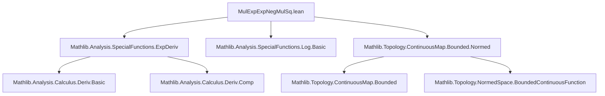

### Technical Brief: `MulExpNegMulSq.lean`

---

#### **1. Key Definitions & Theorems**

| Name | Type / Signature | Purpose |
|------|------------------|---------|
| `mulExpNegMulSq` | `ℝ → ℝ → ℝ`, `ε x ↦ x * exp (-(ε * x * x))` | Core mapping used to regularize/uniformly bound functions via exponential damping. |
| `mulExpNegSq_apply` | `∀ ε x, mulExpNegMulSq ε x = x * exp (-(ε * x * x))` | Definition unfolding. |
| `neg_mulExpNegMulSq_neg` | `∀ ε x, -mulExpNegMulSq ε (-x) = mulExpNegMulSq ε x` | Oddness of the mapping in `x`. |
| `abs_mulExpNegMulSq_one_le_one` | `∀ x, |mulExpNegMulSq 1 x| ≤ 1` | Uniform bound for `ε = 1`. |
| `continuous_mulExpNegMulSq` | `Continuous (mulExpNegMulSq ε)` | Continuity in `x`. |
| `differentiable_mulExpNegMulSq` | `Differentiable ℝ (mulExpNegMulSq ε)` | Smoothness in `x`. |
| `hasDerivAt_mulExpNegMulSq` | Explicit derivative formula | Used for Lipschitz analysis. |
| `norm_deriv_mulExpNegMulSq_le_one` | `0 < ε ⇒ ‖deriv (mulExpNegMulSq ε) x‖ ≤ 1` | Key for Lipschitz constant `1`. |
| `lipschitzWith_one_mulExpNegMulSq` | `0 < ε ⇒ LipschitzWith 1 (mulExpNegMulSq ε)` | Global Lipschitz property. |
| `mulExpNegMulSq_eq_sqrt_mul_mulExpNegMulSq_one` | Scaling identity | Relates general `ε` to `ε = 1`. |
| `abs_mulExpNegMulSq_le` | `0 < ε ⇒ |mulExpNegMulSq ε x| ≤ (√ε)⁻¹` | Uniform bound scaling as `ε⁻¹/²`. |
| `dist_mulExpNegMulSq_le_dist` | `0 < ε ⇒ dist (mulExpNegMulSq ε x) (mulExpNegMulSq ε y) ≤ dist x y` | Non-expansiveness (1-Lipschitz). |
| `tendsto_mulExpNegMulSq` | `Tendsto (ε ↦ mulExpNegMulSq ε x) (𝓝 0) (𝓝 x)` | Pointwise convergence to identity as `ε → 0⁺`. |
| `abs_mulExpNegMulSq_comp_le_norm` | `0 ≤ ε ⇒ |(mulExpNegMulSq ε ∘ g) x| ≤ ‖g‖` | Uniform boundedness of composed function. |

---

#### **2. Naming Conventions**

- **Prefixes**:
  - `mulExpNegMulSq`: compound name reflecting structure `x * exp(-ε * x * x)`.
  - `mulExpNegSq_apply`: variant abbreviation.
- **Suffixes**:
  - `_le_one`, `_le_norm`, `_le_two_mul_sqrt`: indicate bounding results.
  - `_comp`: indicates composition with a function (e.g., `abs_mulExpNegMulSq_comp_le_norm`).
  - `_deriv`, `_norm_deriv`: derivative-related properties.
  - `_tendsto`: convergence-related.
- **Quantifier prefixes**:
  - `neg_`, `abs_`, `dist_`, `norm_`: clarify the nature of inequality.

---

#### **3. Tactic Stack**

Frequent tactics used in proofs:

| Tactic | Usage |
|--------|-------|
| `simp only [...]` | Simplify using explicit definitions and lemmas. |
| `rw [...]` | Rewrite using equalities (e.g., `mulExpNegMulSq`, `exp_neg`). |
| `apply ...` | Apply lemmas like `mul_le_of_le_one_right`, `abs_le.mpr`. |
| `nlinarith` | Handle nonlinear inequalities (e.g., `x² ≥ 0`, `exp(y) ≥ 1 + y`). |
| `ring` | Algebraic simplification of expressions (e.g., derivative simplification). |
| `grind [...]` | Custom simplifier for algebraic normalization (likely from `Grind` or similar). |
| `fun_prop` | Propagate continuity/differentiability via `fun_prop` infrastructure. |
| `have h := ...; rwa [...] at h` | Intermediate lemma extraction and rewrites. |
| `exact ...` | Final step in short proofs (e.g., `exact mulExpNegMulSq_one_le_one (-x)`). |

---

#### **4. Proof Logic**

- **Structure**:
  - **Definition first**: `mulExpNegMulSq` defined explicitly.
  - **Basic algebraic properties**: oddness, bounds for `ε = 1`.
  - **Analytic properties**: continuity, differentiability, derivative formula.
  - **Lipschitz analysis**: via derivative norm bound (`norm_deriv_mulExpNegMulSq_le_one`).
  - **Scaling identity**: relate general `ε` to `ε = 1` using substitution.
  - **Uniform bounds**: derive `|mulExpNegMulSq ε x| ≤ (√ε)⁻¹`.
  - **Convergence**: use continuity of `ε ↦ mulExpNegMulSq ε x` at `ε = 0`.
  - **Composition with bounded continuous functions**: uniform bound via `g.norm_coe_le_norm`.

- **Common proof pattern**:
  - Reduce to known inequalities (`exp y ≥ 1 + y`, `exp y ≥ 1` for `y ≥ 0`).
  - Use substitution (`y := ε * x * x`) to reduce to scalar inequalities.
  - Leverage ` LipschitzWith_of_nnnorm_deriv_le` for Lipschitz conclusions.

---

#### **5. Imports & Dependencies**

| Import | Role |
|--------|------|
| `Mathlib.Analysis.SpecialFunctions.ExpDeriv` | Derivative of `exp`, chain rule, differentiability facts. |
| `Mathlib.Analysis.SpecialFunctions.Log.Basic` | Possibly for related inequalities (though not directly used here). |
| `Mathlib.Topology.ContinuousMap.Bounded.Normed` | Bounded continuous functions (`BoundedContinuousFunction`), normed space structure. |

---

#### **6. Mermaid Diagrams**

##### **Dependency Graph (Module-Level)**



##### **Overview of Theory Flow**

```mermaid
flowchart LR
  A[Definition: mulExpNegMulSq ε x = x * exp(-ε x²)] --> B[Algebraic Properties]
  A --> C[Continuity & Differentiability]
  B --> D[Boundedness for ε = 1]
  C --> E[Derivative Formula]
  E --> F[Lipschitz via Derivative Bound]
  D --> G[Scaling Identity]
  G --> H[General ε Bound: |·| ≤ (√ε)⁻¹]
  C --> I[Pointwise Convergence as ε → 0]
  A --> J[Composition with Bounded Continuous g]
  J --> K[Uniform Bound: |(mulExpNegMulSq ε ∘ g)(x)| ≤ ‖g‖]
```

---

#### **7. Summary**

This module formalizes a key regularization map used in analysis and PDEs:  
$$
(\varepsilon, x) \mapsto x \cdot e^{-\varepsilon x^2}
$$  
It establishes:

- **Uniform boundedness**: $|x e^{-\varepsilon x^2}| \leq \varepsilon^{-1/2}$,
- **Non-expansiveness**: $|f_\varepsilon(x) - f_\varepsilon(y)| \leq |x - y|$,
- **Pointwise recovery**: $f_\varepsilon(x) \to x$ as $\varepsilon \to 0^+$,
- **Stability under composition**: preserves boundedness of $g$ with same norm.

These properties make `mulExpNegMulSq` a standard tool for truncating or regularizing functions while preserving continuity, boundedness, and convergence.

--- 

Let me know if you'd like a formalization roadmap for extending this to Banach-space-valued functions or for use in approximation theorems (e.g., Stone–Weierstrass).
