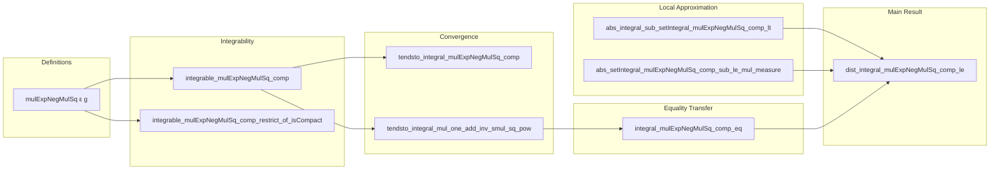

**Technical Brief: `MulExpNegMulSqIntegral.lean`**

---

### 1. **Key Definitions & Theorems**

| Name | Type / Signature | Purpose |
|------|------------------|---------|
| `mulExpNegMulSq` | `ε : ℝ → g : E → ℝ ↦ fun x => g x * Real.exp (-ε * g x * g x)` | Truncates/uniformly approximates identity via Gaussian damping; key tool for regularization. |
| `integrable_mulExpNegMulSq_comp` | `f : C(E, ℝ) → 0 < ε → Integrable (mulExpNegMulSq ε ∘ f) P` | Guarantees integrability of regularized functions under finite measures. |
| `tendsto_integral_mulExpNegMulSq_comp` | `g : E →ᵇ ℝ → Tendsto (ε ↦ ∫ mulExpNegMulSq ε g ∂P) (𝓝[>] 0) (𝓝 (∫ g ∂P))` | Shows convergence of regularized integrals to original as ε → 0⁺ (via dominated convergence). |
| `tendsto_integral_mul_one_add_inv_smul_sq_pow` | `g : E →ᵇ ℝ → 0 < ε → Tendsto (n ↦ ∫ (g * (1 - ε•g²/n)^n) ∂P) atTop (𝓝 (∫ mulExpNegMulSq ε g ∂P))` | Approximates `mulExpNegMulSq` integrals using polynomial sequences (exponential limit). |
| `integral_mulExpNegMulSq_comp_eq` | `0 < ε → (∀ g ∈ A, ∫ g ∂P = ∫ g ∂P') → g ∈ A ⇒ ∫ mulExpNegMulSq ε g ∂P = ∫ mulExpNegMulSq ε g ∂P'` | Extends equality of integrals from subalgebra `A` to its `mulExpNegMulSq`-regularized functions. |
| `abs_integral_sub_setIntegral_mulExpNegMulSq_comp_lt` | `0 < ε → P(Kᶜ) < ε ⇒ |∫ mulExpNegMulSq ε f ∂P - ∫⁻K mulExpNegMulSq ε f ∂P| < √ε` | Controls error when restricting to compact subsets. |
| `abs_setIntegral_mulExpNegMulSq_comp_sub_le_mul_measure` | `∀ x ∈ K, |g x - f x| < δ ⇒ |∫⁻K mulExpNegMulSq ε g ∂P - ∫⁻K mulExpNegMulSq ε f ∂P| ≤ δ·P(K)` | Lipschitz-type continuity of integral w.r.t. uniform closeness on compact sets. |
| **`dist_integral_mulExpNegMulSq_comp_le`** | `0 < ε → A separates points ⇒ (∀ g ∈ A, ∫ g ∂P = ∫ g ∂P') ⇒ |∫ mulExpNegMulSq ε f ∂P - ∫ mulExpNegMulSq ε f ∂P'| ≤ 6√ε` | **Main technical bound**: bridges measure equality on `A` to equality up to `O(√ε)` for regularized functions. |

---

### 2. **Naming Conventions**

- **Prefixes**:
  - `mulExpNegMulSq_`: functions/lemmas involving `mulExpNegMulSq`.
  - `abs_`, `dist_`, `tendsto_`, `integral_`, `setIntegral_`: standard measure-theoretic operations.
  - `integrable_`, `aestronglyMeasurable`: integrability/measurability properties.
- **Suffixes**:
  - `_comp`: composition with a function (`g ∘ f`).
  - `_restrict_of_isCompact`: restriction to compact measurable sets.
  - `_le`, `_lt`, `_eq`: inequality/equality type in conclusion.
  - `_of_`: conditions or assumptions (e.g., `of_isCompact`, `of_separatesPoints`).
- **Variables**:
  - `ε`, `δ`: small positive reals (regularization/error parameters).
  - `K`, `KP`, `KP'`: compact subsets.
  - `A`: subalgebra of bounded continuous functions.
  - `P`, `P'`: finite Borel measures.

---

### 3. **Tactic Stack**

- **Core tactics**:
  - `simp`, `rw`, `linarith`, `apply`, `exact`, `refine`, `cases`
- **Analysis/measure theory**:
  - `integrable`, `aestronglyMeasurable`, `StronglyMeasurable.aestronglyMeasurable`
  - `norm_setIntegral_le_of_norm_le_const`, `norm_integral_sub_setIntegral_le`
  - `dist_triangle8`, `tendsto_integral_filter_of_norm_le_const`
- **Topology/continuity**:
  - `Continuous.stronglyMeasurable`, `Continuous.mul`, `Continuous.pow`
  - `StoneWeierstrass`, `ContinuousMap.exists_mem_subalgebra_near_continuous_of_isCompact_of_separatesPoints`
- **Real analysis**:
  - `sqrt_pos_of_pos`, `mul_self_sqrt`, `abs_le_iff_mul_self_le`, `pow_le_one₀`
  - `tendsto_one_add_div_pow_exp`, `tendsto_nhdsWithin_of_tendsto_nhds`

---

### 4. **Proof Logic**

The proofs follow a **structured approximation-and-decomposition strategy**:

1. **Approximation**:
   - Use `mulExpNegMulSq` to regularize functions (Gaussian damping).
   - Approximate `mulExpNegMulSq ε g` by polynomials `g·(1 - εg²/n)^n` (via exponential limit).
   - Transfer algebraic properties (e.g., membership in subalgebra `A`) to regularized functions.

2. **Decomposition**:
   - For `dist_integral_mulExpNegMulSq_comp_le`, decompose the difference of integrals into 7 segments:
     - Outside compact set `K`: controlled by measure tail (`< √ε`).
     - Inside `K`: use uniform approximation of `f` by `g ∈ A` (Stone–Weierstrass).
     - Between `f` and `g` on `K`: Lipschitz bound (`≤ √ε`).
     - Equality on `g`: follows from assumption `heq` and `integral_mulExpNegMulSq_comp_eq`.

3. **Triangle inequality chaining**:
   - Apply `dist_triangle8` to combine 7 error terms.
   - Sum bounds: `4·√ε` (outer tails) + `2·√ε` (inner approximations) = `6√ε`.

4. **Inductive/limit arguments**:
   - `tendsto_*` lemmas use sequential characterizations (`tendsto_of_seq_tendsto`, `tendsto_integral_filter_of_norm_le_const`).
   - Dominated convergence for ε → 0⁺; polynomial convergence for n → ∞.

---

### 5. **Imports & Scope**

| Module | Role |
|--------|------|
| `Mathlib.Analysis.SpecialFunctions.MulExpNegMulSq` | Core definition and basic properties of `mulExpNegMulSq`. |
| `Mathlib.Analysis.SpecialFunctions.Complex.LogBounds` | Possibly used for complex exponential bounds (though real-valued here). |
| `Mathlib.MeasureTheory.Integral.BoundedContinuousFunction` | Integration theory for bounded continuous functions. |
| `Mathlib.MeasureTheory.Integral.DominatedConvergence` | Enables `tendsto_integral_mulExpNegMulSq_comp`. |
| `Mathlib.MeasureTheory.Measure.RegularityCompacts` | Provides compact approximation of measures (`exists_isCompact_isClosed_diff_lt`). |
| `Mathlib.Topology.ContinuousMap.StoneWeierstrass` | Enables uniform approximation on compacts (`exists_mem_subalgebra_near_continuous_of_isCompact_of_separatesPoints`). |

**Scope**: This module formalizes a *regularization technique* for finite Borel measures on Polish spaces, enabling extension of integral equalities from subalgebras to all bounded continuous functions — a key step in proving **measure separation** (e.g., in uniqueness proofs for stochastic processes or Riesz representation).

---

### 6. **Mermaid Diagrams**

#### **Dependency Graph (High-Level)**

```mermaid
graph TD
  A[Stone-Weierstrass] --> B[Approximate f ∈ C(E) by g ∈ A on K]
  C[Dominated Convergence] --> D[tendsto_integral_mulExpNegMulSq_comp]
  E[Exponential Limit] --> F[tendsto_integral_mul_one_add_inv_smul_sq_pow]
  G[Multiplicative Regularization] --> D & F
  H[Measure Regularity] --> I[Compact approximation K ⊆ E]
  I --> J[Error bounds on E\K]
  J --> K[dist_integral_mulExpNegMulSq_comp_le]
  B --> L[Equality on g ∈ A ⇒ equality on mulExpNegMulSq ε g]
  L --> K
  K --> M[ext_of_forall_mem_subalgebra_integral_eq]
```

#### **Overview of File Structure**



---

**Conclusion**: This file formalizes a powerful regularization method for finite measures, leveraging Gaussian damping and polynomial approximation to bridge algebraic properties (subalgebras) with measure-theoretic conclusions. The bound `6√ε` is tight enough to enable measure uniqueness proofs via separation arguments.
