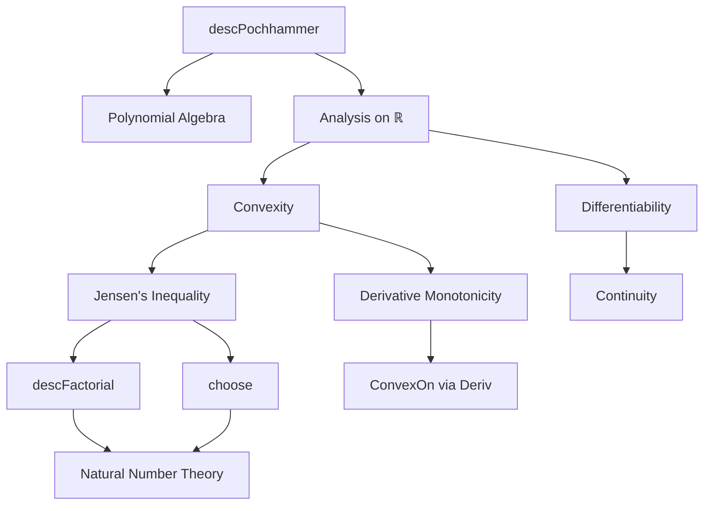

### Technical Brief: `Pochhammer.lean`

---

#### **1. Key Definitions & Theorems**

| Name | Type / Signature | Purpose |
|------|------------------|---------|
| `descPochhammer 𝕜 n` | `𝕜 → 𝕜` (as a polynomial function) | *Descending Pochhammer polynomial*: $x \mapsto \prod_{i=0}^{n-1} (x - i)$ |
| `differentiable_descPochhammer_eval` | `Differentiable 𝕜 (descPochhammer 𝕜 n).eval` | Proves differentiability of the descending Pochhammer polynomial over a nontrivially normed field `𝕜`. |
| `continuous_descPochhammer_eval` | `Continuous (descPochhammer 𝕜 n).eval` | Follows from differentiability; continuity of the polynomial. |
| `deriv_descPochhammer_eval_eq_sum_prod_range_erase` | `deriv (descPochhammer 𝕜 n).eval k = ∑ i ∈ range n, ∏ j ∈ range n \ {i}, (k - j)` | Explicit formula for the derivative via product rule. |
| `monotoneOn_deriv_descPochhammer_eval` | `MonotoneOn (deriv (descPochhammer ℝ n).eval) (Ioi (n - 1))` | Derivative is monotone increasing on $(n-1, \infty)$. |
| `convexOn_descPochhammer_eval` | `ConvexOn ℝ (Ici (n - 1)) (descPochhammer ℝ n).eval` | Main convexity result: polynomial is convex on $[n-1, \infty)$. |
| `piecewise_Ici_descPochhammer_eval_zero_eq_descFactorial` | `(Ici (n-1)).piecewise (descPochhammer ℝ n).eval 0 k = k.descFactorial n` | Shows that extending the polynomial by 0 below $n-1$ yields the factorial function on naturals. |
| `convexOn_piecewise_Ici_descPochhammer_eval_zero` | `ConvexOn ℝ univ (piecewise ...)` | Extends convexity to all of $\mathbb{R}$ via piecewise definition. |
| `descPochhammer_eval_le_sum_descFactorial` | Jensen inequality for `descFactorial` | Special case of Jensen’s inequality: convex function evaluated at weighted average ≤ weighted average of function values. |
| `descPochhammer_eval_div_factorial_le_sum_choose` | Jensen inequality for `choose` | Same as above, but for binomial coefficients via identity $\binom{k}{n} = \frac{k^{\underline{n}}}{n!}$. |

---

#### **2. Naming Conventions**

- **Prefixes**:
  - `descPochhammer_`: core definitions and properties of descending Pochhammer.
  - `differentiable_`, `continuous_`, `deriv_`, `monotoneOn_`, `convexOn_`: standard analysis properties.
  - `piecewise_`: for constructions using `Set.piecewise`.
- **Suffixes**:
  - `_eval`: applied to `.eval` (i.e., evaluation of polynomial as a function).
  - `_le_sum_`: indicates inequality direction in Jensen-style results.
  - `_eq_`: equality lemmas (e.g., derivative formula, piecewise equivalence).
- **Variables**:
  - `n : ℕ`: degree of polynomial.
  - `𝕜`: base field (often `ℝ`).
  - `k : 𝕜`: evaluation point.

---

#### **3. Tactic Stack**

| Tactic | Usage Frequency | Purpose |
|--------|-----------------|---------|
| `simp` / `simp_rw` | Very High | Simplify using definitions (`descPochhammer_eval_eq_prod_range`, `descFactorial`, etc.). |
| `induction` | Medium | Structural induction on `n` (e.g., monotonicity of derivative). |
| `rw` | High | Rewrite using lemmas, definitions, or arithmetic facts. |
| `apply` | Medium | Apply known theorems (e.g., `MonotoneOn.convexOn_of_deriv`). |
| `exact` | Medium | Provide direct proofs where goals match exactly. |
| `intro` / `intro h` | Medium | Introduce hypotheses in proofs. |
| `convexOn_const`, `convex_Ici`, `convex_Iic` | Medium | Apply known convexity facts. |
| `div_le_div_of_nonneg_right` | Low | Used in final inequality proof for binomial coefficients. |
| `simpa` | Medium | Simplify and discharge using a target lemma. |

---

#### **4. Proof Logic**

- **Structure**:
  1. **Base analysis**: Prove differentiability and continuity via `Differentiable.fun_finset_prod`.
  2. **Derivative formula**: Derived using `deriv_fun_finset_prod`.
  3. **Monotonicity of derivative**:
     - Induction on `n`.
     - Use `Finset.sum_le_sum`, `Finset.prod_le_prod`.
     - Arithmetic lemmas on naturals (`Nat.le_pred_of_lt`, `sub_nonneg_of_le`).
  4. **Convexity**:
     - Use `MonotoneOn.convexOn_of_deriv`, requiring:
       - Continuity on closure (`continuousOn`)
       - Differentiability on interior (`differentiableOn`)
       - Monotonicity of derivative on interior.
  5. **Piecewise extension**:
     - Show equality with `descFactorial` on naturals using `ite_eq_left_iff`, `Nat.descFactorial_eq_zero_iff_lt`.
     - Prove convexity on all $\mathbb{R}$ via `convexOn_univ_piecewise_Ici_of_monotoneOn_Ici_antitoneOn_Iic`.
  6. **Jensen inequalities**:
     - Define piecewise function `f`.
     - Apply `ConvexOn.map_sum_le`.
     - Simplify using `piecewise_Ici_descPochhammer_eval_zero_eq_descFactorial`.

---

#### **5. Imports**

| Module | Purpose |
|--------|---------|
| `Mathlib.Algebra.BigOperators.Field` | For `Finset.sum`, `Finset.prod`, field arithmetic. |
| `Mathlib.Analysis.Convex.Deriv` | Derivative-based convexity criteria (`MonotoneOn.convexOn_of_deriv`). |
| `Mathlib.Analysis.Convex.Piecewise` | Convexity of piecewise-defined functions. |
| `Mathlib.Analysis.Convex.Jensen` | General Jensen inequality (`ConvexOn.map_sum_le`). |

---

#### **6. Mermaid Diagrams**

##### **Dependency Graph (Theoretical Scope)**



##### **File Overview**

```mermaid
flowchart LR
  Start[Pochhammer.lean] --> Defs[descPochhammer def]
  Defs --> Thm1[Differentiable eval]
  Thm1 --> Thm2[Continuous eval]
  Thm2 --> Thm3[Derivative formula]
  Thm3 --> Thm4[Derivative monotone on (n−1,∞)]
  Thm4 --> Thm5[Convex on [n−1,∞)]
  Thm5 --> Thm6[Piecewise extension]
  Thm6 --> Thm7[Jensen for descFactorial]
  Thm7 --> Thm8[Jensen for choose]
  Thm7 & Thm8 --> End[Applications]
```

---

#### **7. Theory Context**

- **Domain**: Real analysis + combinatorics.
- **Goal**: Establish convexity and Jensen-type inequalities for combinatorial functions (`descFactorial`, `choose`) via polynomial embeddings.
- **Novelty**: Uses *piecewise convex extension* to apply Jensen on all $\mathbb{R}$, even though the polynomial is only convex from $n-1$ onward.

---

#### **8. Summary**

This file formalizes a bridge between discrete combinatorics and convex analysis: the descending Pochhammer polynomial serves as a smooth interpolation of the falling factorial, and its convexity on $[n-1, \infty)$ enables Jensen inequalities for `descFactorial` and `choose`. The proofs rely heavily on `Mathlib`’s convex analysis infrastructure and product differentiation rules.
