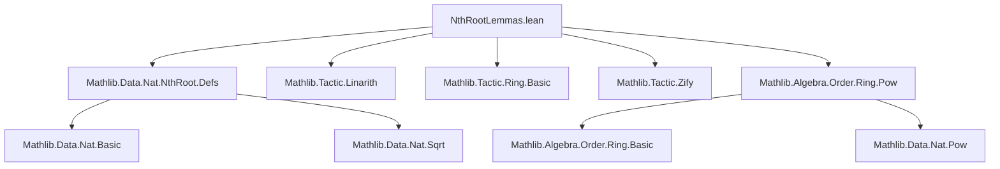
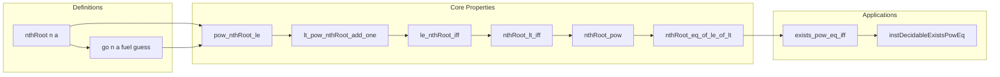

### Technical Brief: `NthRootLemmas.lean`

---

#### **1. Key Definitions & Theorems**

| Name | Type / Signature | Purpose |
|------|------------------|---------|
| `nthRoot` | `ℕ → ℕ → ℕ` | Computes the *floor* of the $n$-th root of $a$, i.e., $\lfloor \sqrt[n]{a} \rfloor$. Defined via `nthRoot.go`. |
| `go` | `ℕ → ℕ → ℕ → ℕ → ℕ` | Auxiliary function used in the definition of `nthRoot`, implementing an iterative refinement (Newton-like) process. |
| `nthRoot_zero_left` | `nthRoot 0 a = 1` | Normalization: $0$-th root of any $a$ is defined as $1$. |
| `nthRoot_one_left` | `nthRoot 1 = id` | $1$-st root is identity: $\sqrt[1]{a} = a$. |
| `nthRoot_zero_right` | `n ≠ 0 → nthRoot n 0 = 0` | $n$-th root of $0$ is $0$ for $n > 0$. |
| `nthRoot_one_right` | `nthRoot n 1 = 1` | $n$-th root of $1$ is $1$ for all $n$. |
| `pow_nthRoot_le` | `nthRoot n a ^ n ≤ a` (if $n ≠ 0$ or $a ≠ 0$) | Core property: the $n$-th power of the root does not exceed $a$. |
| `lt_pow_nthRoot_add_one` | `n ≠ 0 → a < (nthRoot n a + 1) ^ n` | Strict upper bound: $a$ is less than the next integer’s $n$-th power. |
| `le_nthRoot_iff` | `n ≠ 0 → (a ≤ nthRoot n b ↔ a ^ n ≤ b)` | Characterization of ≤ in terms of powers. |
| `nthRoot_lt_iff` | `n ≠ 0 → (nthRoot n a < b ↔ a < b ^ n)` | Characterization of < in terms of powers. |
| `nthRoot_pow` | `n ≠ 0 → nthRoot n (a ^ n) = a` | Exactness on perfect powers. |
| `nthRoot_eq_of_le_of_lt` | `a ^ n ≤ b < (a + 1) ^ n → nthRoot n b = a` | Uniqueness: if $b$ lies between consecutive $n$-th powers, its root is $a$. |
| `exists_pow_eq_iff'` / `exists_pow_eq_iff` | Characterize existence of integer $n$-th roots. | Decidability of whether $a$ is a perfect $n$-th power. |
| `instDecidableExistsPowEq` | `Decidable (∃ x, x ^ n = a)` | Provides decidability instance for perfect power detection. |

---

#### **2. Naming Conventions**

- **Prefixes**:
  - `nthRoot.`: All main definitions and lemmas are in the `Nat` namespace, prefixed with `nthRoot`.
  - `pow_`: Lemmas about powers of `nthRoot`.
  - `go_`: Internal lemmas about the auxiliary `go` function.
- **Suffixes**:
  - `_iff`: Biconditional characterizations (`le_nthRoot_iff`, `nthRoot_lt_iff`, etc.).
  - `_aux`, `_aux0`: Technical lemmas used in proofs of main results.
  - `_left`, `_right`: Symmetric cases (e.g., `nthRoot_zero_left`, `nthRoot_zero_right`).
- **`nthRoot.go`**: Internal implementation; not exposed outside.

---

#### **3. Tactic Stack**

| Tactic | Frequency | Role |
|--------|-----------|------|
| `rcases` / `cases` | High | Structural decomposition of natural numbers (`n`, `a`, `b`, `guess`) and disjunctions. |
| `induction` | High | Induction on `fuel` (iteration count) and sometimes `n`. |
| `simp` / `simp only` | Very High | Simplification using `@[simp]` lemmas, especially for base cases. |
| `grind` | High | Custom tactic (likely `linarith` + `ring` + `omega`-like reasoning) for arithmetic inequalities and equalities. |
| `gcongr` | Medium | Congruence for monotone functions (e.g., raising to powers). |
| `linarith` | Medium | Linear arithmetic (imported via `Mathlib.Tactic.Linarith`). |
| `ring` | Medium | Polynomial simplification (imported via `Mathlib.Tactic.Ring.Basic`). |
| `zify` | Low | Used implicitly via `linarith`/`grind` to lift to integers. |
| `exact`, `assumption` | Medium | Proof term construction. |
| `calc` | Medium | Chain of inequalities (e.g., in `nthRoot.lt_pow_go_succ_aux`). |

---

#### **4. Proof Logic**

- **Inductive structure** dominates proofs involving `go` and `nthRoot`:
  - Induction on `fuel` (iteration depth) to prove monotonicity/upper bounds.
  - Structural induction on `n` (via `rcases n with _ | _ | _`) to handle $n = 0, 1, \ge 2$ separately.
- **Case analysis** on equality (`eq_or_ne n 0`, `eq_or_ne guess 0`) and order (`le_or_gt a (nthRoot n b)`).
- **Bounding arguments**:
  - Lower bound: `pow_nthRoot_le` via induction on `fuel`.
  - Upper bound: `lt_pow_nthRoot_add_one` via `nthRoot.lt_pow_go_succ`, which uses `nthRoot.lt_pow_go_succ_aux`.
- **Characterization via inequalities**:
  - `le_nthRoot_iff`, `nthRoot_lt_iff` reduce order relations on roots to order on powers.
  - `nthRoot_eq_of_le_of_lt` leverages these to prove equality when $b$ is sandwiched.
- **Decidability** via `decidable_of_iff'` + `exists_pow_eq_iff`.

---

#### **5. Imports**

| Module | Purpose |
|--------|---------|
| `Mathlib.Data.Nat.NthRoot.Defs` | Core definition of `nthRoot` and `go`. |
| `Mathlib.Tactic.Linarith` | Linear arithmetic solver. |
| `Mathlib.Tactic.Ring.Basic` | Polynomial simplification. |
| `Mathlib.Tactic.Zify` | Embedding ℕ into ℤ for arithmetic reasoning. |
| `Mathlib.Algebra.Order.Ring.Pow` | Basic properties of powers in ordered rings (e.g., monotonicity of $x \mapsto x^n$ for $n > 0$). |

---

#### **6. Mermaid Diagrams**

##### **Dependency Graph (File-Level)**



##### **Theoretical Overview (Module Scope)**



##### **Proof Strategy Flow (for `le_nthRoot_iff`)**

```mermaid
flowchart TD
  Start[le_nthRoot_iff] --> Case1[a ≤ nthRoot n b]
  Case1 --> Simp1[simp using pow_nthRoot_le]
  Simp1 --> Trans[transitivity via pow_nthRoot_le]
  
  Start --> Case2[a > nthRoot n b]
  Case2 --> Simp2[simp using lt_pow_nthRoot_add_one]
  Simp2 --> Trans2[transitivity via lt_pow_nthRoot_add_one]
  
  Trans --> iff1[≤ ↔ a^n ≤ b]
  Trans2 --> iff2[¬(a ≤ nthRoot n b) ↔ ¬(a^n ≤ b)]
  iff1 & iff2 --> End[Proof complete]
```

---

#### **7. Domain Summary**

This file formalizes the **correctness of `Nat.nthRoot`** as the *floor* of the real $n$-th root. It bridges:
- **Computational definition** (`go`, iterative refinement),
- **Order-theoretic properties** (bounds, monotonicity),
- **Algebraic properties** (exactness on perfect powers),
- **Decidability** (existence of integer roots).

It serves as a foundational module for reasoning about integer roots in arithmetic, number theory, and formal verification of algorithms involving radicals.

--- 

*End of Technical Brief.*
