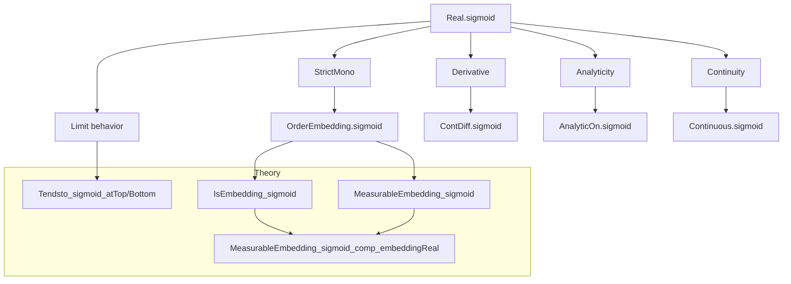
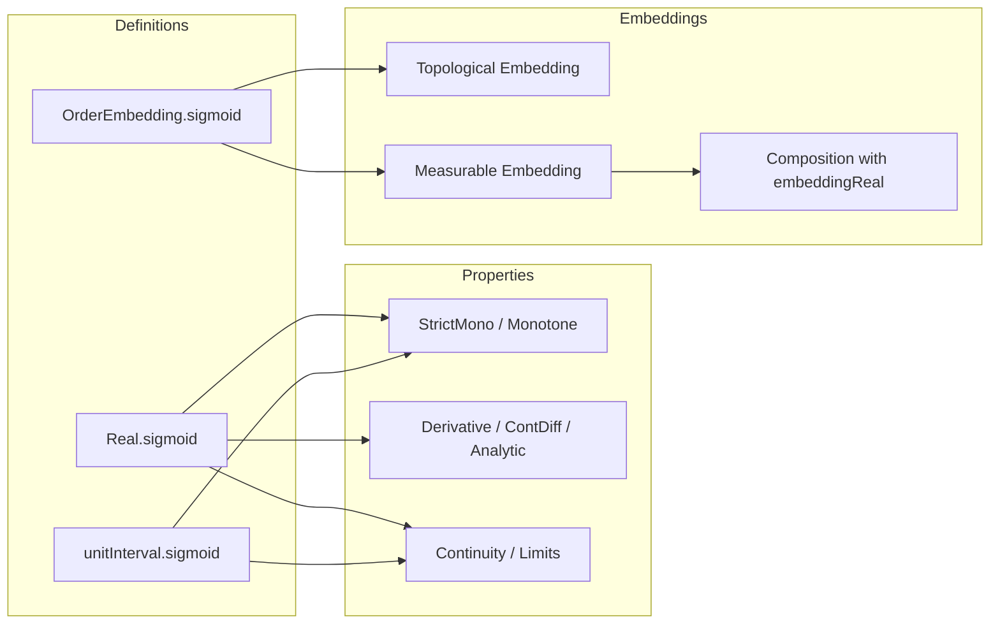

### Technical Brief: `Sigmoid.lean`

---

#### **1. Key Definitions & Theorems**

| Name | Type / Signature | Purpose |
|------|------------------|---------|
| `Real.sigmoid` | `ℝ → ℝ` | Defines the sigmoid function $x \mapsto (1 + e^{-x})^{-1}$. |
| `Real.sigmoid_strictMono` | `StrictMono Real.sigmoid` | Proves strict monotonicity of sigmoid on `ℝ`. |
| `Real.continuous_sigmoid` | `Continuous Real.sigmoid` | Establishes continuity of sigmoid. |
| `Real.tendsto_sigmoid_atTop` | `Tendsto Real.sigmoid atTop (𝓝 1)` | Shows $\lim_{x \to +\infty} \sigma(x) = 1$. |
| `Real.tendsto_sigmoid_atBot` | `Tendsto Real.sigmoid atBot (𝓝 0)` | Shows $\lim_{x \to -\infty} \sigma(x) = 0$. |
| `Real.hasDerivAt_sigmoid` | `HasDerivAt Real.sigmoid (σ(x) * (1 - σ(x))) x` | Computes derivative: $\sigma'(x) = \sigma(x)(1 - \sigma(x))$. |
| `Real.analyticAt_sigmoid` | `AnalyticAt ℝ Real.sigmoid x` | Proves analyticity of sigmoid at every point. |
| `unitInterval.sigmoid` | `ℝ → I` (where $I = [0,1]$) | Sigmoid viewed as a map into the unit interval. |
| `OrderEmbedding.sigmoid` | `ℝ ↪o I` | Sigmoid as an order embedding. |
| `Topology.isEmbedding_sigmoid` | `IsEmbedding unitInterval.sigmoid` | Sigmoid is a topological embedding. |
| `measurableEmbedding_sigmoid` | `MeasurableEmbedding unitInterval.sigmoid` | Sigmoid is a measurable embedding. |
| `measurableEmbedding_sigmoid_comp_embeddingReal` | `MeasurableEmbedding (unitInterval.sigmoid ∘ embeddingReal α)` | Composition with standard Borel embedding remains measurable embedding. |

---

#### **2. Naming Conventions**

- **Prefixes / Suffixes**:
  - `sigmoid_`: Core function-related lemmas (`sigmoid_def`, `sigmoid_zero`, `sigmoid_neg`, etc.).
  - `hasDerivAt_`, `deriv_`, `differentiable_`, `contDiff_`, `analytic_`: Calculus properties.
  - `tendsto_`: Limit behavior at infinities.
  - `mono`, `strictMono`, `monotone`: Monotonicity-related lemmas.
  - `le_iff`, `lt_iff`, `inj`: Logical characterizations of order properties.
  - `isEmbedding_`, `measurableEmbedding_`: Embedding properties.
  - `subtype_mk`, `range_coind`: Used for coercion to subtype (`unitInterval.sigmoid`).

- **Suffixes**:
  - `_def`: Definition.
  - `_le_iff`, `_lt_iff`, `_inj`: Equivalence lemmas for order relations.
  - `_comp`: Composition lemmas.

---

#### **3. Tactic Stack**

Frequently used tactics in this file:

| Tactic | Usage |
|--------|-------|
| `simp` / `simp only` | Simplifying definitions (`sigmoid_def`, `sigmoid_zero`, `sigmoid_neg`). |
| `bound` / `bound'` | Proving bounds like $0 < \sigma(x) < 1$. |
| `gcongr` | Proving monotonicity via `gcongr` on `exp` and `inv`. |
| `field_simp`, `field` | Algebraic simplifications involving inverses and products. |
| `norm_num` | Numerical simplifications (`sigmoid_zero`). |
| `convert ... using 1` | Derivative proof via chain rule. |
| `fun_prop` | Propagation of differentiability/continuity/analyticity. |
| `analyticAt.comp`, `contDiff.comp`, etc. | Composition lemmas for smoothness classes. |
| `subset_antisymm`, `ext` | Set equality proofs (e.g., `range_sigmoid`). |
| `tendsto_*` combinators (`const_add`, `inv₀`, `inv_tendsto_atTop`) | Limit manipulation. |
| `rw [Subtype.range_coind, ...]` | Working with subtype coercion. |

---

#### **4. Proof Logic**

- **Structure**:
  1. **Definition**: Define `Real.sigmoid` and basic algebraic identities (`sigmoid_neg`, `sigmoid_mul_rexp_neg`).
  2. **Order-theoretic properties**:
     - Prove strict monotonicity via `gcongr` on `exp` and `inv`.
     - Derive injectivity, order equivalence (`le_iff`, `lt_iff`).
  3. **Topological/measure-theoretic properties**:
     - Use `tendsto_*` lemmas to prove limits at infinities.
     - Prove continuity/differentiability via `fun_prop` and chain rule.
     - Analyticity follows from `fun_inv` and positivity.
  4. **Embedding formalization**:
     - Lift to `unitInterval.sigmoid` via `subtype.coind`.
     - Use `OrderEmbedding.ofStrictMono` to get order embedding.
     - Show topological/measurable embedding using `isEmbedding_of_ordConnected` and `measurableSet_Ioo`.
     - Compose with `embeddingReal` for standard Borel spaces.

- **Recurring pattern**:
  > *Prove basic algebraic facts → derive monotonicity → lift to embedding → verify topological/measurable structure.*

---

#### **5. Imports**

| Module | Purpose |
|--------|---------|
| `Mathlib.Analysis.Calculus.Deriv.Inv` | Inverse function derivative rules. |
| `Mathlib.Analysis.InnerProductSpace.Basic` | Normed space structure (used for `E`). |
| `Mathlib.Analysis.SpecialFunctions.ExpDeriv` | Derivative of `exp`. |
| `Mathlib.Analysis.SpecialFunctions.Log.Basic` | Logarithm properties (used in `range_sigmoid`). |
| `Mathlib.MeasureTheory.Constructions.Polish.EmbeddingReal` | Measurable embedding `α → ℝ` for standard Borel `α`. |
| `Mathlib.Topology.Algebra.Module.ModuleTopology` | Topology on modules (used for continuity/differentiability). |

---

#### **6. Mermaid Diagrams**

##### **Dependency Graph (High-Level)**

##### **File Overview**

---

#### **7. Theory Context**

- **Domain**: Real analysis, measure theory, and order topology.
- **Role in larger theory**: Provides a canonical smooth, strictly monotone embedding of `ℝ` into `[0,1]`, used for:
  - Probabilistic modeling (e.g., logistic regression).
  - Measurable embeddings for standard Borel spaces.
  - Constructing smooth bump functions or retraction maps.
- **Complements**:
  - `Mathlib.Analysis.SpecialFunctions.Logistic` (if exists).
  - `Mathlib.MeasureTheory.Function.SimpleFunc.measurableEmbedding`.
  - `Mathlib.Topology.Embedding.Real` (standard embeddings).

--- 

Let me know if you'd like a formalized dependency graph (e.g., `.lean`-level imports) or a proof sketch for a specific theorem.
