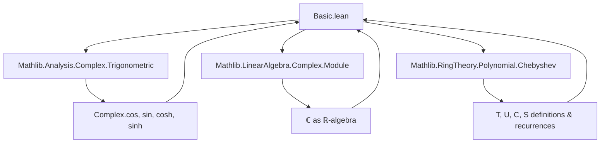

### Technical Brief: `Basic.lean` — Chebyshev Polynomials and Trigonometric Identities

---

#### **1. Key Definitions & Theorems**

| Name | Type / Signature | Purpose |
|------|------------------|---------|
| `T R n` | `Polynomial R` | $n$-th Chebyshev polynomial of the first kind over ring `R`. |
| `U R n` | `Polynomial R` | $n$-th Chebyshev polynomial of the second kind over `R`. |
| `C R n` | `Polynomial R` | Rescaled Chebyshev polynomial of the first kind (Vieta–Lucas), defined as $C_n(x) = 2 \cdot T_n(x/2)$. |
| `S R n` | `Polynomial R` | Rescaled Chebyshev polynomial of the second kind (Vieta–Fibonacci), defined as $S_n(x) = U_n(x/2)$. |
| `complex_ofReal_eval_T` | `∀ x n, ((T ℝ n).eval x : ℂ) = (T ℂ n).eval (x : ℂ)` | Compatibility of evaluation with complexification for `T`. |
| `T_complex_cos` | `(T ℂ n).eval (cos θ) = cos (n * θ)` | Core identity: $T_n(\cos \theta) = \cos(n\theta)$ for complex $\theta$. |
| `U_complex_cos` | `(U ℂ n).eval (cos θ) * sin θ = sin((n+1)\theta)` | Identity for second kind: $U_n(\cos \theta)\sin\theta = \sin((n+1)\theta)$. |
| `C_two_mul_complex_cos` | `(C ℂ n).eval (2 * cos θ) = 2 * cos(n * θ)` | Rescaled version: $C_n(2\cos\theta) = 2\cos(n\theta)$. |
| `S_two_mul_complex_cos` | `(S ℂ n).eval (2 * cos θ) * sin θ = sin((n+1)\theta)` | Rescaled second kind identity. |
| `T_complex_cosh` | `(T ℂ n).eval (cosh θ) = cosh(n * θ)` | Hyperbolic analog: $T_n(\cosh\theta) = \cosh(n\theta)$. |
| `U_complex_cosh` | `(U ℂ n).eval (cosh θ) * sinh θ = sinh((n+1)\theta)` | Hyperbolic second kind identity. |
| `T_real_cos`, `U_real_cos`, etc. | `mod_cast` variants of complex theorems | Real versions via coercion (`mod_cast`). |

---

#### **2. Naming Conventions**

- **Polynomial families**:
  - `T`, `U`: standard Chebyshev polynomials (first/second kind).
  - `C`, `S`: *rescaled* versions (Vieta–Lucas / Vieta–Fibonacci), often evaluated at `2 * x`.
- **Function prefixes**:
  - `complex_ofReal_*`: coercion compatibility lemmas.
  - `*_complex_*`: complex-domain identities.
  - `*_real_*`: real-domain identities (derived via `mod_cast`).
- **Suffixes**:
  - `_cos`, `_cosh`: argument type (trig vs hyperbolic).
  - `two_mul_*`: rescaled version (argument scaled by 2).
- **Inductive structure**:
  - `induct` pattern: `zero`, `one`, `add_two`, `neg_add_one` — handles all integers via recurrence.

---

#### **3. Tactic Stack**

| Tactic | Usage Frequency | Purpose |
|--------|-----------------|---------|
| `simp` | Very High | Simplifies using `[simp]` theorems (`T_complex_cos`, etc.), algebraic rewrites. |
| `ring` / `ring_nf` | High | Normalizes polynomial expressions after applying recurrence or trig identities. |
| `push_cast` | Medium | Lifts real equalities to complex (or vice versa) for coercion. |
| `calc` | Medium | Chain of equalities (especially in hyperbolic proofs). |
| `rw` | Medium | Rewriting with definitions like `C_eq_two_mul_T_comp_half_mul_X`. |
| `induction ... using ...` | High | Structural induction on `n : ℤ` via `Polynomial.Chebyshev.induct`. |
| `simp only [...]` | High | Targeted simplification with explicit list to avoid over-simplification. |

---

#### **4. Proof Logic**

- **Inductive structure**: Proofs proceed by induction on `n : ℤ` using `Polynomial.Chebyshev.induct`, which encodes the recurrence:
  $$
  T_{n+1}(x) = 2x T_n(x) - T_{n-1}(x), \quad
  U_{n+1}(x) = 2x U_n(x) - U_{n-1}(x)
  $$
  with base cases $n = 0, 1$ and extension to negative integers via $T_{-n} = T_n$, $U_{-n-1} = -U_n$.

- **Trigonometric/hyperbolic reduction**:
  - For `cos`, use angle addition formulas (`cos_add_cos`, `sin_add_sin`).
  - For `cosh`, reduce to `cos` via complex multiplication: $\cosh \theta = \cos(i\theta)$, $\sinh \theta = -i \sin(i\theta)$.

- **Rescaling**: Identities for `C`, `S` follow from definitions:
  $$
  C_n(x) = 2 T_n(x/2), \quad S_n(x) = U_n(x/2)
  $$
  and substitution (e.g., `C_eq_two_mul_T_comp_half_mul_X`).

- **Real → Complex**: Real theorems are derived by `mod_cast`, leveraging `complex_ofReal_*` lemmas to commute evaluation and coercion.

---

#### **5. Imports**

| Import | Role |
|--------|------|
| `Mathlib.Analysis.Complex.Trigonometric` | Complex trig/hyperbolic functions (`cos`, `sin`, `cosh`, `sinh`) and identities. |
| `Mathlib.LinearAlgebra.Complex.Module` | Complex as a real algebra (for coercion and `algebraMap_eval_*`). |
| `Mathlib.RingTheory.Polynomial.Chebyshev` | Definition of Chebyshev polynomials `T`, `U`, `C`, `S`, recurrence, and basic algebraic properties. |

---

#### **8. Mermaid Diagrams**

##### **Dependency Graph (Module-Level)**



##### **Theoretical Overview (Chebyshev–Trigonometry Bridge)**

```mermaid
flowchart LR
  subgraph Polynomials
    T1[T ℂ n] --> eval1[eval at cos θ]
    U1[U ℂ n] --> eval2[eval at cos θ]
    C1[C ℂ n] --> eval3[eval at 2 cos θ]
    S1[S ℂ n] --> eval4[eval at 2 cos θ]
  end

  subgraph Trig Functions
    cosθ[cos θ] --> T1
    cosθ --> U1
    2cosθ --> C1
    2cosθ --> S1
  end

  subgraph Identities
    T_id[T_n(cos θ) = cos(nθ)]
    U_id[U_n(cos θ) sin θ = sin((n+1)θ)]
    C_id[C_n(2cos θ) = 2cos(nθ)]
    S_id[S_n(2cos θ) sin θ = sin((n+1)θ)]
  end

  eval1 --> T_id
  eval2 --> U_id
  eval3 --> C_id
  eval4 --> S_id

  subgraph Hyperbolic
    coshθ[cosh θ] --> T2[T_n(cosh θ) = cosh(nθ)]
    sinhθ[sinh θ] --> U2[U_n(cosh θ) sinh θ = sinh((n+1)θ)]
    2coshθ --> C2[C_n(2cosh θ) = 2cosh(nθ)]
    2coshθ --> S2[S_n(2cosh θ) sinh θ = sinh((n+1)θ)]
  end

  T_id -.->|via cos(iθ)| T2
  U_id -.->|via sin(iθ)| U2
  C_id -.->|via cos(iθ)| C2
  S_id -.->|via sin(iθ)| S2
```

---

#### **Summary**

This file formalizes the *trigonometric characterizations* of Chebyshev polynomials over both real and complex numbers, leveraging:
- Algebraic structure (`algebraMap_eval_*`),
- Inductive proofs on integer indices,
- Complex-analytic identities (`cos(iθ) = cosh θ`, etc.),
- Coercion compatibility (`mod_cast`, `complex_ofReal_*`).

It serves as a foundational bridge between orthogonal polynomials and trigonometric/hyperbometric identities, with implications for approximation theory, signal processing, and algebraic combinatorics.
