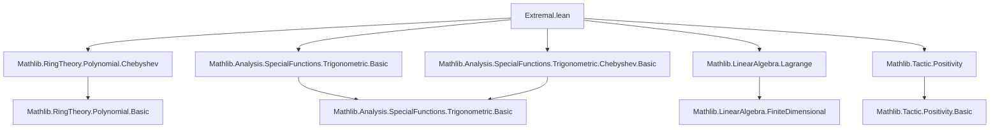

**Technical Brief: Extremal Properties of Chebyshev Polynomials in Lean 4**

---

### 1. KEY DEFINITIONS & THEOREMS

| Name | Type / Signature | Purpose |
|------|------------------|---------|
| `node n i` | `node : ℕ → ℕ → ℝ`, `node n i = cos (i * π / n)` | Defines the $i$-th Chebyshev node in $[-1,1]$, i.e., extremal points of $T_n$. |
| `sumNodes n c P` | `sumNodes : ℕ → (ℕ → ℝ) → ℝ[X] → ℝ`, `∑ i ≤ n, P.eval (node n i) * c i` | Linear combination of polynomial values at Chebyshev nodes with weights $c(i)$. |
| `leadingCoeffC n i` | `leadingCoeffC n i = (∏_{j ≠ i} (node n i - node n j))⁻¹` | Weight coefficient used to recover the leading coefficient via Lagrange interpolation. |
| `eval_T_real_node` | `(T ℝ n).eval (node n i) = (-1)^i` | Evaluates Chebyshev polynomial $T_n$ at node $i$ gives alternating $\pm 1$. |
| `sumNodes_le_sumNodes_T` | `sumNodes n c P ≤ sumNodes n c (T ℝ n)` | Main inequality: under sign-compatible weights and boundedness $|P| ≤ 1$, $P$’s weighted sum is ≤ that of $T_n$. |
| `sumNodes_eq_coeff` | `sumNodes n (leadingCoeffC n) P = P.coeff n` | Key identity: leading coefficient equals weighted sum of values at nodes. |
| `sumNodes_T_eq` | `sumNodes n (leadingCoeffC n) (T ℝ n) = 2^{n-1}` | Shows that the same sum for $T_n$ yields its known leading coefficient. |
| `coeff_le_of_forall_abs_le_one` | `P.coeff n ≤ 2^{n-1}` | Upper bound on leading coefficient under $|P(x)| ≤ 1$ on $[-1,1]$. |
| `leadingCoeff_le_of_forall_abs_le_one` | `P.leadingCoeff ≤ 2^{n-1}` | Same bound phrased in terms of `leadingCoeff`. |
| `coeff_eq_iff_of_forall_abs_le_one` | `P.coeff n = 2^{n-1} ↔ P = T ℝ n` | Equality case for coefficient (no degree assumption needed). |
| `leadingCoeff_eq_iff_of_forall_abs_le_one` | `P.leadingCoeff = 2^{n-1} ↔ P = T ℝ n`, assuming $n ≥ 2$ | Equality case for leading coefficient (requires $n ≥ 2$ to avoid degenerate $T_0, T_1$). |

---

### 2. NAMING CONVENTIONS

- **Prefixes**:
  - `node_`: for node-related definitions/lemmas (`node`, `node_eq_one`, `node_lt`, etc.)
  - `sumNodes_`: for sums over nodes (`sumNodes`, `sumNodes_le_sumNodes_T`, `sumNodes_eq_coeff`, etc.)
  - `leadingCoeff_`: for leading coefficient-related lemmas (`leadingCoeffC`, `leadingCoeff_le_of_forall_abs_le_one`, etc.)
  - `negOnePow_`: for sign-handling lemmas involving $(-1)^i$ (`negOnePow_mul_le`, `negOnePow_mul_leadingCoeffC_pos`, etc.)

- **Suffixes**:
  - `_pos`: positivity of expressions (e.g., `negOnePow_mul_leadingCoeffC_pos`)
  - `_iff`: equivalence characterizations (e.g., `coeff_eq_iff_of_forall_abs_le_one`)
  - `_le`: inequality lemmas (e.g., `sumNodes_le_sumNodes_T`, `coeff_le_of_forall_abs_le_one`)
  - `_eq`: equalities (e.g., `sumNodes_T_eq`, `node_eq_one`)

---

### 3. TACTIC STACK

Frequently used tactics in this file:

| Tactic | Usage |
|--------|-------|
| `aesop` | Simplifying arithmetic and order reasoning (e.g., in `node_eq_neg_one`, `node_lt`) |
| `grind` | Custom tactic (likely from project-specific imports) for grinding through finite set arithmetic and index manipulations |
| `simp` / `rw` | Rewriting definitions and simplifying expressions (e.g., `eval_T_real_node`, `node_eq_one`) |
| `ring` | Algebraic simplifications (e.g., in `negOnePow_mul_negOnePow_mul_cancel`) |
| `gcongr` | For monotonicity arguments involving exponentials (e.g., in `leadingCoeff_eq_iff_of_forall_abs_le_one`) |
| `apply lt_of_le_of_lt`, `apply le_of_lt`, `apply eq_of_le_of_ge` | Order reasoning and equality from bounds |
| `Finset.sum_le_sum`, `Finset.sum_lt_sum` | Comparing sums over finite sets |
| `convert` / `symm` | Matching goals to known lemmas up to definitional equality |
| `grw` | Likely a custom `rw` variant for `grind`-friendly rewrites (used in `sumNodes_eq_coeff`, `coeff_le_of_forall_abs_le_one`) |

---

### 4. PROOF LOGIC

The proof strategy follows a classical extremal argument:

1. **Reduction to exact degree**: Using monotonicity of $2^{n-1}$, assume $\deg P = n$ (via `lift P.degree` and `WithBot` reasoning).
2. **Lagrange interpolation identity**: Express the leading coefficient as a linear combination of values at Chebyshev nodes (`sumNodes_eq_coeff`), using injectivity of nodes (`strictAntiOn_node` ⇒ injective).
3. **Sign alignment**: Show that the coefficients $(-1)^i \cdot \text{leadingCoeffC}_i > 0$, and that $T_n$ evaluates to $(-1)^i$ at node $i$ (`eval_T_real_node`, `negOnePow_mul_leadingCoeffC_pos`).
4. **Bounding via sign-compatible weights**: Use `sumNodes_le_sumNodes_T` to compare $P$ and $T_n$ under the assumption $|P| ≤ 1$.
5. **Equality case**: If equality holds, then $P$ must agree with $T_n$ on all nodes; since both have degree ≤ $n$ and agree on $n+1$ points, they are identical (`sumNodes_eq_sumNodes_T_iff`, `eq_of_degrees_lt_of_eval_finset_eq`).
6. **Leading coefficient version**: For $n ≥ 2$, lift from coefficient equality to leading coefficient equality, handling the case $P = 0$ separately.

---

### 5. IMPORTS

| Module | Role |
|--------|------|
| `Mathlib.RingTheory.Polynomial.Chebyshev` | Core definitions of Chebyshev polynomials over rings |
| `Mathlib.Analysis.SpecialFunctions.Trigonometric.Basic` | Basic trigonometric facts (e.g., `cos`, `sin`) |
| `Mathlib.Analysis.SpecialFunctions.Trigonometric.Chebyshev.Basic` | Chebyshev polynomials via trigonometric definition (`T_real_cos`) |
| `Mathlib.LinearAlgebra.Lagrange` | Lagrange interpolation formula (used in `sumNodes_eq_coeff`) |
| `Mathlib.Tactic.Positivity` | Tactics for proving positivity (e.g., ` positivity`, ` gcongr`) |

---

### 6. MERMAID DIAGRAMS

#### Dependency Graph (Module-Level)



#### Overview of Proof Structure

```mermaid
flowchart LR
  A[Assume deg P ≤ n] --> B[Reduce to deg P = n]
  B --> C[Use Lagrange interpolation]
  C --> D[Define sumNodes with leadingCoeffC]
  D --> E[Show sumNodes(P) = P.coeff n]
  E --> F[Show sumNodes(T_n) = 2^{n-1}]
  F --> G[Compare via sign-compatible weights]
  G --> H[Conclude P.coeff n ≤ 2^{n-1}]
  H --> I[Equality ⇔ P = T_n]
  I --> J[Leading coefficient version (n ≥ 2)]
```

---

### 7. THEORY CONTEXT

This file formalizes a classical extremal property of Chebyshev polynomials: among all real polynomials of degree ≤ $n$ bounded by 1 on $[-1,1]$, $T_n$ uniquely maximizes the leading coefficient (up to sign). This is foundational in approximation theory and optimization (e.g., minimax problems, Chebyshev alternation theorem). The proof leverages:
- Trigonometric representation of $T_n$,
- Interpolation at extremal points (Chebyshev nodes),
- Sign-alternating structure of $T_n$ at those nodes.

The formalization is fully constructive in the sense of Lean’s real numbers, with no choice principles beyond definitional computation.

--- 

Let me know if you'd like a formalized summary in `lean` comment style or a dependency graph for internal lemmas.
