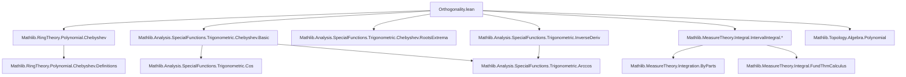
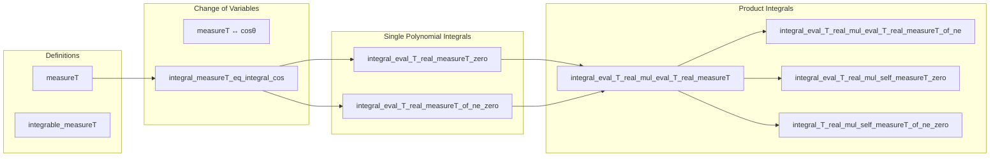
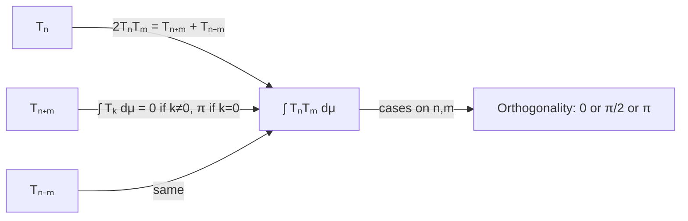

### Technical Brief: Orthogonality of Chebyshev Polynomials over ℝ

---

#### **1. Key Definitions & Theorems**

| Name | Type / Signature | Purpose |
|------|------------------|---------|
| `measureT` | `Measure ℝ` | Lebesgue measure weighted by $(1 - x^2)^{-1/2}$ and restricted to $(-1, 1]$. |
| `integral_measureT` | `∫ x, f x ∂measureT = ∫ x in -1..1, f x * √(1 - x ^ 2)⁻¹` | Rewrites the `measureT` integral as a standard interval integral with weight. |
| `intervalIntegrable_sqrt_one_sub_sq_inv` | `IntervalIntegrable (fun x ↦ √(1 - x ^ 2)⁻¹) volume (-1) 1` | Ensures the weight function is integrable on $[-1, 1]$. |
| `integrable_measureT` | `ContinuousOn f (Icc (-1) 1) → Integrable f measureT` | Continuous functions on $[-1,1]$ are integrable w.r.t. `measureT`. |
| `integral_measureT_eq_integral_cos` | `∫ x, f x ∂measureT = ∫ θ in 0..π, f (cos θ)` | Change-of-variables formula: integrates w.r.t. `measureT` ↔ integrates $f(\cos\theta)$ over $[0,\pi]$. |
| `integral_eval_T_real_measureT_zero` | `∫ x, T₀(x) ∂measureT = π` | Integral of $T_0 = 1$ w.r.t. `measureT` is $\pi$. |
| `integral_eval_T_real_measureT_of_ne_zero` | `n ≠ 0 ⇒ ∫ x, Tₙ(x) ∂measureT = 0` | Orthogonality of $T_n$ with constant function (i.e., $T_0$). |
| `integral_eval_T_real_mul_eval_T_real_measureT` | Integral of product = average of integrals of $T_{n+m}$ and $T_{n-m}$ | Uses Chebyshev identity $2T_n T_m = T_{n+m} + T_{n-m}$. |
| `integral_eval_T_real_mul_eval_T_real_measureT_of_ne` | $n ≠ m ⇒ \int T_n T_m \, d\text{measureT} = 0$ | Main orthogonality for distinct degrees. |
| `integral_eval_T_real_mul_self_measureT_zero` | $\int T_0^2 \, d\text{measureT} = \pi$ | Norm-squared of $T_0$. |
| `integral_T_real_mul_self_measureT_of_ne_zero` | $n ≠ 0 ⇒ \int T_n^2 \, d\text{measureT} = \pi/2$ | Norm-squared of $T_n$ for $n > 0$. |

---

#### **2. Naming Conventions**

- **Prefixes**:
  - `integral_...`: statements about integrals w.r.t. `measureT`.
  - `eval_...`: evaluation of polynomials at real arguments.
  - `measureT_...`: definitions/properties of the weighted measure.
- **Suffixes**:
  - `_of_ne_zero`: applies when index ≠ 0.
  - `_of_ne`: applies when two indices differ.
  - `_zero`: applies when index = 0.
- **Operators**:
  - `T ℝ n` denotes the $n$-th Chebyshev polynomial of the first kind over ℝ.
  - `T_mul_T`: Chebyshev multiplication identity.

---

#### **3. Tactic Stack**

| Tactic | Usage Frequency | Purpose |
|--------|-----------------|---------|
| `simp_rw` | High | Rewriting with definitional equalities (e.g., `eval_mul`, `T_real_cos`). |
| `rw` | High | Applying lemmas, definitions, and previously proven equalities. |
| `simp` | High | Simplifying goals using known lemmas and algebraic identities. |
| `grind` | Medium | Solving arithmetic goals (e.g., $n ≠ m ⇒ n ± m ≠ 0$). |
| `aesop` | Medium | Automated reasoning for inequalities and membership in intervals. |
| `congr!` | Low | Congruence reasoning for integrals. |
| `convert` | Low | Matching goals up to definitional equality. |
| `by_cases!` | Medium | Splitting on positivity/negativity of integer indices. |
| `fun_prop` | Medium | Proving continuity/differentiability of composite functions. |
| `measurability` | Medium | Verifying measurability conditions for measure-theoretic lemmas. |

---

#### **4. Proof Logic**

- **Core Strategy**: Reduce integrals w.r.t. `measureT` to integrals over $[0,\pi]$ via substitution $x = \cos\theta$, leveraging:
  - $dx = -\sin\theta\,d\theta = -\sqrt{1 - x^2}\,d\theta$
  - $\sqrt{1 - x^2}^{-1} dx = d\theta$
- **Orthogonality Proof Flow**:
  1. Use identity $2T_n(x)T_m(x) = T_{n+m}(x) + T_{n-m}(x)$.
  2. Express $\int T_n T_m\,d\text{measureT}$ as average of integrals of $T_{n+m}$ and $T_{n-m}$.
  3. Apply:
     - $\int T_k\,d\text{measureT} = 0$ for $k ≠ 0$,
     - $\int T_0\,d\text{measureT} = \pi$.
  4. Conclude:
     - If $n ≠ m$, both $n+m$ and $n-m$ are nonzero ⇒ integral = 0.
     - If $n = m ≠ 0$, only $T_0$ contributes ⇒ $\pi/2$.
     - If $n = m = 0$, $T_0^2 = T_0$ ⇒ $\pi$.

- **Induction Not Used**: Relies on algebraic identities and known integrals of $T_n$.

---

#### **5. Imports**

| Module | Role |
|--------|------|
| `Mathlib.RingTheory.Polynomial.Chebyshev` | Definition and algebraic properties of Chebyshev polynomials. |
| `Mathlib.Analysis.SpecialFunctions.Trigonometric.Chebyshev.Basic` | Analytic definitions: $T_n(\cos\theta) = \cos(n\theta)$. |
| `Mathlib.Analysis.SpecialFunctions.Trigonometric.Chebyshev.RootsExtrema` | (Not used directly here, but related to structure.) |
| `Mathlib.Analysis.SpecialFunctions.Trigonometric.InverseDeriv` | Derivative of `arccos`, used in change-of-variables. |
| `Mathlib.MeasureTheory.Integral.*` | Interval integrals, integrability, change-of-variables, integration by parts. |
| `Mathlib.Topology.Algebra.Polynomial` | Continuity of polynomial evaluation. |

---

#### **8. Mermaid Diagrams**

##### **Dependency Graph (File-Level)**

##### **Overview of Theory Flow**

##### **Orthogonality Triangle**

---

#### **Summary**

This file formalizes the **orthogonality of Chebyshev polynomials of the first kind** over $[-1,1]$ with respect to the weight $(1 - x^2)^{-1/2}$. It leverages:
- A change-of-variables $x = \cos\theta$ to reduce integrals to elementary trigonometric ones,
- The Chebyshev multiplication identity to reduce product integrals to sums,
- Known integrals of $T_n$ (zero for $n ≠ 0$, $\pi$ for $n = 0$).

The structure is clean, modular, and highly aligned with standard mathematical proofs, making it a strong candidate for inclusion in a Hilbert space or approximation theory library.
