**Technical Brief: `RootsExtrema.lean` — Chebyshev Polynomials over ℝ: Roots and Extrema**

---

### 1. **Key Definitions & Theorems**

| Name | Type / Signature | Purpose |
|------|------------------|---------|
| `T ℝ n` | `Polynomial ℝ` | Chebyshev polynomial of the first kind, degree `n` |
| `U ℝ n` | `Polynomial ℝ` | Chebyshev polynomial of the second kind, degree `n` |
| `eval_T_real_mem_Icc` | `x ∈ [-1,1] → T_n(x) ∈ [-1,1]` | Boundedness of $T_n$ on $[-1,1]$ |
| `abs_eval_T_real_le_one_iff` | `|x| ≤ 1 ↔ |T_n(x)| ≤ 1` (for $n ≠ 0$) | Characterization of $|T_n(x)| ≤ 1$ |
| `roots_T_real` | `T_n.roots = {cos((2k+1)π/(2n)) | k ∈ [0,n)}` | Explicit multiset of real roots of $T_n$ |
| `roots_U_real` | `U_n.roots = {cos((k+1)π/(n+1)) | k ∈ [0,n)}` | Explicit multiset of real roots of $U_n$ |
| `isLocalExtr_T_real_iff` | `IsLocalExtr T_n ↔ x = cos(kπ/n), k ∈ (0,n)` | Local extrema of $T_n$ on ℝ |
| `isExtrOn_T_real_iff` | `IsExtrOn_{[-1,1]} T_n ↔ x = cos(kπ/n), k ≤ n` | Global extrema of $T_n$ on $[-1,1]$ |
| `irrational_of_isRoot_T_real` | `T_n(x)=0, x≠0 ⇒ x irrational` | Irrationality of nonzero real roots of $T_n$ |

---

### 2. **Naming Conventions**

- **Prefixes**:
  - `eval_`: evaluation of polynomial at real argument.
  - `abs_`: statements about absolute values.
  - `isLocal_`, `isMaxOn`, `isMinOn`, `isExtrOn`: extremum-related predicates.
  - `irrational_of_`: irrationality results from root assumptions.
- **Suffixes**:
  - `_real`: emphasizes real domain (vs. complex).
  - `_iff`: biconditional characterizations.
  - `_eq_one`, `_eq_neg_one`: equality to extremal values.
- **Pattern**:
  - `k`, `n` for natural indices; `x` for real variable.
  - `hn`, `hk`, `hx` for hypotheses on `n`, `k`, `x`.

---

### 3. **Tactic Stack**

| Tactic | Frequency | Role |
|--------|-----------|------|
| `grind` | Very high | Custom simplifier/automation (likely `simp` + `linarith` + `norm_num` + `field_simp` + `ring`) |
| `rw` | High | Rewriting using definitions, lemmas, and arithmetic identities |
| `simp` / `simp only` | High | Simplification with definitional equalities and known lemmas |
| `field_simp`, `norm_cast` | High | Field simplification and integer-to-real coercion normalization |
| `aesop` | Medium | Automated reasoning for order, positivity, and basic logic |
| `gcongr` | Medium | Congruence reasoning for inequalities (e.g., $a < b ⇒ f(a) < f(b)$) |
| `convert` | Medium | Structural equality with unification of goals |
| `wlog!` | Medium | Without loss of generality (symmetry arguments, e.g., $x ≥ 0$ vs $x < 0$) |
| `cases ... even_or_odd` | Medium | Parity case analysis on integers/naturals |
| `exact`, `assumption` | Medium | Direct proof steps |

---

### 4. **Proof Logic**

- **Structure**:
  - **Induction/Case analysis** is rare; proofs rely on *algebraic identities* (e.g., $T_n(\cos θ) = \cos(nθ)$) and *trigonometric properties*.
  - **Key strategy**:
    1. Reduce polynomial evaluation to trigonometric expressions via `T_real_cos`, `U_real_cos`, `T_real_cosh`.
    2. Use known lemmas: `cos_mem_Icc`, `abs_cos_eq_one_iff`, `cos_eq_zero_iff`, `sin_eq_zero_iff`.
    3. Translate root/extremum conditions into arithmetic constraints on angles (e.g., $kπ/n$).
    4. Prove multiplicity = 1 via `roots_eq_of_degree_eq_card` + `nodup_map`.
    5. For irrationality: reduce to `irrational_cos_rat_mul_pi`, then analyze rational angle denominator.

- **Typical flow**:
  > *Rewrite → simplify → apply trigonometric characterization → solve arithmetic constraints → conclude.*

---

### 5. **Imports**

| Module | Purpose |
|--------|---------|
| `Mathlib.RingTheory.Polynomial.Chebyshev` | Definition and basic algebraic properties of Chebyshev polynomials |
| `Mathlib.Data.Real.Basic` | Real numbers, order, absolute value |
| `Mathlib.Analysis.SpecialFunctions.Trigonometric.Basic` | `cos`, `sin`, `arccos`, `π`, basic identities |
| `Mathlib.Analysis.SpecialFunctions.Trigonometric.Chebyshev.Basic` | Trigonometric definitions of $T_n$, $U_n$ |
| `Mathlib.Analysis.SpecialFunctions.Trigonometric.Complex` | Complex trigonometric extensions (used implicitly) |
| `Mathlib.Algebra.Polynomial.Roots` | Multiset of roots, multiplicities, degree-cardinality relations |
| `Mathlib.NumberTheory.Real.Irrational` | Irrationality criteria (e.g., `irrational_cos_rat_mul_pi`) |
| `Mathlib.NumberTheory.Niven` | Niven’s theorem (used in irrationality proofs) |
| `Mathlib.Analysis.Calculus.Deriv.Polynomial` | Derivatives of polynomials, used for extremum conditions |
| `Mathlib.Analysis.SpecialFunctions.Arcosh` | Hyperbolic identities for $|x| > 1$ regime |

---

### 6. **Mermaid Diagrams**

#### **Dependency Graph (Module-Level)**

```mermaid
graph TD
  A[RootsExtrema.lean] --> B[Mathlib.RingTheory.Polynomial.Chebyshev]
  A --> C[Mathlib.Data.Real.Basic]
  A --> D[Mathlib.Analysis.SpecialFunctions.Trigonometric.Basic]
  A --> E[Mathlib.Analysis.SpecialFunctions.Trigonometric.Chebyshev.Basic]
  A --> F[Mathlib.Analysis.SpecialFunctions.Trigonometric.Complex]
  A --> G[Mathlib.Algebra.Polynomial.Roots]
  A --> H[Mathlib.NumberTheory.Real.Irrational]
  A --> I[Mathlib.NumberTheory.Niven]
  A --> J[Mathlib.Analysis.Calculus.Deriv.Polynomial]
  A --> K[Mathlib.Analysis.SpecialFunctions.Arcosh]
```



#### **Overview of Theory Flow**

```mermaid
flowchart LR
  subgraph Definitions
    T[T_n: Chebyshev I]
    U[U_n: Chebyshev II]
  end

  subgraph Identities
    T_cos[T_n(cos θ) = cos(nθ)]
    U_cos[U_n(cos θ) = sin((n+1)θ)/sin θ]
    T_cosh[T_n(cosh t) = cosh(nt)]
  end

  subgraph Roots
    roots_T[roots_T_real]
    roots_U[roots_U_real]
    mult_T[rootMultiplicity_T_real]
    mult_U[rootMultiplicity_U_real]
  end

  subgraph Extrema
    local_extr[isLocalExtr_T_real_iff]
    global_extr[isExtrOn_T_real_iff]
    max_on[isMaxOn_T_real]
    min_on[isMinOn_T_real]
  end

  subgraph Irrationality
    irr[irrational_of_isRoot_T_real]
  end

  Definitions --> Identities
  Identities --> Roots
  Identities --> Extrema
  Roots --> Irrationality
  Extrema --> Irrationality
```

---

### 7. **Domain-Specific AI Agent Insights**

- **Key reasoning patterns**:
  - *Trigonometric substitution* is the core proof technique.
  - *Parity* and *angle rational multiples of π* drive classification of extrema and roots.
  - *Symmetry* (`wlog!`, `T_eval_neg`) reduces cases.
  - *Algebraic-to-analytic translation*: polynomial properties → trigonometric identities → number-theoretic consequences.

- **Automation opportunities**:
  - `grind` could be formalized as a custom `simp` set combining:
    - `T_real_cos`, `U_real_cos`, `T_real_cosh`, `cos_int_mul_pi`, `cos_zero`, `cos_pi`, `sin_zero`, `sin_pi`, `abs_cos_eq_one_iff`, `cos_eq_zero_iff`, `sin_eq_zero_iff`, `neg_one_pow_even`, `neg_one_pow_odd`.
  - `irrational_of_isRoot_T_real` suggests a reusable pattern: *root ⇒ rational angle ⇒ denominator constraints ⇒ contradiction unless trivial*.

- **Formalization recommendations**:
  - Extract `irrational_cos_rat_mul_pi` lemmas into a reusable `IrrationalCos` module.
  - Generalize `roots_T_real`/`roots_U_real` to arbitrary fields with suitable embeddings (e.g., `Real.closed`).
  - Add `derivative_roots` lemmas linking roots of $T_n'$ and $U_{n-1}$.

--- 

Let me know if you'd like a **Lean tactic glossary**, **proof sketch automation plan**, or **formalization checklist** for this module.
