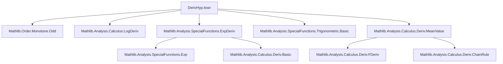
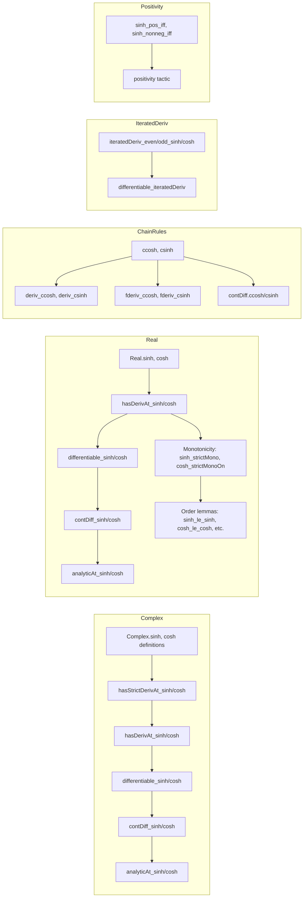

### Technical Brief: `DerivHyp.lean`

---

#### **1. Key Definitions & Theorems**

| Name | Type / Signature | Purpose |
|------|------------------|---------|
| `sinh`, `cosh` | `ℂ → ℂ` (or `ℝ → ℝ`) | Complex/real hyperbolic sine and cosine, defined via exponential: $\sinh x = \frac{e^x - e^{-x}}{2},\ \cosh x = \frac{e^x + e^{-x}}{2}$ |
| `hasStrictDerivAt_sinh`, `hasStrictDerivAt_cosh` | `HasStrictDerivAt sinh (cosh x) x`, `HasStrictDerivAt cosh (sinh x) x` | Establish strict differentiability and compute derivatives |
| `hasDerivAt_sinh`, `hasDerivAt_cosh` | `HasDerivAt sinh (cosh x) x`, `HasDerivAt cosh (sinh x) x` | Derivability (weaker than strict) and derivative values |
| `deriv_sinh`, `deriv_cosh` | `deriv sinh = cosh`, `deriv cosh = sinh` | Global derivative identities |
| `contDiff_sinh`, `contDiff_cosh` | `ContDiff ℂ n sinh`, `ContDiff ℝ n sinh`, etc. | Smoothness (infinitely differentiable) |
| `differentiable_sinh`, `differentiable_cosh` | `Differentiable ℂ sinh`, etc. | Global differentiability |
| `analyticAt_sinh`, `analyticAt_cosh` | `AnalyticAt ℂ sinh x`, etc. | Complex/real analyticity |
| `sinh_strictMono`, `cosh_strictMonoOn` | `StrictMono sinh`, `StrictMonoOn cosh (Ici 0)` | Monotonicity properties |
| `sinh_injective`, `sinh_inj`, `sinh_le_sinh`, etc. | Logical equivalences involving `sinh` | Order-theoretic characterizations |
| `iteratedDeriv_even_sinh`, `iteratedDeriv_odd_sinh`, etc. | `iteratedDeriv (2*n) sinh = sinh`, `iteratedDeriv (2*n+1) sinh = cosh`, etc. | Pattern of higher derivatives: periodic with period 4 |
| `logDeriv_cosh` | `logDeriv cosh = tanh` | Logarithmic derivative of `cosh` is `tanh` |
| `ccosh`, `csinh`, `cosh`, `sinh` (in chain rule lemmas) | e.g., `HasDerivAt.ccosh`, `HasDerivAt.sinh` | Chain rule lemmas for composite functions |

---

#### **2. Naming Conventions**

- **Prefixes**:
  - `hasStrictDerivAt_`, `hasDerivAt_`, `hasFDerivAt_`, `hasStrictFDerivAt_`: derivative existence at a point (Fréchet/strict variants).
  - `deriv_`, `derivWithin_`: derivative expressions.
  - `differentiable_`, `differentiableAt_`, `differentiableWithinAt_`: differentiability properties.
  - `contDiff_`, `contDiffAt_`, `contDiffOn_`, `contDiffWithinAt_`: smoothness.
  - `analytic_`, `analyticAt_`, `analyticWithinAt_`, `analyticOn_`, `analyticOnNhd_`: analyticity.
  - `isEquivalent_`: asymptotic equivalence (e.g., `sinh ~[𝓝 0] id`).
  - `ccosh`, `csinh`, `cosh`, `sinh`: chain rule lemmas for complex/real-valued functions.
  - `iteratedDeriv_`: higher-order derivative identities.

- **Suffixes**:
  - `_of_pos`, `_of_nonneg`, `_of_ne_zero`: positivity/nonnegativity/nonzero lemmas derived from assumptions.
  - `_iff_`: equivalence lemmas (e.g., `sinh_le_sinh`, `cosh_le_cosh`).

- **Function names**:
  - `sinh`, `cosh`, `tanh`: standard hyperbolic functions.
  - `ccosh`, `csinh`: complex-valued versions used in chain rule lemmas.
  - `Real.sinh`, `Complex.sinh`: namespace-qualified.

---

#### **3. Tactic Stack**

- **Core tactics**:
  - `simp`, `rw`, `convert`, `ext`, `induction`, `cases`
- **Analysis-specific**:
  - `exact`, `intro`, `refine`, `apply`, `assumption`
  - `conv`, `aesop`, `linarith`, `ring`, `abel`
  - ` positivity` (custom tactic for positivity of `sinh`)
- **Derivative/analysis lemmas**:
  - `hasDerivAt.comp`, `hasFDerivAt.comp`, `hasDerivWithinAt.comp_hasDerivWithinAt`, etc.
  - `differentiableAt.of_hasDerivAt`, `differentiableWithinAt.of_hasFDerivWithinAt`
  - `contDiff.comp`, `contDiffOn.comp_contDiffOn`, etc.

---

#### **4. Proof Logic**

- **Structure**:
  - **Base case**: Prove `hasStrictDerivAt_sinh` and `hasStrictDerivAt_cosh` using definitions and known derivative facts for `exp`.
  - **Derivative propagation**:
    - Use `hasStrictDerivAt → hasDerivAt`, `hasDerivAt → differentiableAt`, `contDiff_exp → contDiff_sinh/cosh`.
    - Chain rule lemmas (`comp`, `comp_hasFDerivAt`, etc.) extend to composite functions.
  - **Monotonicity**:
    - Use derivative sign: `strictMono_of_deriv_pos`, `strictMonoOn_of_deriv_pos`.
    - For `sinh`, derivative `cosh > 0` everywhere ⇒ strictly monotone.
    - For `cosh`, derivative `sinh` changes sign at 0 ⇒ monotone only on $[0, \infty)$.
  - **Higher derivatives**:
    - Induction on $n$ using recurrence: $\frac{d}{dx}\sinh = \cosh$, $\frac{d}{dx}\cosh = \sinh$.
    - Even derivatives return original function; odd derivatives swap `sinh`/`cosh`.
  - **Analyticity**:
    - Follows from `ContDiff → AnalyticAt` (in complex case), or `ContDiff ℝ n → AnalyticAt ℝ` (real analyticity via extension to complex).
  - **Positivity**:
    - Use `sinh_pos_iff`, `sinh_nonneg_iff`, etc., often via `positivity` tactic.

---

#### **5. Imports**

| Module | Purpose |
|--------|---------|
| `Mathlib.Order.Monotone.Odd` | Monotonicity and oddness properties (used for `sinh` monotonicity proofs) |
| `Mathlib.Analysis.Calculus.LogDeriv` | Logarithmic derivative (`logDeriv`) and `tanh` definitions |
| `Mathlib.Analysis.SpecialFunctions.ExpDeriv` | Derivatives of exponential function (used to derive `sinh`/`cosh` derivatives) |
| `Mathlib.Analysis.SpecialFunctions.Trigonometric.Basic` | Basic trigonometric function theory (contextual, not directly used) |
| `Mathlib.Analysis.Calculus.Deriv.MeanValue` | Mean value theorem (used for monotonicity proofs) |

---

#### **6. Mermaid Diagrams**

##### **Dependency Graph (Top-Level)**

##### **Overview of Theory Flow**

---

#### **7. Summary**

This file establishes a comprehensive calculus theory for hyperbolic functions (`sinh`, `cosh`, `tanh`) over both complex and real numbers. It proves:

- **Differentiability & smoothness**: everywhere differentiable, analytic, and $C^\infty$.
- **Derivative identities**: $\frac{d}{dx}\sinh = \cosh$, $\frac{d}{dx}\cosh = \sinh$, extended to chain rules and Fréchet derivatives.
- **Higher derivatives**: periodic pattern with period 4.
- **Monotonicity & order properties**: `sinh` strictly increasing, `cosh` increasing on $[0, \infty)$, with explicit order equivalences.
- **Positivity**: `sinh x` has same sign as `x`, used by `positivity` tactic.
- **Logarithmic derivative**: $\frac{d}{dx} \log(\cosh x) = \tanh x$.

The structure follows Lean’s analysis library conventions, leveraging existing results on `exp`, `logDeriv`, and monotonicity. The proofs are largely mechanical, relying on composition rules and induction for higher derivatives.

--- 

Let me know if you'd like a formal dependency graph (e.g., `.lean` file-level), or a proof sketch for a specific theorem.
