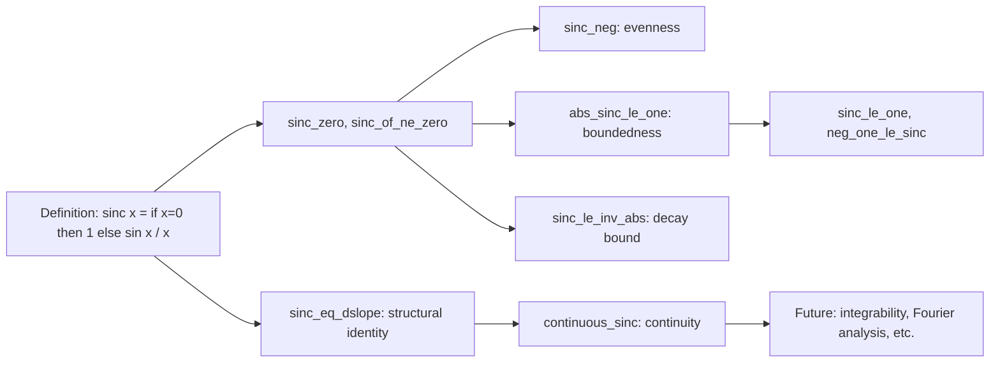

**Technical Brief: `Sinc.lean` Module**

---

### 1. **Key Definitions & Theorems**

| Name | Type / Signature | Purpose |
|------|------------------|---------|
| `sinc` | `ℝ → ℝ` | Defines the (unnormalized) sinc function: `sinc x = if x = 0 then 1 else sin x / x`. |
| `sinc_apply` | `sinc x = if x = 0 then 1 else sin x / x` | Definition unfolding lemma. |
| `sinc_zero` | `sinc 0 = 1` | Special case at 0. |
| `sinc_of_ne_zero` | `x ≠ 0 → sinc x = sin x / x` | Simplifies `sinc` away from 0. |
| `sinc_eq_dslope` | `sinc = dslope sin 0` | Identifies `sinc` as the derivative slope of `sin` at 0 (i.e., the *discrete slope*). |
| `sinc_neg` | `sinc (-x) = sinc x` | Evenness of sinc. |
| `abs_sinc_le_one` | `|sinc x| ≤ 1` | Boundedness of sinc by 1 in absolute value. |
| `sinc_le_one` | `sinc x ≤ 1` | Upper bound of sinc. |
| `neg_one_le_sinc` | `-1 ≤ sinc x` | Lower bound of sinc. |
| `sin_div_le_inv_abs` | `sin x / x ≤ |x|⁻¹` | Inequality for `sin x / x` (used in bounding). |
| `sinc_le_inv_abs` | `x ≠ 0 → sinc x ≤ |x|⁻¹` | Pointwise bound away from 0. |
| `continuous_sinc` | `Continuous sinc` | Main regularity result: sinc is continuous on ℝ. |

---

### 2. **Naming Conventions**

- **Prefixes**:
  - `sinc_`: for properties of the sinc function (`sinc_zero`, `sinc_neg`, `sinc_le_one`, etc.).
  - `abs_`: for absolute-value bounds (`abs_sinc_le_one`).
  - `sin_div_`: for inequalities involving `sin x / x` (`sin_div_le_inv_abs`).
- **Suffixes**:
  - `_le_one`, `_le_inv_abs`, `_of_ne_zero`: indicate the type of inequality or condition.
- **Special**:
  - `sinc_eq_dslope`: identifies structural equivalence (not just property).
  - `continuous_sinc`: follows `continuous_` pattern for regularity lemmas.

---

### 3. **Tactic Stack**

Frequently used tactics in proofs:

| Tactic | Usage |
|--------|-------|
| `by_cases` | To split on `x = 0` or `x ≠ 0`. |
| `simp` | Simplify using `sinc`, `sinc_zero`, `sinc_of_ne_zero`, `abs_div`, etc. |
| `rw` | Rewrite using equalities like `sinc_of_ne_zero`, `abs_div`, `div_eq_mul_inv`. |
| `refine` / `exact` | For structured proof construction (e.g., `refine div_le_of_le_mul₀ ...`). |
| `fun_prop` | Propagation of continuity facts (used in `continuous_sinc`). |
| `ring_nf`, `linarith` (implicit via `exact`/`linarith`-like goals) | For algebraic simplifications (e.g., `mul_inv_cancel₀`). |
| `rcases lt_trichotomy` | Case analysis on order of real numbers. |

---

### 4. **Proof Logic**

- **Structure**: Most proofs follow a *case split* on whether `x = 0` or `x ≠ 0`, leveraging `sinc_zero` and `sinc_of_ne_zero`.
- **Bounding arguments** (e.g., `abs_sinc_le_one`, `sinc_le_inv_abs`) use:
  - `abs_div`, `div_le_of_le_mul₀`, `one_mul`,
  - known bounds: `abs_sin_le_abs`, `sin_le_one`, `neg_one_le_sin`.
- **Continuity proof** (`continuous_sinc`):
  - Uses equivalence `sinc = dslope sin 0`.
  - Applies `continuous_iff_continuousAt`.
  - At `x = 0`: uses continuity of `dslope` at its base point.
  - At `x ≠ 0`: uses `continuousAt_dslope_of_ne`, then `fun_prop`.

---

### 5. **Imports & Dependencies**

| Import | Role |
|--------|------|
| `Mathlib.Analysis.SpecialFunctions.Trigonometric.Bounds` | Provides bounds on `sin`, e.g., `abs_sin_le_abs`, `sin_le_one`, `neg_one_le_sin`. |
| `Mathlib.Analysis.Calculus.DSlope` | Provides `dslope`, discrete slope operator, and continuity lemmas like `continuousAt_dslope_of_ne`. |

> **Note**: No explicit use of `Mathlib.Analysis.SpecialFunctions.Trigonometric.Basic` or `Mathlib.Topology.Basic` is visible, but they are implicitly needed (e.g., for `Continuous`, `abs`, `div` definitions).

---

### 6. **Mermaid Diagrams**

#### **Dependency Graph (Module-Level)**

```mermaid
graph TD
  A[Sinc.lean] --> B[Mathlib.Analysis.SpecialFunctions.Trigonometric.Bounds]
  A --> C[Mathlib.Analysis.Calculus.DSlope]
  B --> D[Trigonometric Bounds: sin, cos]
  C --> E[Discrete Slope dslope f a = (f x - f a)/(x - a) extended]
```

#### **Overview of `sinc` Theory Flow**



---

### 7. **Domain & Theory Scope**

- **Domain**: Real analysis, specifically:
  - Special functions (trigonometric),
  - Continuity and boundedness,
  - Calculus of discrete slopes.
- **Theory Context**:
  - Part of a larger effort to formalize Fourier analysis or signal processing foundations (sinc is central to sampling theory).
  - This module provides the *basic* analytic properties needed before deeper results (e.g., integrability, Fourier transform of sinc, Poisson summation).

--- 

Let me know if you'd like a formalization roadmap for extending this module (e.g., integrability, asymptotics, or complex sinc).
