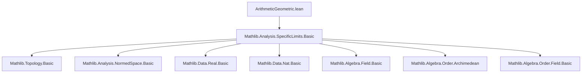
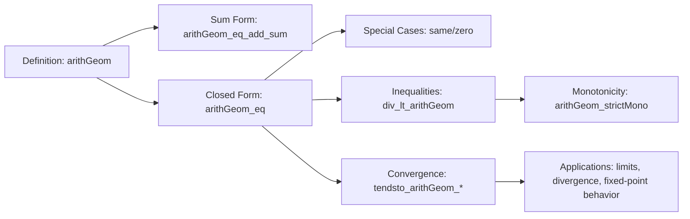

**Technical Brief: `ArithmeticGeometric.lean`**

---

### 1. **Key Definitions & Theorems**

| Name | Type / Signature | Purpose |
|------|------------------|---------|
| `arithGeom` | `[Mul R] [Add R] → R → R → R → ℕ → R` | Defines the arithmetic-geometric sequence via recurrence: $u_{n+1} = a \cdot u_n + b$ |
| `arithGeom_zero` | `arithGeom a b u₀ 0 = u₀` | Base case of the recurrence |
| `arithGeom_succ` | `arithGeom a b u₀ (n+1) = a * arithGeom a b u₀ n + b` | Recurrence step |
| `arithGeom_eq_add_sum` | `arithGeom a b u₀ n = a^n * u₀ + b * ∑_{k=0}^{n-1} a^k` | Closed-form as sum (valid in `CommSemiring`) |
| `arithGeom_eq` | `a ≠ 1 ⇒ arithGeom a b u₀ n = a^n * (u₀ - b/(1-a)) + b/(1-a)` | Explicit closed-form for $a \ne 1$ (in `Field`) |
| `arithGeom_same_eq_mul_div` | `a ≠ 1 ⇒ arithGeom a b b n = b * (a^{n+1} - 1)/(a - 1)` | Special case $u_0 = b$ expressed as rational function |
| `arithGeom_zero_eq_mul_div` | `a ≠ 1 ⇒ arithGeom a b 0 n = b * (a^n - 1)/(a - 1)` | Special case $u_0 = 0$ |
| `div_lt_arithGeom` | `0 < a ∧ a ≠ 1 ∧ b/(1-a) < u₀ ⇒ b/(1-a) < arithGeom a b u₀ n` | Lower bound preservation |
| `arithGeom_strictMono` | `1 < a ∧ b/(1-a) < u₀ ⇒ StrictMono (arithGeom a b u₀)` | Monotonicity under growth condition |
| `tendsto_arithGeom_atTop_of_one_lt` | `1 < a ∧ b/(1-a) < u₀ ⇒ Tendsto ... atTop atTop` | Divergence to $+\infty$ when $a > 1$ and initial value above fixed point |
| `tendsto_arithGeom_nhds_of_lt_one` | `0 ≤ a < 1 ⇒ Tendsto ... atTop (𝓝 (b/(1-a)))` | Convergence to fixed point $b/(1-a)$ when $0 ≤ a < 1$ |

---

### 2. **Naming Conventions**

- **Prefixes**:
  - `arithGeom_`: all definitions/lemmas related to the sequence.
  - `div_lt_`, `arithGeom_strictMono`: descriptive of properties (inequality, monotonicity).
- **Suffixes**:
  - `_eq`: closed-form equality.
  - `_eq_add_sum`: sum representation.
  - `_eq_mul_div`, `_eq_mul_div'`: rational closed-form (with `'` variant using $1-a$ denominator).
  - `_same`, `_zero`: special cases where $u_0 = b$ or $u_0 = 0$.
- **Logical suffixes**:
  - `_of_`, `_of_lt_one`, `_of_one_lt`: conditions on parameters (e.g., `of_one_lt` for $a > 1$).
  - `_nhds`, `_atTop`: target filter in convergence statements.

---

### 3. **Tactic Stack**

Frequently used tactics:
- `induction n with | zero | succ n hn => ...`
- `simp`, `rw`, `congr`, `ring`, `field`, `linarith`, `gcongr`
- `grind`: custom tactic (likely from Mathlib’s `Grind` module) for automated simplification of ring/field expressions.
- `conv_rhs => rw [...]`: for targeted rewriting on right-hand side of equations.
- `exact`, `refine`, `have h_lt : ...`, `calc`: for structured proofs.

---

### 4. **Proof Logic**

- **Inductive structure**: Most closed-form lemmas (`arithGeom_eq`, `div_lt_arithGeom`, etc.) use induction on `n`.
- **Case analysis on `a ≠ 1`**: Required for division by $1-a$; handled via `field [sub_ne_zero.mpr ha.symm]`.
- **Monotonicity proofs**:
  - Use `strictMono_nat_of_lt_succ`, requiring $u_{n+1} > u_n$.
  - Derive inequality via `div_lt_arithGeom` and `gcongr`.
- **Convergence proofs**:
  - Decompose using `arithGeom_eq'` into sum of vanishing term (`a^n * const`) and constant.
  - Apply known limits: `tendsto_pow_atTop_nhds_zero_of_lt_one` (for $|a| < 1$) and `tendsto_pow_atTop_atTop_of_one_lt` (for $a > 1$).
- **Archimedean assumption**: Used to lift real-like behavior (e.g., divergence to `atTop`).

---

### 5. **Imports & Dependencies**

- **Core imports**:
  ```lean
  import Mathlib.Analysis.SpecificLimits.Basic
  ```
- **Algebraic structures assumed**:
  - `[Mul R]`, `[Add R]`: for recurrence definition.
  - `[CommSemiring R]`: for sum-based closed forms.
  - `[Field R]`: for division-based closed forms.
  - `[LinearOrder R]`, `[IsStrictOrderedRing R]`: for monotonicity and inequality lemmas.
  - `[Archimedean R]`, `[TopologicalSpace R]`, `[OrderTopology R]`: for convergence results.

---

### 6. **Mermaid Diagrams**

#### **Dependency Graph (Module-Level)**



#### **Overview of Theory Flow**



---

### 7. **Domain Scope**

- **Mathematical domain**: Real (or ordered field) sequences defined by linear recurrences.
- **Applications**: Analysis of convergence/divergence, monotonicity, fixed points of affine maps $x \mapsto a x + b$.
- **Typical use cases**: Modeling compound interest with constant deposits/withdrawals, population models with immigration/emigration.

--- 

Let me know if you'd like a formalized dependency graph for the `arithGeom` family of lemmas or a proof sketch for a specific theorem.
