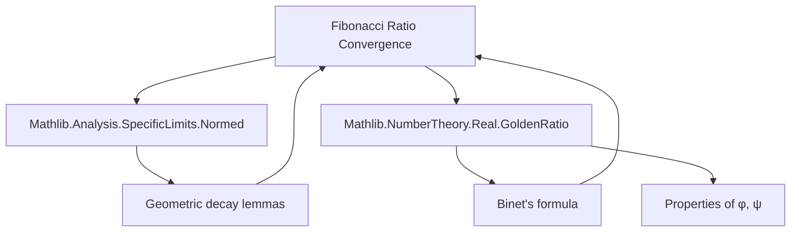
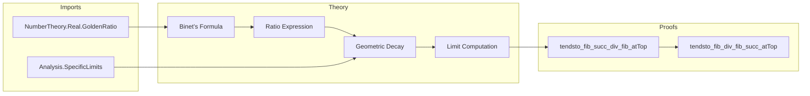

**Technical Brief: Fibonacci Ratio Convergence in Lean 4**

---

### 1. **Key Definitions & Theorems**

| Name | Type / Signature | Purpose |
|------|------------------|---------|
| `φ` (goldenRatio) | `ℝ` | The golden ratio, defined as $(1 + \sqrt{5}) / 2$ |
| `ψ` (goldenRatio_conj) | `ℝ` | The conjugate golden ratio, defined as $(1 - \sqrt{5}) / 2$ |
| `fib : ℕ → ℕ` | Function | Fibonacci sequence |
| `coe_fib_eq` | Lemma | Relates `fib n` to its real coercion: `↑(fib n) = (φ^n - ψ^n) / (φ - ψ)` |
| `tendsto_fib_succ_div_fib_atTop` | `Tendsto (fun n ↦ fib (n + 1) / fib n) atTop (𝓝 φ)` | Main theorem: ratio of consecutive Fibonacci numbers converges to `φ` |
| `tendsto_fib_div_fib_succ_atTop` | `Tendsto (fun n ↦ fib n / fib (n + 1)) atTop (𝓝 (-ψ))` | Consequence: reciprocal ratio converges to `-ψ` |

---

### 2. **Naming Conventions**

- **Prefixes**:
  - `tendsto_…_atTop`: Indicates convergence along the `atTop` filter (i.e., $n \to \infty$).
  - `coe_…`: Coercion lemmas (e.g., `coe_fib_eq`).
- **Suffixes**:
  - `_div_`: Denotes division-based expressions.
  - `_succ`: Denotes successor indices (`n + 1`).
- **Constants**:
  - `φ`, `ψ`: Standard notation for golden ratio and its conjugate.
  - `goldenRatio_pos`: Positivity of `φ`.
  - `inv_goldenRatio`: Identity for `1/φ`.

---

### 3. **Tactic Stack**

- `simp only [coe_fib_eq, pow_succ, div_pow]`: Simplify using Binet’s formula and algebraic rewrites.
- `field`: Apply field simplification (e.g., to rewrite division of expressions).
- `rw [abs_div, div_lt_one …, abs_of_pos, abs_lt]`: Manipulate absolute values and inequalities.
- `ring_nf`, `bound`: Normalize ring expressions and bound terms (used in `tendsto_pow_atTop_nhds_zero_of_abs_lt_one`).
- `tendsto_pow_atTop_nhds_zero_of_abs_lt_one`: Apply known result about geometric decay.
- `convert … using 2`: Use conversion with flexibility in proof goals.
- `inv_div`, `inv_goldenRatio`: Rewriting lemmas for inverses.
- `const_sub`, `const_mul`, `div`: Apply continuity lemmas for limits under arithmetic operations.

---

### 4. **Proof Logic**

- **Main theorem (`tendsto_fib_succ_div_fib_atTop`)**:
  1. Express `fib (n+1) / fib n` using **Binet’s formula** (`coe_fib_eq`) → rational function in `φ`, `ψ`.
  2. Show that $(\psi / \phi)^n \to 0$ as $n \to \infty$ (since $|\psi / \phi| < 1$).
  3. Use continuity of arithmetic operations to deduce the limit is $(\phi - 0)/(1 - 0) = \phi$.

- **Corollary (`tendsto_fib_div_fib_succ_atTop`)**:
  1. Use `inv₀` (inverse of a convergent sequence) on the previous theorem.
  2. Simplify using algebraic identities: `inv_div`, `inv_goldenRatio`, and known value of $1/\phi = -\psi$.

---

### 5. **Imports & Dependencies**

| Import | Role |
|--------|------|
| `Mathlib.Analysis.SpecificLimits.Normed` | Provides tools for limits in normed spaces, especially `tendsto_pow_atTop_nhds_zero_of_abs_lt_one`. |
| `Mathlib.NumberTheory.Real.GoldenRatio` | Defines `φ`, `ψ`, their algebraic properties, positivity, and inverse identities. |

---

### 6. **Mermaid Diagrams**

#### **Dependency Graph**

#### **Overview of File Structure**

---

### 7. **Key Identities Used**

- **Binet’s formula** (coerced):
  $$
  \text{fib}(n) = \frac{\varphi^n - \psi^n}{\varphi - \psi}
  $$
- **Ratio simplification**:
  $$
  \frac{\text{fib}(n+1)}{\text{fib}(n)} = \frac{\varphi - \psi (\psi/\varphi)^n}{1 - (\psi/\varphi)^n}
  $$
- **Geometric decay**:
  $$
  \left|\frac{\psi}{\varphi}\right| < 1 \implies \left(\frac{\psi}{\varphi}\right)^n \to 0
  $$
- **Inverse golden ratio**:
  $$
  \frac{1}{\varphi} = -\psi
  $$

--- 

Let me know if you'd like a formalization of Binet’s formula or a generalization to Lucas sequences.
