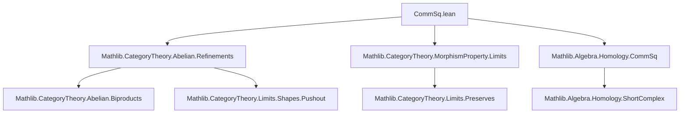

### Technical Brief: `CommSq.lean` (Pushout/Pullback Exact Sequences in Abelian Categories)

---

#### **1. Key Definitions & Theorems**

| Name | Type / Signature | Purpose |
|------|------------------|---------|
| `IsPushout` | `t : X₁ ⟶ X₂`, `l : X₁ ⟶ X₃`, `r : X₂ ⟶ X₄`, `b : X₃ ⟶ X₄` → `Prop` | Encodes the universal property of a pushout square in `C`. |
| `IsPullback` | Same as above | Encodes the universal property of a pullback square. |
| `h.shortComplex` | `ShortComplex C` | The complex $X₁ \xrightarrow{(l, -t)} X₂ ⊞ X₃ \xrightarrow{[r, b]} X₄$ associated to a pushout square. |
| `h.shortComplex'` | `ShortComplex C` | The dual complex $X₁ \xrightarrow{⟨t, l⟩} X₂ ⊞ X₃ \xrightarrow{[r, b]} X₄$ for a pullback square. |
| `exact_shortComplex` | `h : IsPushout t l r b ⇒ h.shortComplex.Exact` | The pushout complex is exact at $X₂ ⊞ X₃$ and $X₄$; i.e., $X₁ → X₂ ⊞ X₃ → X₄ → 0$ is exact. |
| `exact_shortComplex'` | `h : IsPullback t l r b ⇒ h.shortComplex'.Exact` | The pullback complex is exact at $X₁$ and $X₂ ⊞ X₃$; i.e., $0 → X₁ → X₂ ⊞ X₃ → X₄$ is exact. |
| `hom_eq_add_up_to_refinements` | `IsPushout ⇒ ∀ x₄ : T ⟶ X₄, ∃ π : T' ⟶ T$ epi, x₂, x₃, π ≫ x₄ = x₂ ≫ r + x₃ ≫ b` | Characterizes epimorphicity of $[r, b] : X₂ ⊞ X₃ → X₄$ via “up-to-refinement” additive factorization. |
| `mono_of_isPullback_of_mono` | `IsPushout + IsPullback + Mono r' ⇒ Mono k` | A lifting lemma: if a pushout square and a pullback square share edges and the outer map is mono, then the mediating map $k : X₄ → X₅$ is mono. |
| `mono_cokernel_map_of_isPullback` | `IsPullback ⇒ Mono (cokernel.map _ _ _ _ sq.w)` | The induced map on cokernels is mono. |
| `epi_kernel_map_of_isPushout` | `IsPushout ⇒ Epi (kernel.map _ _ _ _ sq.w)` | The induced map on kernels is epi. |

---

#### **2. Naming Conventions**

- **Prefixes**:
  - `is_`: for properties of diagrams (`IsPushout`, `IsPullback`)
  - `exact_`: for exactness of complexes (`exact_shortComplex`, `exact_shortComplex'`)
  - `hom_`: for morphism factorization lemmas (`hom_eq_add_up_to_refinements`)
  - `epi_`, `mono_`: for properties of induced maps (`epi_kernel_map_of_isPushout`, `mono_cokernel_map_of_isPullback`)
- **Suffixes**:
  - `_up_to_refinements`: for statements involving epimorphic precomposition to achieve equality.
  - `_assoc`: for associativity rewrites (e.g., `reassoc_of% hx₂'`)
  - `_fst`, `_snd`: for projections from biproducts (`biprod.fst`, `biprod.snd`)
  - `_inr`, `_inl`: for biproduct injections.

---

#### **3. Tactic Stack**

| Tactic | Usage Frequency | Purpose |
|--------|-----------------|---------|
| `simp` / `simp only` | Very High | Simplify biproduct morphisms, zero morphisms, associativity, and universal properties. |
| `rw` / `rfl` | High | Rewrite using hypotheses, definitions, and equalities (e.g., `fac₁`, `fac₂`). |
| `obtain ⟨…⟩` | High | Extract data from existential or universal properties (e.g., `surjective_up_to_refinements_of_epi`, `IsPullback.lift`, `exists_lift`). |
| `congr` | Medium | Prove equality of sums by splitting into components. |
| `cat_disch` | Medium | Category-theoretic discharge tactic (likely custom or from `Mathlib.CategoryTheory`). |
| `ext` | Medium | Extensionality for morphisms (e.g., biproducts, kernels/cokernels). |
| `aesop` | Not present | Not used — proofs are highly structured and manual. |
| `ring` | Not present | Not needed — additive structure handled via `Preadditive` lemmas. |

---

#### **4. Proof Logic**

- **Structure**: Proofs are largely *diagram-chasing* style, leveraging:
  - **Abelianness**: existence of kernels/cokernels, exactness, biproducts.
  - **Universal properties**: pushout/pullback lifting/uniqueness.
  - **Refinements**: use of epimorphic precompositions to simulate surjectivity/injectivity in absence of concrete elements.

- **Typical Flow**:
  1. Use `IsPushout`/`IsPullback` to get short complexes.
  2. Prove exactness via `exact_of_g_is_cokernel` / `exact_of_f_is_kernel`.
  3. For lifting/lifting-up-to-refinement lemmas:
     - Apply `surjective_up_to_refinements_of_epi` (for epis) or dual (for monos).
     - Use biproduct projections/injections to decompose morphisms.
     - Apply universal property (e.g., `IsPullback.lift`, `IsPushout.lift`) to glue components.
  4. Cancel epis/monos at the end using `cancel_epi`, `mono_iff_cancel_zero`.

- **Induction**: Not used — all arguments are categorical/universal.

---

#### **5. Imports & Dependencies**

| Module | Role |
|--------|------|
| `Mathlib.CategoryTheory.Abelian.Refinements` | Provides `surjective_up_to_refinements_of_epi`, `exact_up_to_refinements`, and stability lemmas for monos/epis under (co)base change. |
| `Mathlib.CategoryTheory.MorphismProperty.Limits` | Defines `MorphismProperty`, `IsStableUnderBaseChange`, `IsStableUnderCobaseChange`. |
| `Mathlib.Algebra.Homology.CommSq` | Defines `CommSq`, `shortComplex`, `shortComplex'`, and basic constructions for commutative squares. |

---

#### **6. Theory Overview & Dependency Diagram**

##### **High-Level Theory Flow**

```
Abelian Category C
│
├─ Pushout Squares → shortComplex → exactness → epi of g
│   ├─ hom_eq_add_up_to_refinements (epi characterization)
│   └─ epi_kernel_map_of_isPushout (kernel map epi)
│
├─ Pullback Squares → shortComplex' → exactness → mono of f
│   └─ mono_cokernel_map_of_isPullback (cokernel map mono)
│
└─ Interactions:
     IsPushout + IsPullback + Mono → Mono (lifting lemma)
```

##### **Mermaid Diagrams**

**Dependency Graph (Module Level)**



**Diagrammatic Overview of Main Results**

```mermaid
graph LR
  subgraph Pushout
    X1[X₁] -->|t| X2[X₂]
    V|l| V
    X3[X₃] -->|b| X4[X₄]
  end

  subgraph Pullback
    X1[X₁] -->|t| X2[X₂]
    V|l| V
    X3[X₃] -->|b| X4[X₄]
  end

  Pushout -->|exact_shortComplex| Complex1["X₁ → X₂ ⊞ X₃ → X₄ → 0"]
  Pullback -->|exact_shortComplex'| Complex2["0 → X₁ → X₂ ⊞ X₃ → X₄"]

  Complex1 -->|epi_kernel_map_of_isPushout| KernelMap["ker(t) ↠ ker(b)"]
  Complex2 -->|mono_cokernel_map_of_isPullback| CokernelMap["coker(l) ↣ coker(r)"]
```

---

#### **7. Summary**

This file formalizes foundational homological algebra in abelian categories: the exactness of the canonical complexes attached to pushout and pullback squares, and the behavior of induced maps on kernels/cokernels. It uses *refinement-based* reasoning (epi precompositions) to emulate element-wise arguments, a common technique in formalized category theory. The lemmas are tightly interlinked, with `IsPushout` and `IsPullback` serving as the central combinatorial objects, and `Abelian` providing the necessary structural lemmas (e.g., stability of monos/epis under (co)base change).
