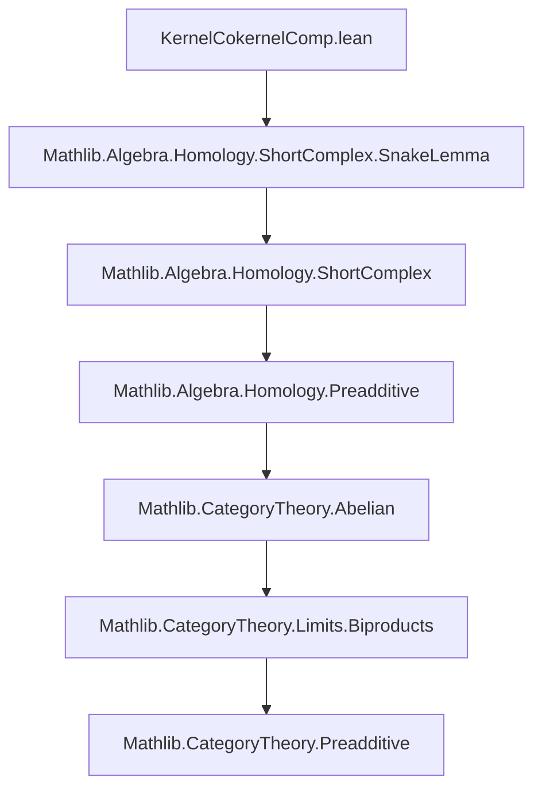
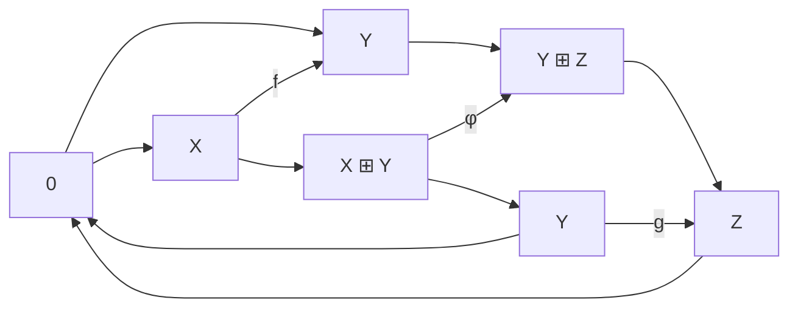

### Technical Brief: `KernelCokernelComp.lean`

---

#### **1. Key Definitions & Theorems**

| Name | Type / Purpose |
|------|----------------|
| `ι f g : kernel (f ≫ g) ⟶ X ⊞ Y` | Embeds kernel of composite into biproduct via $x \mapsto (x, f(x))$. |
| `φ f g : X ⊞ Y ⟶ Y ⊞ Z` | Matrix morphism $\begin{pmatrix} f & -1 \\ 0 & g \end{pmatrix}$, used to set up snake lemma diagram. |
| `π f g : Y ⊞ Z ⟶ cokernel (f ≫ g)` | Maps $(y,z) \mapsto [g(y)] + [z]$ in cokernel of composite. |
| `ι_φ : ι f g ≫ φ f g = 0` | Verifies that image of `ι` lies in kernel of `φ`. |
| `φ_π : φ f g ≫ π f g = 0` | Verifies image of `φ` lies in kernel of `π`. |
| `isLimit : IsLimit (KernelFork.ofι _ (ι_φ f g))` | Shows $\ker \varphi \cong \ker(f \circ g)$. |
| `isColimit : IsColimit (CokernelCofork.ofπ _ (φ_π f g))` | Shows $\operatorname{coker} \varphi \cong \operatorname{coker}(f \circ g)$. |
| `snakeInput f g : ShortComplex.SnakeInput C` | Constructs the morphism of short exact sequences needed for Snake Lemma. |
| `δ f g : kernel g ⟶ cokernel f` | Connecting homomorphism from Snake Lemma; explicitly: $-\ker(g) \xrightarrow{\iota_g} Y \xrightarrow{\pi_f} \operatorname{coker}(f)$. |
| `δ_fac : δ f g = - kernel.ι g ≫ cokernel.π f` | Explicit formula for connecting map. |
| `kernelCokernelCompSequence f g : ComposableArrows C 5` | Long exact sequence:  
  $0 \to \ker f \to \ker(fg) \to \ker g \to \operatorname{coker} f \to \operatorname{coker}(fg) \to \operatorname{coker} g \to 0$. |
| `kernelCokernelCompSequence_exact` | Proof that the constructed sequence is exact (via Snake Lemma). |

---

#### **2. Naming Conventions**

- **Prefixes:**
  - `ι_`, `φ_`, `π_`: Standard notation for inclusion, middle map, projection in biproduct-based constructions.
  - `isLimit`, `isColimit`: Prove universal properties identifying kernels/cokernels.
  - `snakeInput`: Input to Snake Lemma.
  - `δ`: Connecting morphism.
- **Suffixes:**
  - `_f_g`: Parameters `f`, `g` are often implicit in typeclass inference but made explicit in definitions.
  - `_assoc`: Used in `reassoc` lemmas for associativity rewriting (e.g., `φ_snd_assoc`).
- **Structure names:**
  - `kernelCokernelCompSequence`: Composite kernel-cokernel long exact sequence.

---

#### **3. Tactic Stack**

| Tactic | Usage Frequency | Purpose |
|--------|------------------|---------|
| `simp` / `simp_rw` | Very High | Simplify using `reassoc` lemmas, biproduct projections/inclusions. |
| `aesop` | High | Solve equalities involving zero morphisms, biproducts, and additive structure. |
| `ext` | Medium | Extensionality for biproduct morphisms (component-wise equality). |
| `obtain ⟨…⟩ := biprod.decomp_hom_to/from k` | Medium | Decompose morphisms into biproduct components. |
| `infer_instance` | Medium | Prove monomorphism/epimorphism instances. |
| `dsimp` | Medium | Simplify definitions before applying lemmas. |
| `rw [...] at hk` | Medium | Rewrite hypotheses using biproduct properties. |
| `exact ...` / `refine ⟨...⟩` | Medium | Construct witnesses for limits/colimits. |

---

#### **4. Proof Logic**

The proof proceeds in three main phases:

1. **Setup of Diagram:**
   - Define maps $\iota$, $\varphi$, $\pi$ between biproducts.
   - Show $\iota \varphi = 0$, $\varphi \pi = 0$.
   - Prove $\iota$ mono, $\pi$ epi.

2. **Identify Kernels/Cokernels:**
   - Use `isLimit` and `isColimit` to show:
     $$
     \ker(\varphi) \cong \ker(fg), \quad \operatorname{coker}(\varphi) \cong \operatorname{coker}(fg).
     $$
   - These rely on biproduct decomposition and universal properties.

3. **Apply Snake Lemma:**
   - Construct `snakeInput`, a morphism of short exact sequences:
     $$
     \begin{tikzcd}
     0 \arrow[r] & X \arrow[r] \arrow[d,"f"] & X \oplus Y \arrow[r] \arrow[d,"\varphi"] & Y \arrow[r] \arrow[d,"g"] & 0 \\
     0 \arrow[r] & Y \arrow[r] & Y \oplus Z \arrow[r] & Z \arrow[r] & 0
     \end{tikzcd}
     $$
   - Apply `SnakeLemma.snake_lemma` to get long exact sequence in homology:
     $$
     0 \to \ker f \to \ker(fg) \to \ker g \to \operatorname{coker} f \to \operatorname{coker}(fg) \to \operatorname{coker} g \to 0.
     $$

---

#### **5. Imports & Dependencies**

- **Primary Import:**
  ```lean
  import Mathlib.Algebra.Homology.ShortComplex.SnakeLemma
  ```
- **Core Libraries Used:**
  - `Mathlib.CategoryTheory.Limits.Types` (via `Limits`)
  - `Mathlib.CategoryTheory.Preadditive` (for additive structure)
  - `Mathlib.CategoryTheory.Abelian` (abelian category axioms)
  - `Mathlib.CategoryTheory.Biproducts` (biproducts, biprod.*)

---

#### **6. Mermaid Diagrams**

##### **Dependency Graph (Module Level)**



##### **Overview of Theoretical Flow**

```mermaid
graph LR
  A[Composable f: X→Y, g: Y→Z] --> B[Define ι, φ, π]
  B --> C[Show ιφ = 0, φπ = 0]
  C --> D[Prove ker φ ≅ ker(fg), coker φ ≅ coker(fg)]
  D --> E[Build snakeInput: morphism of SES]
  E --> F[Apply Snake Lemma]
  F --> G[Long exact sequence in kernels/cokernels]
```

##### **Snake Input Diagram (Morphism of SES)**



---

#### **7. Summary**

This file formalizes a classical homological algebra result: the long exact sequence in kernel and cokernel for a composition of morphisms in an abelian category. It leverages the **Snake Lemma** applied to a carefully constructed morphism of split short exact sequences involving biproducts. The key technical work lies in verifying that the middle term’s kernel and cokernel match those of the composite morphism — done via biproduct calculus and universal properties.

The formalization is clean, modular, and follows Lean’s homological algebra conventions (e.g., `ShortComplex`, `SnakeInput`, `δ`). It serves as a foundational ingredient for more advanced results like the long exact sequence of homology associated to a mapping cone or distinguished triangles.
