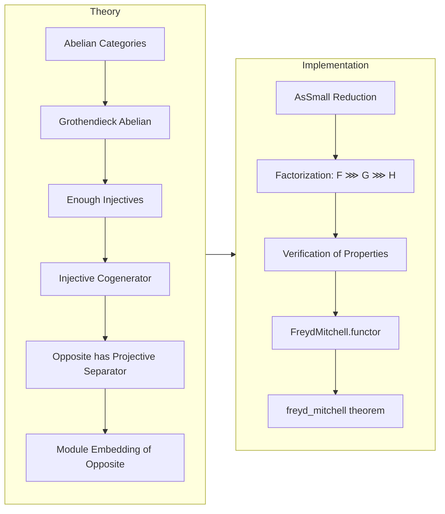

### Technical Brief: Freyd-Mitchell Embedding Theorem in Lean 4 (`FreydMitchell.lean`)

---

#### **1. Key Definitions & Theorems**

| Name | Type / Signature | Purpose |
|------|------------------|---------|
| `EmbeddingRing C` | `Type (max u v)` | A ring constructed from an injective cogenerator in a Grothendieck abelian category, used to embed `C` into modules over it. |
| `functor C` | `C ⥤ ModuleCat.{max u v} (EmbeddingRing C)` | The full, faithful, and exact embedding functor guaranteed by the Freyd–Mitchell theorem. |
| `freyd_mitchell` | `∃ R, Ring R, ∃ F : C ⥤ Module R, F.Full ∧ F.Faithful ∧ PreservesFiniteLimits F ∧ PreservesFiniteColimits F` | The formal statement of the Freyd–Mitchell embedding theorem: existence of such an embedding. |

**Auxiliary definitions (internal to proof):**
- `F C := AsSmall.equiv.functor`: Equivalence from `C` to its small reflection `AsSmall.{max u v} C`.
- `G C := Ind.yoneda.rightOp`: Right-op of the Ind-completion Yoneda embedding `AsSmall Cᵒᵖ → Ind (AsSmall Cᵒᵖ)`.
- `H C := IsGrothendieckAbelian.OppositeModuleEmbedding.embedding (G C)`: Module embedding from the opposite of a Grothendieck abelian category.

---

#### **2. Naming Conventions**

- **Prefixes:**
  - `is_`: e.g., `IsGrothendieckAbelian` — typeclass for Grothendieck abelian categories.
  - `FreydMitchell.`: Module namespace for the embedding construction.
  - `OppositeModuleEmbedding.`: For embeddings of opposite Grothendieck categories into module categories.
- **Suffixes:**
  - `embedding`: Refers to the module embedding functor (e.g., `embedding`, `faithful_embedding`, `full_embedding`).
  - `rightOp`: For functors constructed via `opposite.opposite` (e.g., `rightOp` on `Ind.yoneda`).
- **Other:**
  - `AsSmall`: For embedding large categories into small ones via equivalence.
  - `Ind`: For the Ind-completion construction.

---

#### **3. Tactic Stack**

The proofs rely heavily on:
- `infer_instance`: To discharge typeclass goals (e.g., `Faithful`, `Full`, `PreservesFiniteLimits`).
- `rw [functor]`, `rw [F]`, `rw [G]`, `rw [H]`: To unfold definitions and apply lemmas about components.
- `apply preservesFiniteLimits_rightOp`, `apply preservesFiniteColimits_rightOp`: To transfer limit/colimit preservation across `opposite.opposite`.
- `aesop`: Likely used for routine category-theoretic reasoning (not explicit in snippet, but standard in Mathlib).
- `simp_rw`: Possibly used for simplification with rewrite rules (standard in modern Mathlib proofs).

---

#### **4. Proof Logic**

The proof follows a layered decomposition:

1. **Reduction to small case**: Use `AsSmall.{max u v} C` to reduce to the small case (Lean handles size issues via universe lifting).
2. **Factorization of the embedding**:
   - `F`: Equivalence `C ≃ AsSmall C`
   - `G`: Yoneda embedding `AsSmall C → Ind (AsSmall C)` (then `rightOp` to land in `(Ind Cᵒᵖ)ᵒᵖ`)
   - `H`: Module embedding from `(Ind Cᵒᵖ)ᵒᵖ → Module R`, where `R = EmbeddingRing C`
3. **Verification of properties**:
   - Faithfulness, fullness, and exactness (limit/colimit preservation) are shown componentwise using:
     - `AsSmall.equiv.functor` is an equivalence ⇒ fully faithful & exact.
     - Yoneda embeddings are fully faithful & preserve limits/colimits.
     - `OppositeModuleEmbedding.embedding` is known to be fully faithful and exact (from prior lemmas).
4. **Conclusion**: Combine via `infer_instance` to lift properties through composition.

---

#### **5. Imports & Dependencies**

**Core imports:**
```lean
public import Mathlib.CategoryTheory.Abelian.GrothendieckCategory.ModuleEmbedding.Opposite
public import Mathlib.CategoryTheory.Abelian.GrothendieckAxioms.Indization
```

**Key underlying theories:**
- `Mathlib.CategoryTheory.Abelian.GrothendieckCategory.ModuleEmbedding.Opposite`: Constructs the module embedding for `Dᵒᵖ` where `D` is Grothendieck abelian with an injective cogenerator.
- `Mathlib.CategoryTheory.Abelian.GrothendieckAxioms.Indization`: Shows `Ind C` is Grothendieck abelian and equivalent to `LeftExactFunctors C Ab`.
- `Mathlib.CategoryTheory.Generator.Abelian`: Proves existence of injective cogenerators in Grothendieck abelian categories.
- `Mathlib.CategoryTheory.Abelian.Yoneda`: Shows Hom-functors from projective separators are full, faithful, and exact.

---

#### **6. Mermaid Diagrams**

##### **Dependency Graph (High-Level)**

```mermaid
graph TD
  A[Abelian Category C] --> B[AsSmall.{max u v} C]
  B --> C[Ind (AsSmall Cᵒᵖ)]
  C --> D[(Ind (AsSmall Cᵒᵖ))ᵒᵖ]
  D --> E[ModuleCat (EmbeddingRing C)]

  B -->|FreydMitchell.F| C
  C -->|FreydMitchell.G| D
  D -->|FreydMitchell.H| E

  E --> F[Module Embedding Theorem]
  C -->|Indization| G[Grothendieck Abelian]
  G --> H[Injective Cogenerator]
  H --> I[Projective Separator in Opposite]
  I --> J[Hom(G, -) is Full/Faithful/Exact]
  J --> E
```

##### **Overview of File Structure**



---

#### **7. Summary**

This file formalizes the Freyd–Mitchell embedding theorem in Lean 4, constructing a full, faithful, and exact embedding of any abelian category `C` into modules over a suitably constructed ring. The construction leverages:
- Ind-completion to obtain a Grothendieck abelian category,
- Yoneda embedding to embed into a presheaf category,
- Module embedding from the opposite of a Grothendieck category (via injective cogenerator),
- Size tricks (`AsSmall`) to avoid smallness assumptions.

The proof is modular and builds on a chain of previously established results in Mathlib, reflecting the modern Lean approach to category theory: decompose complex theorems into reusable components.
