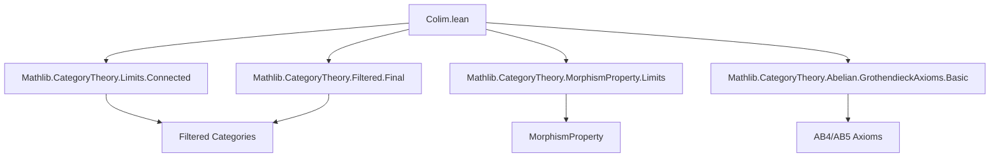
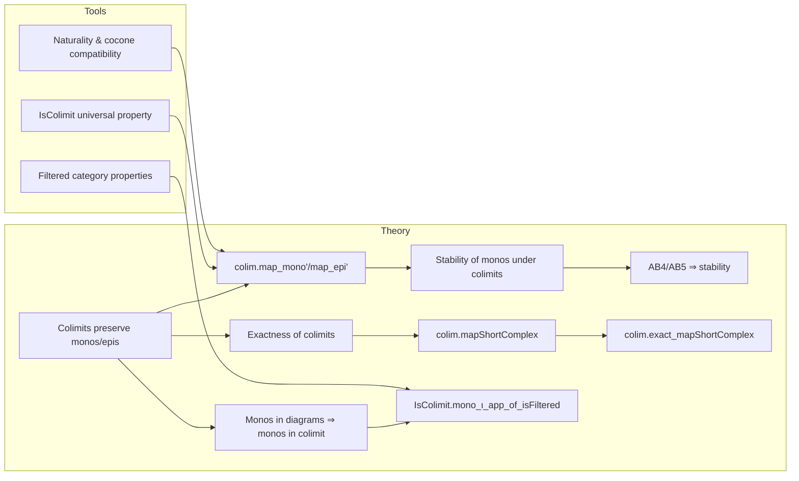

Here is the structured technical metadata extracted from `Colim.lean`:

---

### **1. Key Definitions & Theorems**

| Name | Type / Signature | Purpose |
|------|------------------|---------|
| `colim.map_mono'` | `{X₁ X₂ : J ⥤ C} → (φ : X₁ ⟶ X₂) → Mono φ → (c₁ : Cocone X₁) → IsColimit c₁ → (c₂ : Cocone X₂) → IsColimit c₂ → (f : c₁.pt ⟶ c₂.pt) → (∀ j, c₁.ι.app j ≫ f = φ.app j ≫ c₂.ι.app j) → Mono f` | Shows that a morphism `f` between colimit cocones induced by a monic natural transformation `φ` is itself monic, assuming `colim` preserves monos. |
| `colim.map_epi'` | `{X₁ X₂ : J ⥤ C} → (φ : X₁ ⟶ X₂) → (∀ j, Epi (φ.app j)) → (c₁ : Cocone X₁) → (c₂ : Cocone X₂) → IsColimit c₂ → (f : c₁.pt ⟶ c₂.pt) → (∀ j, c₁.ι.app j ≫ f = φ.app j ≫ c₂.ι.app j) → Epi f` | Shows that `f` is epic if `φ` is pointwise epic and `c₂` is a colimit cocone. |
| `IsColimit.mono_ι_app_of_isFiltered` | `{X : J ⥤ C} → (∀ j j' φ, Mono (X.map φ)) → IsColimit c → IsFiltered J → (j₀ : J) → [(colim : (Under j₀ ⥤ C) ⥤ C).PreservesMonomorphisms] → Mono (c.ι.app j₀)` | Proves that the structure map `c.ι.app j₀` into the colimit is monic when the diagram consists of monos, `J` is filtered, and colimits over `Under j₀` preserve monos (e.g., AB5). |
| `colim.mapShortComplex` | `def` | Constructs a short complex in `C` from a short exact complex `S` in `J ⥤ C` and colimit cocones, using the universal property. |
| `colim.exact_mapShortComplex` | `lemma` | Shows that if `S` is exact in `J ⥤ C`, then the induced short complex in `C` (via colimits) is exact, assuming `colim` preserves exactness (`HasExactColimitsOfShape J C`). |
| `isStableUnderColimitsOfShape_monomorphisms` | `instance` | Shows that monomorphisms are stable under colimits of shape `J` if `colim` preserves monos. |
| `isStableUnderCoproducts_monomorphisms` | `instance` | AB4 implies monos stable under coproducts. |
| `isStableUnderFilteredColimits_monomorphisms` | `instance` | AB5 implies monos stable under filtered colimits. |

---

### **2. Naming Conventions**

- **Prefixes**:
  - `colim.`: for lemmas about colimits (e.g., `colim.map_mono'`, `colim.exact_mapShortComplex`)
  - `isStableUnder...`: for stability properties of morphism classes under limits/colimits.
  - `mono_`, `epi_`: for properties of monos/epis (e.g., `Mono`, `Epi`, `mono_ι_app_of_isFiltered`)
- **Suffixes**:
  - `'` (prime): often used for variants of a lemma using arbitrary cocones instead of canonical colimit cocones (e.g., `map_mono'` vs. `map_mono`).
  - `app`: for components of natural transformations at objects (e.g., `φ.app j`, `c.ι.app j`).
- **`IsColimit`**: used for cocones that are colimits.
- **`ShortComplex`**: used for 3-term complexes `X₁ → X₂ → X₃` with zero composite.

---

### **3. Tactic Stack**

Frequently used tactics in proofs:

| Tactic | Usage |
|--------|-------|
| `refine` / `exact` | To construct proofs by matching goal structure. |
| `rw [...]` | Rewriting using naturality, colimit cocone equations, and universal properties. |
| `dsimp` | Simplifying definitions (e.g., unfolding `coconePointUniqueUpToIso`, `ι_colimMap`). |
| `simp [hφ]` | Simplifying using hypotheses (e.g., `hf`, `hφ`). |
| `cat_disch` | Category-theoretic tactic for discharging diagrammatic equations. |
| `assumption` / `infer_instance` | For typeclass resolution (e.g., `inferInstanceAs (Mono ...)`). |
| `hom_ext` | To prove equality of cocone morphisms by extensionality (pointwise equality). |
| `reassoc_of%` / `cancel_epi` / `cancel_mono` | Rewriting associativity or using cancellation lemmas. |
| `rw [← cancel_epi ...]` | To cancel epimorphisms on left. |

---

### **4. Proof Logic**

- **Inductive/structural reasoning**:
  - Proofs rely heavily on the **universal property of colimits**, especially `IsColimit.coconePointUniqueUpToIso` and `hom_ext`.
  - Many proofs reduce to checking pointwise properties (e.g., `∀ j, ...`) and then lifting via colimit universal property.
- **Common pattern**:
  1. Use naturality or compatibility condition (`hf`, `hg`) to relate `f` to diagram maps.
  2. Apply known results about `colim.map φ` (e.g., `Mono (colim.map φ)`).
  3. Use `coconePointUniqueUpToIso` to relate `f` to `colim.map φ`.
  4. Conclude via `mono`/`epi` stability or cancellation.
- **Filtered case**:
  - Uses `Under j₀` to localize the diagram around an object.
  - Constructs a constant diagram morphism `const (X j₀) ⟶ Under.forget j₀ ⋙ X`.
  - Applies `colim.map_mono'` to the induced map.

---

### **5. Imports**

| Module | Purpose |
|--------|---------|
| `Mathlib.CategoryTheory.Filtered.Final` | For filtered categories and final functors (used in `Under j₀` arguments). |
| `Mathlib.CategoryTheory.Limits.Connected` | For properties of connected diagrams (used in filtered case). |
| `Mathlib.CategoryTheory.MorphismProperty.Limits` | For `MorphismProperty` infrastructure (e.g., `IsStableUnderColimitsOfShape`). |
| `Mathlib.CategoryTheory.Abelian.GrothendieckAxioms.Basic` | For AB4/AB5 axioms and their consequences (e.g., stability of monos under coproducts/filtered colimits). |

---

### **6. Mermaid Diagrams**

#### **Dependency Graph (High-Level)**

#### **Overview of File Structure**

---

Let me know if you'd like a formalized dependency graph in Lean or a more detailed tactic-level proof sketch.
