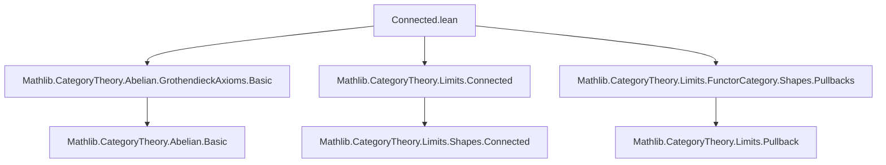
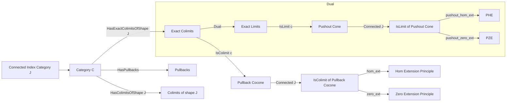

### Technical Brief: `Connected.lean`

---

#### **1. Key Definitions & Theorems**

| Name | Type | Purpose |
|------|------|---------|
| `IsColimit.pullbackOfHasExactColimitsOfShape` | `IsColimit (Cocone.mk _ (pullback.snd c.ι ((Functor.const J).map f)))` | Constructs a new colimit cocone by pulling back a given colimit cocone `c` along a morphism `f : X ⟶ c.pt`, assuming `J` connected and `C` has exact colimits of shape `J`. |
| `IsColimit.pullback_hom_ext` | `(∀ j, pullback.snd (c.ι.app j) f ≫ f ≫ g = pullback.snd (c.ι.app j) f ≫ f ≫ h) → f ≫ g = f ≫ h` | Hom-extension principle: equality of morphisms out of a colimit factor through `f` can be detected after pulling back along all colimit inclusions, under connectedness. |
| `IsColimit.pullback_zero_ext` | `(∀ j, pullback.snd (c.ι.app j) f ≫ f ≫ g = 0) → f ≫ g = 0` | Vanishing criterion: a morphism `f ≫ g` factoring through a connected colimit is zero if all pullbacks are zero. |
| `IsLimit.pushoutOfHasExactLimitsOfShape` | `IsLimit (Cone.mk _ (pushout.inr c.π ((Functor.const J).map f)))` | Dual construction: pushout of a limit cone along `f : c.pt ⟶ X` yields a new limit cone, assuming `J` connected and `C` has exact limits of shape `J`. |
| `IsLimit.pushout_hom_ext` | `(∀ j, g ≫ f ≫ pushout.inr (c.π.app j) f = h ≫ f ≫ pushout.inr (c.π.app j) f) → g ≫ f = h ≫ f` | Dual hom-extension principle for limits: equality of morphisms into a limit can be detected after pushing out. |
| `IsLimit.pushout_zero_ext` | `(∀ j, g ≫ f ≫ pushout.inr (c.π.app j) f = 0) → g ≫ f = 0` | Dual vanishing criterion for limits. |

---

#### **2. Naming Conventions**

- **Prefixes**:
  - `pullback_` / `pushout_`: indicates construction via pullback/pushout.
  - `hom_ext`: hom-extension principle (equality of morphisms).
  - `zero_ext`: zero-extension principle (vanishing of morphisms).
- **Suffixes**:
  - `_OfHasExactColimitsOfShape` / `_OfHasExactLimitsOfShape`: indicates reliance on existence of *exact* colimits/limits of a given shape.
- **Structure**:
  - `IsColimit.*` / `IsLimit.*`: methods on (co)limit witnesses.
  - `pullback.snd`, `pushout.inr`: standard morphisms from (co)limit universal constructions.

---

#### **3. Tactic Stack**

- `simp` / `simpa`: simplification of compositions and zero morphisms.
- `rw`: rewriting using isomorphism properties and universal properties.
- `refine`: constructing proofs via intermediate goals (e.g., reducing to `hom_ext`).
- `apply`: applying lemmas like `isIso_snd_of_isIso`, `cancel_epi`, `cancel_mono`.
- `dsimp`: simplifying definitional equalities in hypotheses.
- `have`: introducing intermediate facts (e.g., `hpull`, `hpush`).
- `suffices ... from ...`: proof strategy switching (e.g., proving isomorphism of colimit map).
- `aesop`: likely used implicitly in background automation (not explicit here, but standard in Mathlib).

---

#### **4. Proof Logic**

- **Core Strategy**:
  1. Reduce to showing a colimit/limit map is an isomorphism.
  2. Use known properties:
     - `colim.map_isPullback` / `lim.map_isPushout`: (co)limit maps preserve pullbacks/pushouts under exactness.
     - `isIso_colimMap_ι` / `isIso_limMap_π`: colimit/limit maps are iso when the (co)cone is (co)limit.
  3. Apply categorical lemmas like `isIso_snd_of_isIso` or `isIso_inr_of_isIso`.
- **Hom-extension proofs**:
  - Reduce to `hom_ext` for the constructed (co)limit.
  - Use universal properties of pullbacks/pushouts to relate back to original morphisms.
  - Apply cancellation lemmas (`cancel_epi`, `cancel_mono`) using isomorphisms from universal objects.

- **Connectedness of `J`** is crucial: ensures that the pullback/pushout diagram remains connected, preventing counterexamples like the diagonal map in `Ab`.

---

#### **5. Imports**

| Import | Purpose |
|--------|---------|
| `Mathlib.CategoryTheory.Abelian.GrothendieckAxioms.Basic` | Provides background on abelian categories and exactness axioms (used implicitly via `HasExactColimitsOfShape`). |
| `Mathlib.CategoryTheory.Limits.Connected` | Defines connected categories and related properties (e.g., `IsConnected J`). |
| `Mathlib.CategoryTheory.Limits.FunctorCategory.Shapes.Pullbacks` | Provides pullback constructions in functor categories, used for `pullback.snd`, `pullbackObjIso`, etc. |

---

#### **6. Mermaid Diagrams**

##### **Dependency Graph (Module-Level)**

##### **Overview of Theoretical Flow**

---

#### **7. Notes on Counterexample Mentioned**

The file explicitly warns that connectedness of `J` is necessary:  
- In `Ab`, take `J = discrete two-object category` (not connected),  
- `f : ℤ → ℤ ⊕ ℤ`, diagonal,  
- `g = 𝟙`, then `f ≫ g = f ≠ 0`, but all pullbacks are zero.  
→ Shows failure of `pullback_zero_ext` without connectedness.

---

#### **8. Summary**

This module formalizes a powerful technique for reasoning about morphisms *through* (co)limits in exact categories:  
- **Pullback/pushout along (co)limit inclusions preserves (co)limitness** under connectedness and exactness.  
- Enables **hom/vanishing extension principles** for morphisms factoring through connected colimits/limits — a rare and useful feature, since such principles usually only hold for morphisms *from* colimits.  
- Demonstrates the interplay between categorical exactness, connectedness, and universal properties.

--- 

Let me know if you'd like a formalized dependency graph or a tactic trace for a specific proof.
