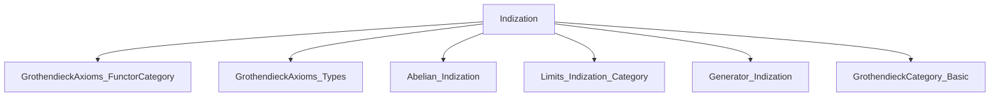

**Technical Brief: `Indization.lean`**

---

### 1. **Key Definitions & Theorems**

| Name | Type / Signature | Purpose |
|------|------------------|---------|
| `HasExactColimitsOfShape.domain_of_functor` | `{J : Type v} [SmallCategory J] [IsFiltered J] [HasFiniteLimits C] → HasExactColimitsOfShape J (Ind C)` | Lifts finite limits in `C` to exact colimits of shape `J` in `Ind C`. Used to establish AB5. |
| `AB5` | `AB5 (Ind C)` | Grothendieck’s AB5 axiom: filtered colimits are exact in `Ind C`. Proven via `HasExactColimitsOfShape`. |
| `isGrothendieckAbelian_ind` | `IsGrothendieckAbelian.{u} (Ind C)` | Shows `Ind C` is Grothendieck abelian when `C` is small abelian. Key ingredient: existence of a separator. |
| `Ind.isSeparator_range_yoneda` | `IsSeparator (Range (yoneda C))` | The range of the Yoneda embedding into `Ind C` provides a separator. |
| `Ind.inclusion` | `C ⥤ Ind C` | Canonical inclusion functor from `C` to its ind-completion. |

---

### 2. **Naming Conventions**

- **Prefixes**:
  - `is_`: Predicate-style properties (e.g., `isGrothendieckAbelian`, `isSeparator`).
  - `domain_of_`: Construction of structure on `Ind C` from structure on `C` (e.g., `domain_of_functor`).
- **Suffixes**:
  - `_ind`: Refers to constructions or instances specific to `Ind C` (e.g., `isGrothendieckAbelian_ind`).
  - `_range_`: Relates to the range of a functor (e.g., `isSeparator_range_yoneda`).
- **Category-theoretic terms**:
  - `HasFiniteLimits`, `IsFiltered`, `AB5`, `IsGrothendieckAbelian`, `HasExactColimitsOfShape` — standard abelian/category-theory terminology.

---

### 3. **Tactic Stack**

- `inferInstance`: Primary tactic used to synthesize typeclass instances (e.g., `AB5` via `HasExactColimitsOfShape`).
- Implicit use of `apply`, `exact`, and `refine` via `instance` declarations.
- No explicit use of `simp`, `rw`, or `aesop` — proof is largely *typeclass-based* and *definition-driven*.

---

### 4. **Proof Logic**

- **AB5 proof**:
  1. Assume `C` has finite limits.
  2. For any filtered shape `J`, use `HasExactColimitsOfShape.domain_of_functor` to lift finite limits in `C` to exact colimits in `Ind C`.
  3. Conclude `AB5 (Ind C)` by `inferInstance`.

- **Grothendieck abelian proof**:
  1. Assume `C` is small and abelian.
  2. Construct a separator in `Ind C` using the Yoneda embedding: `⟨⟨_, Ind.isSeparator_range_yoneda⟩⟩`.
  3. `IsGrothendieckAbelian` requires:
     - `AB5` (already proven above),
     - existence of a generator (here, a separator suffices in abelian context),
     - `GrothendieckCategory` (implied by `AB5` + separator + smallness).
  4. Instance is closed automatically.

---

### 5. **Imports**

| Import | Role |
|--------|------|
| `Mathlib.CategoryTheory.Abelian.GrothendieckAxioms.FunctorCategory` | AB axioms in functor categories (background). |
| `Mathlib.CategoryTheory.Abelian.GrothendieckAxioms.Types` | Definitions of AB axioms (e.g., `AB5`). |
| `Mathlib.CategoryTheory.Abelian.Indization` | General theory of ind-completion (objects, morphisms, properties). |
| `Mathlib.CategoryTheory.Limits.Indization.Category` | Limits/colimits in `Ind C`. |
| `Mathlib.CategoryTheory.Generator.Indization` | Separators/generators in ind-completions. |
| `Mathlib.CategoryTheory.Abelian.GrothendieckCategory.Basic` | Grothendieck abelian categories (definitions, basic facts). |

---

### 6. **Mermaid Diagrams**

#### **Dependency Graph (Module-Level)**



#### **Theoretical Flow Overview**

```mermaid
flowchart LR
  C[Small Abelian Category C] -->|ind-completion| IndC[Ind C]
  C -->|HasFiniteLimits| HasFL[HasFiniteLimits C]
  HasFL -->|domain_of_functor| ExactColim[HasExactColimitsOfShape J (Ind C)]
  ExactColim -->|AB5_def| AB5[AB5 (Ind C)]
  C -->|Small + Abelian| Sep[Separator in Ind C]
  Sep -->|Yoneda_range| Separator[IsSeparator]
  AB5 & Separator -->|IsGrothendieckAbelian_def| GrothAb[IsGrothendieckAbelian (Ind C)]
```

---

### 7. **Summary**

This module establishes foundational properties of the ind-completion `Ind C`:
- If `C` has finite limits, then `Ind C` satisfies AB5 (filtered colimits are exact).
- If `C` is small and abelian, then `Ind C` is Grothendieck abelian.

The proofs are concise and rely heavily on existing infrastructure in `Mathlib`, especially the `Ind` construction and its interaction with limits, separators, and the Yoneda embedding.

--- 

*End of Technical Brief.*
