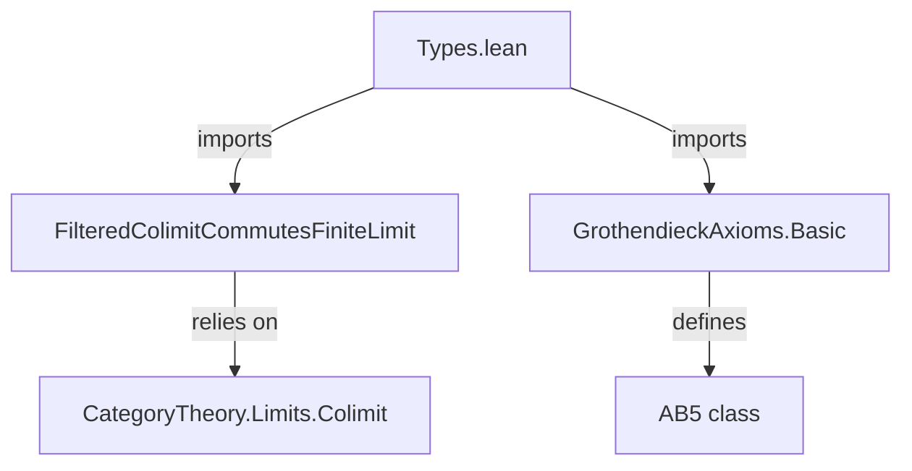

**Technical Brief: `Types.lean` — Grothendieck AB5 Axiom for `Type v`**

---

### 1. **Key Definitions & Theorems**

| Name | Type / Instance | Purpose |
|------|-----------------|---------|
| `AB5` | `Class AB5 (𝒞 : Type u → Type v) [Category 𝒞]` | A categorical axiom stating that filtered colimits commute with finite limits (i.e., filtered colimits are exact). |
| `instance : AB5 (Type v)` | `AB5 (Type v)` | Proves that the category of `v`-small types satisfies AB5. |
| `ofShape _ _ _ := ⟨inferInstance⟩` | Proof term | Uses `inferInstance` to derive the required universal property from `FilteredColimitCommutesFiniteLimit`, which is already proven in Mathlib. |

> **Note**: The actual proof is *not* constructive here — it leverages an existing theorem in Mathlib that `FilteredColimitCommutesFiniteLimit` holds in `Type`, and then packages it as an `AB5` instance.

---

### 2. **Naming Conventions**

- **Prefixes**:
  - `is_`, `AB5`, `ofShape`: Standard categorical naming (e.g., `AB5` is a class name).
- **Suffixes**:
  - `_commutes_`: Used in `FilteredColimitCommutesFiniteLimit`, indicating a universal property of interchange.
- **Module-level**:
  - `public import`: Indicates this module re-exports key infrastructure.

---

### 3. **Tactic Stack**

- **`inferInstance`**: Sole tactic used in the proof term. Relies on typeclass resolution to find a proof of `FilteredColimitCommutesFiniteLimit` in `Type v`.
- No explicit `simp`, `rw`, `exact`, or `intro` tactics appear — the proof is *elaborated* by the typeclass machine.

---

### 4. **Proof Logic**

- **Strategy**: *Proof by reduction to known result*.
  1. The category `Type v` has all filtered colimits and finite limits.
  2. Mathlib already proves `FilteredColimitCommutesFiniteLimit (Type v)` (in `FilteredColimitCommutesFiniteLimit`).
  3. The `AB5` class is defined such that its instance requires exactly that property.
  4. Thus, `ofShape _ _ _ := ⟨inferInstance⟩` constructs the `AB5` instance by invoking the existing theorem.

- **No induction or case analysis** is needed — the argument is purely categorical and relies on pre-existing infrastructure.

---

### 5. **Imports**

| Import | Purpose |
|--------|---------|
| `Mathlib.CategoryTheory.Limits.FilteredColimitCommutesFiniteLimit` | Provides the core theorem that filtered colimits commute with finite limits in `Type`. |
| `Mathlib.CategoryTheory.Abelian.GrothendieckAxioms.Basic` | Defines the `AB5` class and related Grothendieck axioms for abelian categories (here used in the more general categorical setting). |

> **Note**: Though the import path mentions *abelian* categories, `AB5` is defined more generally for any category with the required limits/colimits.

---

### 6. **Mermaid Diagrams**

#### **Dependency Graph (Module-Level)**



#### **Overview of Theoretical Flow**

```mermaid
flowchart LR
  A[FilteredColimitCommutesFiniteLimit in Type v] -->|reused as| B[AB5 (Type v) instance]
  B -->|consequence| C[Filtered colimits are exact in Type v]
  C -->|application| D[Construction of exact functors, sheafification, etc.]
```

---

### 7. **Summary**

This file is a minimal but crucial *bridge* between general categorical abstraction (`AB5`) and concrete set-theoretic reality (`Type v`). It confirms that the foundational category of types behaves well with respect to exactness properties — a prerequisite for homological algebra in sheaf theory, derived categories, and Grothendieck toposes.

The elegance lies in its *absence* of proof terms: the heavy lifting is already done in Mathlib, and this module simply *exposes* the result as a typeclass instance.

--- 

**End of Brief**
