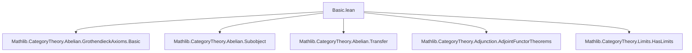
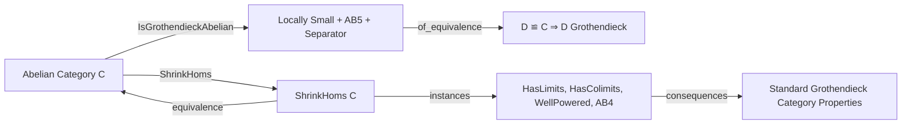
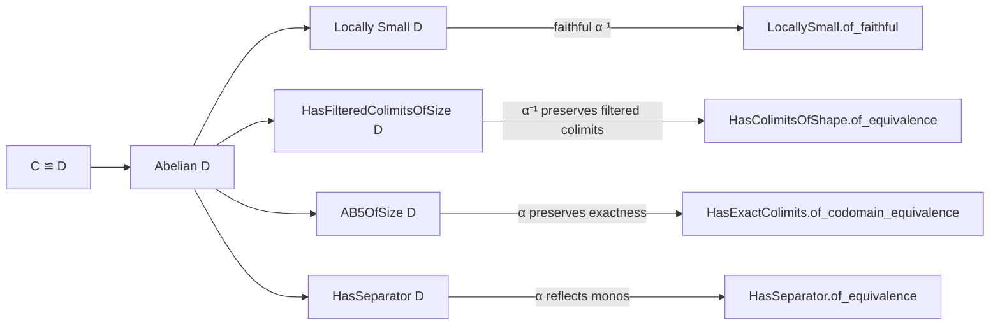

**Technical Brief: `Basic.lean` — Grothendieck Abelian Categories in Lean 4**

---

### 1. **Key Definitions & Theorems**

| Name | Type / Class | Purpose |
|------|--------------|---------|
| `IsGrothendieckAbelian.{w} C` | `class [Abelian C] : Prop` | Defines a *universe-polymorphic* notion of Grothendieck abelian category: locally small (at `w`), AB5 (exact filtered colimits of size `w`), and has a separator. Designed to be invariant under categorical equivalence. |
| `IsGrothendieckAbelian.of_equivalence` | `theorem` | Proves invariance of `IsGrothendieckAbelian` under equivalence of abelian categories: if `C ≌ D` and `C` is Grothendieck, then so is `D`. |
| `ShrinkHoms.isGrothendieckAbelian` | `instance` | Shows that `ShrinkHoms C` (hom-set-shrunk version of `C`) inherits `IsGrothendieckAbelian` from `C`, using `of_equivalence` and `ShrinkHoms.equivalence`. |
| `IsGrothendieckAbelian.hasColimits` | `instance` | Derives existence of all colimits of size `w` from AB5 + finite colimits + separator (via `has_colimits_of_finite_and_filtered`). |
| `IsGrothendieckAbelian.hasLimits` | `instance` | Derives existence of all limits of size `w` using `ShrinkHoms`, `hasLimits_of_hasColimits_of_hasSeparator`, and equivalence invariance. |
| `IsGrothendieckAbelian.wellPowered` | `instance` | Shows `C` is well-powered (subobject lattices are small) via equivalence to `ShrinkHoms C`. |
| `IsGrothendieckAbelian.ab4OfSize` | `instance` | Proves AB4 (exactness of infinite products) follows from AB5 and finite biproducts. |

---

### 2. **Naming Conventions**

- **Prefixes**:
  - `IsGrothendieckAbelian.` — class and its projections/instances.
  - `has...OfSize` — universe-polymorphic limit/colimit existence (e.g., `hasFilteredColimitsOfSize`, `AB5OfSize`).
  - `locallySmall_of_...`, `wellPowered_of_...`, `HasSeparator.of_...` — derived instances via functors/equivalences.
- **Suffixes**:
  - `OfSize` — indicates universe parameters `(w, w)` or `(w, w, v, u)` for size control.
  - `of_...` — inference or transfer lemmas (e.g., `of_equivalence`, `of_hasFiniteProducts`).
- **Abbreviations**:
  - `AB4`, `AB5`, `AB5OfSize` — standard homological algebra axioms.
  - `ShrinkHoms` — category with hom-sets shrunk to `Type w`.

---

### 3. **Tactic Stack**

Frequent tactics used in proofs:

| Tactic | Role |
|--------|------|
| `infer_instance` | Automatically fills class arguments (e.g., `locallySmall`, `AB5OfSize`). |
| `exact` / `refine` | Core proof construction; often with `⟨...⟩` to build structured instances. |
| `have` / `set` | Introduces intermediate lemmas or constructs (e.g., `have hasFilteredColimits : ...`). |
| `apply ... of_...` | Applies transfer lemmas (e.g., `HasExactColimitsOfShape.of_codomain_equivalence`). |
| `equivalence` methods | `equivalence.functor`, `.inverse`, `.symm` for manipulating adjoint equivalences. |
| `simp_rw` / `simp` | Likely used implicitly (not shown, but standard in Mathlib for simplification of instances). |

No heavy automation (e.g., `aesop`, `linarith`) appears — proofs are mostly structural and categorical.

---

### 4. **Proof Logic**

- **Structure**: Proofs follow a *transfer-and-instantiate* pattern:
  1. **Equivalence invariance**: Use `of_equivalence` to move properties along `C ≌ D`.
  2. **Reduction to `ShrinkHoms C`**: Since `ShrinkHoms C` is equivalent to `C`, many properties (limits, well-poweredness) are proven for `ShrinkHoms C` and transferred back.
  3. **Instance chaining**: Use existing Mathlib results (e.g., `hasLimits_of_hasColimits_of_hasSeparator`, `wellPowered_of_equiv`) to derive consequences.
  4. **Universe management**: Explicit universe parameters (`w`, `v`, `u`) are tracked; `ShrinkHoms` allows shrinking to `Type w`.

- **Typical proof flow**:
  ```lean
  refine ⟨?_, ?_, ?_, ?_⟩
  · apply locallySmall_of_...
  · refine ⟨fun _ _ _ => ?_⟩; exact HasExactColimitsOfShape.of_...
  · apply HasSeparator.of_equivalence
  ```

---

### 5. **Imports & Dependencies**

| Import | Purpose |
|--------|---------|
| `Mathlib.CategoryTheory.Abelian.GrothendieckAxioms.Basic` | Core definitions (AB4, AB5, separators). |
| `Mathlib.CategoryTheory.Abelian.Subobject` | Subobject theory (used in `WellPowered`, `HasSeparator`). |
| `Mathlib.CategoryTheory.Abelian.Transfer` | Transfer lemmas across functors/equivalences. |
| `Mathlib.CategoryTheory.Adjunction.AdjointFunctorTheorems` | Equivalence machinery (`of_equivalence`, `equivalence`). |
| `Mathlib.CategoryTheory.Limits.HasLimits` | General limit/colimit existence tools (`has_colimits_of_finite_and_filtered`, etc.). |

---

### 6. **Mermaid Diagrams**

#### **Dependency Graph (Module-Level)**



#### **Conceptual Overview of Theory Flow**



#### **Proof Structure for `IsGrothendieckAbelian.of_equivalence`**



---

### 7. **Summary**

This file formalizes a *universe-flexible*, *equivalence-invariant* notion of Grothendieck abelian category, resolving the non-invariance of the classical AB5 + separator definition. It leverages `ShrinkHoms` to reduce to the strict case and uses categorical transfer lemmas to derive key structural properties (limits, colimits, well-poweredness, AB4). The design aligns with the Stacks Project’s definition while ensuring robustness under equivalence — essential for sheaf theory and homological algebra in Lean.
