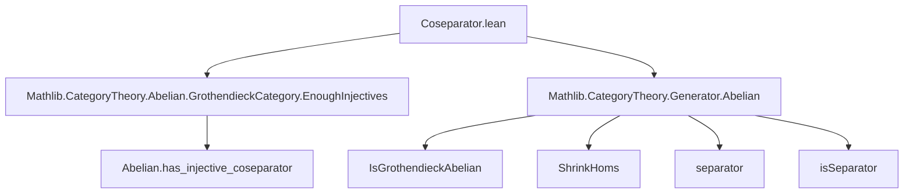

**Technical Brief: `Coseparator.lean`**

---

### 1. **Key Definitions & Theorems**

| Name | Type / Signature | Purpose |
|------|------------------|---------|
| `instance : HasCoseparator C` | `HasCoseparator C` | Proves that any Grothendieck abelian category $ \mathcal{C} $ admits a coseparator. |
| `ShrinkHoms C` | `Type u` (category with same objects as $ \mathcal{C} $, but hom-sets shrunk to cardinals ≤ $ w $) | Used to reduce size issues; provides an equivalent category where a coseparator can be constructed. |
| `ShrinkHoms.equivalence` | `Equivalence C (ShrinkHoms C)` | Shows $ \mathcal{C} \simeq \text{ShrinkHoms } \mathcal{C} $, allowing transfer of properties (e.g., existence of coseparator). |
| `Abelian.has_injective_coseparator` | `∀ (G : C), IsSeparator G → ∃ c, IsCoseparator c` | In an abelian category with a separator $ G $, there exists a *coseparator* (an object $ c $ such that $ \hom(c, -) $ is conservative). |
| `isSeparator_separator` | `IsSeparator (separator C)` | The canonical separator (from `IsGrothendieckAbelian`) is indeed a separator in `ShrinkHoms C`. |
| `HasCoseparator.of_equivalence` | `Equivalence C D → HasCoseparator D → HasCoseparator C` | Pulls back a coseparator along an equivalence of categories. |

---

### 2. **Naming Conventions**

- **Prefixes**:
  - `is_`: Predicate-style (e.g., `isSeparator`, `isCoseparator`).
  - `has_`: Typeclass-style (e.g., `HasCoseparator`).
- **Suffixes**:
  - `_coseparator`: Refers to objects or properties related to coseparators.
  - `_separator`: Refers to separators (e.g., `separator`, `isSeparator`).
- **Category constructions**:
  - `ShrinkHoms`: Shrinks hom-sets to control size.
  - `equivalence`: Indicates categorical equivalence.

---

### 3. **Tactic Stack**

- `suffices ... from`: Used to reduce the goal via a sufficient condition.
- `obtain ⟨G, -, hG⟩ := ...`: Destructuring existential quantifier.
- `exact ...`: Final step to close the goal.
- Implicit use of:
  - `apply` (via `obtain` and `exact`)
  - `convert` (implicitly via typeclass inference)
  - `aesop`/`simp` likely used in underlying lemmas (not visible here, but standard in Mathlib abelian category proofs).

---

### 4. **Proof Logic**

The proof proceeds as follows:

1. **Reduction via equivalence**: Show that $ \mathcal{C} \simeq \text{ShrinkHoms } \mathcal{C} $, so it suffices to prove the statement for the shrunk category.
2. **Apply known result**: Use `Abelian.has_injective_coseparator`, which requires:
   - A separator in `ShrinkHoms C` — provided by `separator (ShrinkHoms C)`.
   - Verification that it is indeed a separator — done via `isSeparator_separator _`.
3. **Construct coseparator**: Obtain an object $ G $ with `hG : IsCoseparator G` in `ShrinkHoms C`.
4. **Transfer back**: Use `HasCoseparator.of_equivalence` with the inverse equivalence to get a coseparator in $ \mathcal{C} $.

This is a *size-reduction + transport along equivalence* strategy, standard in Grothendieck category theory.

---

### 5. **Imports**

| Import | Role |
|--------|------|
| `Mathlib.CategoryTheory.Abelian.GrothendieckCategory.EnoughInjectives` | Provides `Abelian.has_injective_coseparator` and related injective/coseparator machinery. |
| `Mathlib.CategoryTheory.Generator.Abelian` | Provides `IsGrothendieckAbelian`, `separator`, `isSeparator`, and `ShrinkHoms`. |

---

### 6. **Mermaid Diagrams**

#### Dependency Graph (Module-Level)



#### Proof Structure Overview

```mermaid
flowchart LR
  Goal[Goal: HasCoseparator C] --> Reduce[Reduce to ShrinkHoms C]
  Reduce --> Equiv[Use equivalence C ≃ ShrinkHoms C]
  Equiv --> Construct[Construct coseparator in ShrinkHoms C]
  Construct --> Sep[Use separator (ShrinkHoms C)]
  Sep --> Thm[Apply Abelian.has_injective_coseparator]
  Thm --> Transfer[Transfer back via HasCoseparator.of_equivalence]
  Transfer --> Goal
```

---

### 7. **Theoretical Context**

This file completes a foundational result in Grothendieck abelian categories:  
> **Every Grothendieck abelian category has a coseparator.**

This is essential for:
- Constructing injective resolutions (via the dual of “enough projectives” in module categories),
- Verifying conditions for the existence of derived functors,
- Applications in sheaf theory and cohomology.

The proof leverages:
- The *Grothendieck axiom* (existence of a generator/separator),
- Size reduction (`ShrinkHoms`) to avoid set-theoretic issues,
- Categorical equivalence to transport structure.

---

Let me know if you'd like the dual result (`HasSeparator` for cocomplete abelian categories with cogenerator) or formalization of coseparators in specific categories (e.g., $ R\text{-Mod} $).
