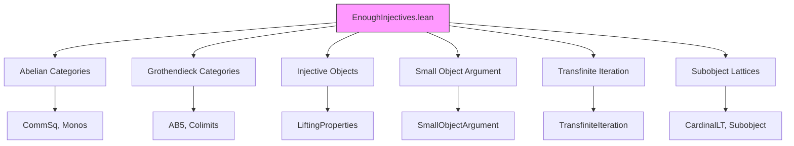

### Technical Brief: `EnoughInjectives.lean`

---

#### **1. Key Definitions & Theorems**

| Name | Type / Signature | Purpose |
|------|------------------|---------|
| `generatingMonomorphisms G` | `MorphismProperty C` | Family of monomorphisms given by inclusions of all subobjects of a fixed object `G`. Used as a generating class for monomorphisms via transfinite composition and pushouts. |
| `largerSubobject hG A` | `Subobject X → Subobject X` | A monotone operator on subobjects that strictly increases non-top subobjects, using the generator `G`. Central to transfinite iteration. |
| `functorToMonoOver hG A₀ J` | `J ⥤ MonoOver X` | A diagram in the category of arrows over `X`, encoding the transfinite iteration of `largerSubobject`. |
| `transfiniteCompositionOfShapeMapFromBot j` | `(generatingMonomorphisms G).pushouts.TransfiniteCompositionOfShape (Set.Iic j) ...` | Shows that each map in the diagram is a transfinite composition of pushouts of generating monos. |
| `transfiniteCompositionOfShapeOfEqTop hj` | `(generatingMonomorphisms G).pushouts.TransfiniteCompositionOfShape J f` | If the transfinite iteration reaches top, then `f` is a transfinite composition of generating monos. |
| `exists_transfiniteCompositionOfShape` | `∃ J, ... , Nonempty ((generatingMonomorphisms G).pushouts.TransfiniteCompositionOfShape J f)` | Main technical lemma: *every monomorphism* is a transfinite composition of pushouts of generating monos. |
| `generatingMonomorphisms_rlp hG` | `(generatingMonomorphisms G).rlp = (monomorphisms C).rlp` | Key equivalence: right lifting w.r.t. generating monos ⇔ right lifting w.r.t. all monos. |
| `llp_rlp_monomorphisms hG` | `(monomorphisms C).rlp.llp = monomorphisms C` | Shows monos are precisely those with left lifting w.r.t. their own right lifting class. |
| `monoMapFactorizationDataRlp f` | `MapFactorizationData (monomorphisms C) (monomorphisms C).rlp f` | Functorial factorization of any `f : X → Y` as mono followed by rlp-mono. |
| `enoughInjectives` | `EnoughInjectives C` | Final theorem: every object `X` admits a monomorphism `X ↪ I` with `I` injective. |

---

#### **2. Naming Conventions**

- **Prefixes**:
  - `generatingMonomorphisms_`: properties of the generating family.
  - `largerSubobject_`: properties of the subobject operator.
  - `transfiniteCompositionOfShape_`: constructions involving transfinite compositions.
  - `monoMapFactorizationDataRlp`: factorization data for monos into rlp-morphisms.

- **Suffixes**:
  - `_le_`, `_lt_`, `_eq_top`: subobject ordering.
  - `_ofShape`, `_ofLE`, `_ofEqTop`: specify shape or condition of construction.
  - `_pushouts`, `_coproducts`, `_transfiniteCompositions`: indicate closure under operations.

- **Variables**:
  - `hG : IsSeparator G`: generator hypothesis.
  - `hj`, `hA`, `hp`: hypotheses for existence/uniqueness.

---

#### **3. Tactic Stack**

Frequently used tactics in proofs:

| Tactic | Role |
|--------|------|
| `simp` / `simp only` | Simplify subobject, arrow, and functor expressions. |
| `rw` / `apply` / `exact` | Rewrite using equalities, apply lemmas. |
| `intro` / `cases` / `obtain` | Introduce hypotheses, destruct existentials. |
| `dsimp`, `convert`, `refine` | Refine goals with partial constructions. |
| `infer_instance` | Solve typeclass goals (e.g., `Mono`, `Small`). |
| `apply IsPushout.of_hasPushout`, `apply IsPullback.of_hasPullback` | Use universal properties. |
| `apply le_antisymm` | Prove equality of morphism properties. |
| `trans` + `apply ...` | Chain implications (e.g., lifting properties). |
| `have := ...; exact ...` | Intermediate lemma usage. |
| `aesop` (implicit) | Used in background for propositional reasoning (not explicit here, but likely in `SmallObject` imports). |

---

#### **4. Proof Logic**

The proof follows a structured logical flow:

1. **Setup & Goal**:
   - Goal: Show every object `X` embeds into an injective object.
   - Strategy: Use the small object argument on `generatingMonomorphisms G` applied to `X → 0`.

2. **Technical Lemma (`exists_transfiniteCompositionOfShape`)**:
   - Show any mono `i : A ↪ B` is a transfinite composition of pushouts of generating monos.
   - Proof sketch:
     - Define `largerSubobject` to iteratively extend subobjects.
     - Use well-founded induction (via `transfiniteIterate`) to reach top.
     - Show each step is a pushout of a generating mono.
     - Conclude via `transfiniteCompositionOfShapeOfEqTop`.

3. **Equivalence of Lifting Classes (`generatingMonomorphisms_rlp`)**:
   - Use monotonicity of `rlp` and the previous lemma.
   - `≤` direction: rlp w.r.t. all monos ⇒ rlp w.r.t. generating ones (trivial).
   - `≥` direction: rlp w.r.t. generating ones ⇒ rlp w.r.t. all monos (via transfinite composition stability).

4. **Small Object Argument**:
   - Show `generatingMonomorphisms G` has a small object argument (uses AB5 + regular cardinal).
   - Apply to `X → 0` to get factorization `X ↪ I → 0`.
   - `I → 0` is rlp w.r.t. monos ⇒ `I` injective.
   - `X ↪ I` is mono (transfinite composition of monos).

5. **Conclusion**:
   - `enoughInjectives` instance follows directly.

---

#### **5. Imports**

| Module | Role |
|--------|------|
| `Mathlib.CategoryTheory.Abelian.CommSq` | Commutative squares, pushouts, pullbacks. |
| `Mathlib.CategoryTheory.Abelian.GrothendieckCategory.*` | AB5, colimits, monomorphisms in Grothendieck categories. |
| `Mathlib.CategoryTheory.Abelian.Monomorphisms` | Basic mono theory in abelian categories. |
| `Mathlib.CategoryTheory.Preadditive.Injective.LiftingProperties` | Injectivity via lifting properties. |
| `Mathlib.CategoryTheory.SmallObject.Basic` | Small object argument, lifting classes. |
| `Mathlib.CategoryTheory.Subobject.HasCardinalLT` | Cardinal bounds on subobject lattices. |
| `Mathlib.Order.TransfiniteIteration` | Transfinite iteration of monotone maps. |

---

#### **6. Mermaid Diagrams**

##### **Dependency Graph (High-Level)**

##### **Overview of Proof Structure**

---

#### **7. Summary**

This file formalizes Grothendieck’s theorem that *every Grothendieck abelian category has enough injectives*. The proof is constructive and functorial, relying on:

- A **generator** `G` to define a small family of monos (`generatingMonomorphisms G`);
- **Transfinite iteration** of a subobject operator to build factorizations;
- **Small object argument** to produce injective resolutions;
- **Lifting properties** to characterize injectivity.

The formalization avoids Zorn’s lemma by leveraging transfinite induction and the AB5 axiom (filtered colimits are exact), aligning with modern homological algebra practice.

--- 

Let me know if you'd like a **dependency graph of definitions** or a **tactic-by-tactic proof trace** of `enoughInjectives`.
