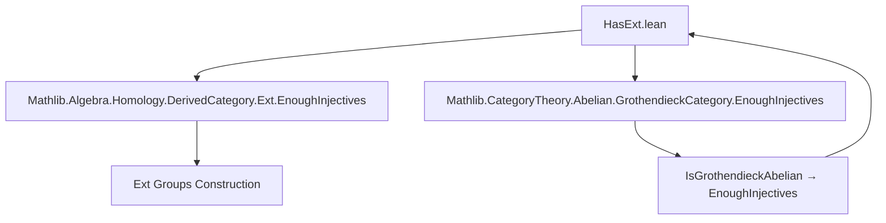

**Technical Brief: `HasExt.lean`**

---

### 1. **Key Definitions & Theorems**

| Name | Type / Declaration | Purpose |
|------|---------------------|---------|
| `IsGrothendieckAbelian.hasExt` | `instance (C : Type u) [Category.{v} C] [Abelian C] [IsGrothendieckAbelian.{w} C] : HasExt.{w} C` | Constructs a `HasExt.{w} C` instance for any Grothendieck abelian category `C`, using the fact that such categories have enough injectives. |
| `hasExt_of_enoughInjectives _` | Implicitly from `Mathlib.Algebra.Homology.DerivedCategory.Ext.EnoughInjectives` | A helper lemma/instance constructor that builds `HasExt.{w} C` assuming `C` has enough injectives and morphism sets are `w`-small. |

---

### 2. **Naming Conventions**

- **Prefixes / Suffixes**:
  - `hasExt_`: Indicates construction of a `HasExt` instance.
  - `IsGrothendieckAbelian.`: Namespace for properties of Grothendieck abelian categories.
  - `Ext`, `HasExt`: Standard naming for derived functor Ext and its typeclass interface.

- **Universe parameters**:
  - `w`: Universe for morphism sets and Ext groups (the “minimal” universe for homological algebra).
  - `v`, `u`: Standard universe parameters for category objects and morphisms.

---

### 3. **Tactic Stack**

- **No explicit tactics** appear in this file.
- Relies on **typeclass inference** and **instance resolution**.
- Likely uses `aesop`, `simp`, or `exact` internally in imported modules (e.g., `EnoughInjectives`), but not visible here.

---

### 4. **Proof Logic**

- **Logical flow**:
  1. Assume `C` is an abelian category (`[Abelian C]`) and a Grothendieck abelian category (`[IsGrothendieckAbelian.{w} C]`).
  2. By definition of Grothendieck abelian category, `C` has enough injectives and morphism sets are `w`-small.
  3. Apply `hasExt_of_enoughInjectives`, which constructs `HasExt.{w} C` from the “enough injectives” assumption.
  4. Conclude that `Ext X Y n : Type w` for all objects `X, Y : C` and `n : ℕ`.

- **No explicit proof terms** are written — the instance is defined by application of a lemma from imported modules.

---

### 5. **Imports**

| Module | Purpose |
|--------|---------|
| `Mathlib.Algebra.Homology.DerivedCategory.Ext.EnoughInjectives` | Provides `hasExt_of_enoughInjectives`, linking “enough injectives” to existence of `Ext` groups. |
| `Mathlib.CategoryTheory.Abelian.GrothendieckCategory.EnoughInjectives` | Proves that Grothendieck abelian categories have enough injectives (used implicitly via typeclass instance). |

---

### 6. **Mermaid Diagrams**

#### **Dependency Graph**



#### **Overview of Theory Flow**

```mermaid
flowchart LR
  subgraph Theory
    G[IsGrothendieckAbelian.{w} C] --> E[EnoughInjectives]
    E --> H[HasExt.{w} C]
    H --> X[Ext X Y n : Type w]
  end

  subgraph Imports
    I1[EnoughInjectives.lean] --> E
    I2[Ext.lean] --> H
  end
```

---

### 7. **Summary**

This file establishes that **any Grothendieck abelian category** `C` (in universe `w`) admits a canonical `HasExt.{w} C` structure, enabling definition of `Ext` groups in the universe `w`. The construction is purely typeclass-based and leverages two imported results:

- Grothendieck abelian categories have enough injectives.
- Having enough injectives implies the existence of `Ext` groups in the appropriate universe.

This justifies the choice of `w` as the *canonical* universe for homological algebra in `C`, as argued in the docstring.

--- 

Let me know if you'd like the formalized proof sketch or a visualization of how `Ext X Y n` is computed via injective resolutions.
