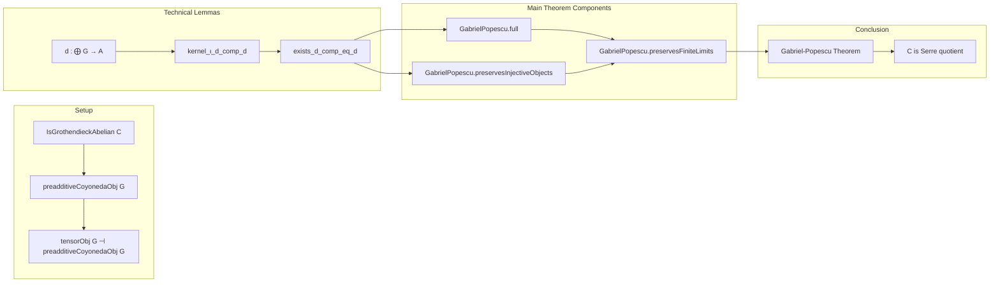

### Technical Brief: `GabrielPopescu.lean`

---

#### **1. Key Definitions & Theorems**

| Name | Type / Signature | Purpose |
|------|------------------|---------|
| `preadditiveCoyonedaObj G` | `C ⥤ ModuleCat (End G)ᵐᵒᵖ` | Functor sending $X \mapsto \mathrm{Hom}(G, X)$, viewed as a module over $\mathrm{End}(G)^{\mathrm{op}}$. Central embedding functor in the theorem. |
| `tensorObj G` | `ModuleCat (End G)ᵐᵒᵖ ⥤ C` | Left adjoint to `preadditiveCoyonedaObj G`, denoted $-\otimes G$. Constructed via adjunction. |
| `tensorObjPreadditiveCoyonedaObjAdjunction G` | `tensorObj G ⊣ preadditiveCoyonedaObj G` | The tensor-hom adjunction. |
| `d {g : M ⟶ Hom(G, A)}` | `∐_{m : M} G ⟶ A` | Canonical map induced by a module map $M \to \mathrm{Hom}(G, A)$, using coproducts over the underlying set of $M$. |
| `kernel_ι_d_comp_d` | `kernel.ι (d g) ≫ d f = 0` | Key technical lemma (Mitchell’s “Lemma”): kernel of $d g$ maps to zero under $d f$, assuming $g$ mono and $G$ a separator. |
| `exists_d_comp_eq_d` | `∃ l, d g ≫ l = d f` | Lifts $d f$ through $d g$ when codomain is injective. Used to prove faithfulness/fullness and injectivity preservation. |
| `GabrielPopescu.full` | `(preadditiveCoyonedaObj G).Full` | Proves fullness of the embedding using separator property and previous lemmas. |
| `GabrielPopescu.preservesInjectiveObjects` | `(preadditiveCoyonedaObj G).PreservesInjectiveObjects` | Shows injective objects map to injective modules (Baer’s criterion). |
| `GabrielPopescu.preservesFiniteLimits` | `PreservesFiniteLimits (tensorObj G)` | Left exactness of the left adjoint: additive + preserves monos + cokernels ⇒ preserves finite limits. |

---

#### **2. Naming Conventions**

- **Prefixes**:
  - `preadditiveCoyonedaObj`: standard preadditive co-Yoneda embedding.
  - `tensorObj`: left adjoint to co-Yoneda, denoted $-\otimes G$.
  - `GabrielPopescu.*`: main theorem components (fullness, injectivity, finite limits).
- **Suffixes**:
  - `Obj`: object-level construction (e.g., `tensorObj`, `preadditiveCoyonedaObj`).
  - `Adjunction`: adjunction data (e.g., `tensorObjPreadditiveCoyonedaObjAdjunction`).
  - `Aux`: auxiliary constructions (e.g., `GabrielPopescuAux.d`, `GabrielPopescuAux.kernel_ι_d_comp_d`).
- **Other**:
  - `ι_d`, `d`: notation for canonical maps from coproducts.
  - `factorThruImage`, `epiDesc`, `kernel.ι`: standard abelian category morphism constructions.

---

#### **3. Tactic Stack**

| Tactic | Usage Frequency | Purpose |
|--------|-----------------|---------|
| `simp` / `simp only` | Very High | Simplify hom expressions, especially using `ι_d`, `d`, `sigma.desc`, `sum_comp`, etc. |
| `rw` | High | Rewrite using lemmas like `kernel_ι_d_comp_d`, `pullback.condition_assoc`, `factorThruImage`. |
| `exact` / `refine` | High | Construct witnesses (e.g., existence of $l$ in `exists_d_comp_eq_d`). |
| `ext` | Medium | Extensionality for morphisms (e.g., in `full`). |
| `cat_disch` | Medium | Category-theoretic discharge tactic (used in proofs involving monos/epis). |
| `conv_lhs` | Low | Local rewriting in convolution-style proofs (e.g., `preservesFiniteLimits`). |
| `classical` | Low | For classical logic assumptions (e.g., in `kernel_ι_d_comp_d`). |
| `aesop` | Not present | Not used — proofs are highly structured and manual. |

---

#### **4. Proof Logic**

The proof follows a **structured categorical strategy**, typical of Grothendieck abelian category arguments:

1. **Setup**:
   - Fix Grothendieck abelian category $C$, separator $G$.
   - Define co-Yoneda embedding $H_G = \mathrm{Hom}(G, -)$ and its left adjoint $-\otimes G$.

2. **Technical Lemma (Mitchell’s Lemma)**:
   - Show $\ker(d g) \to A$ composes with $d f$ to zero.
   - Uses:
     - Finite filtered colimits (via `isColimitFiniteSubproductsCocone`)
     - Separator property (`isSeparator_iff`)
     - Summation over finite sets, module structure.

3. **Lifting through monos**:
   - Use injectivity of $B$ to lift $d f$ along $d g$ (when $g$ mono).
   - Construct $l$ via epi-desc and injective factorization.

4. **Fullness**:
   - Use separator property to show epimorphicity of evaluation maps.
   - Construct preimage using `epiDesc` and `ι_d`.

5. **Injectivity Preservation**:
   - Apply Baer’s criterion.
   - Use `exists_d_comp_eq_d` to produce the required extension.

6. **Left Exactness of $-\otimes G$**:
   - Show it preserves monos (via injective preservation + adjunction).
   - Show it preserves binary biproducts (via coproduct preservation).
   - Conclude additivity and homology preservation ⇒ finite limit preservation.

---

#### **5. Imports & Dependencies**

| Module | Role |
|--------|------|
| `Mathlib.Algebra.Category.ModuleCat.Injective` | Injective objects in module categories, Baer’s criterion. |
| `Mathlib.CategoryTheory.Abelian.GrothendieckAxioms.Connected` | Finite filtered colimits, connectedness of index diagrams. |
| `Mathlib.CategoryTheory.Abelian.GrothendieCategory.Coseparator` | Coseparating families, co-Yoneda embeddings. |
| `Mathlib.CategoryTheory.Preadditive.Injective.Preserves` | Preservation of injectives under adjoints. |
| `Mathlib.CategoryTheory.Preadditive.LiftToFinset` | Summation over finite sets in preadditive categories. |
| `Mathlib.CategoryTheory.Preadditive.Yoneda.Limits` | Limits in preadditive/Yoneda contexts. |

**Core Theory Scope**: Grothendieck abelian categories, co-Yoneda embeddings, module categories, injectives, finite limits, separators.

---

#### **6. Mermaid Diagrams**

##### **Dependency Graph (High-Level)**

```mermaid
graph TD
  A[IsGrothendieckAbelian C] --> B[preadditiveCoyonedaObj G]
  A --> C[tensorObj G]
  B --> D[Fullness (GabrielPopescu.full)]
  B --> E[PreservesInjectives (GabrielPopescu.preservesInjectiveObjects)]
  C --> F[PreservesFiniteLimits (GabrielPopescu.preservesFiniteLimits)]
  D --> G[Gabriel-Popescu Theorem]
  E --> G
  F --> G
  G --> H[C ≃ Serre quotient of ModuleCat(End G)^op]
```

##### **Overview of File Structure**



---

#### **7. Theoretical Significance**

- **Gabriel–Popescu Theorem**: Every Grothendieck abelian category $C$ embeds fully faithfully into a module category $\mathrm{Mod}(R)^{\mathrm{op}}$ (here $R = \mathrm{End}(G)^{\mathrm{op}}$) via $X \mapsto \mathrm{Hom}(G, X)$, with left adjoint $-\otimes G$ exact.
- **Consequence**: $C$ is a **Serre quotient** of $\mathrm{Mod}(R)^{\mathrm{op}}$, i.e., $C \simeq \mathrm{Mod}(R)^{\mathrm{op}} / \mathcal{T}$ for some Serre subcategory $\mathcal{T}$.
- **Methodology**: Uses elementary categorical tools (separators, injectives, finite filtered colimits), avoiding homological algebra machinery.

---

Let me know if you'd like a formal statement of the theorem in Lean or a summary of the Serre quotient implication.
