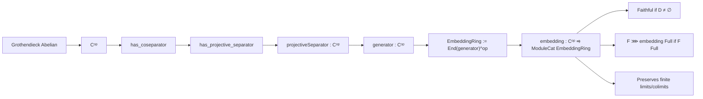

### Technical Brief: `Opposite.lean`

---

#### **1. Key Definitions & Theorems**

| Name | Type / Signature | Purpose |
|------|------------------|---------|
| `projectiveSeparator` | `Cᵒᵖ` | A projective separator in `Cᵒᵖ`, constructed via `has_projective_separator` on the coseparator of `Cᵒᵖ`. |
| `generator` | `Cᵒᵖ` | A coproduct of copies of `projectiveSeparator`, indexed over objects and morphisms in `D` mapping into `F`. Used to embed `Cᵒᵖ` into modules. |
| `EmbeddingRing` | `Type v` | The opposite ring of the endomorphism ring of `generator F`: $(\mathrm{End}(G))^{op}$. |
| `embedding` | `Cᵒᵖ ⥤ ModuleCat (EmbeddingRing F)` | The contravariant Yoneda embedding into modules over `EmbeddingRing F`, i.e., `preadditiveCoyonedaObj (generator F)`. |
| `exists_epi` | `∃ f : generator F ⟶ F.obj X, Epi f` | For each `X : D`, there is an epimorphism from the generator to `F X`. Crucial for fullness of `F ⋙ embedding`. |
| `faithful_embedding` | Instance | `embedding F` is faithful if `D` is nonempty, using `isSeparator_iff_faithful_preadditiveCoyonedaObj`. |
| `full_embedding` | Instance | `F ⋙ embedding F` is full if `F` is full and `D` is nonempty, via `full_comp_preadditiveCoyonedaObj`. |
| `preservesFiniteLimits_embedding` | Instance | `embedding F` preserves finite limits, via `preservesFiniteLimits_of_preservesFiniteLimitsOfSize`. |
| `preservesFiniteColimits_embedding` | Instance | `embedding F` preserves finite colimits, via `preservesFiniteColimits_preadditiveCoyonedaObj_of_projective`. |

---

#### **2. Naming Conventions**

- **Prefixes**:
  - `isSeparator_`: properties of separators (e.g., `isSeparator_projectiveSeparator`).
  - `exists_`: existence lemmas (e.g., `exists_epi`).
  - `preservesFinite_`: preservation properties of functors.
- **Suffixes**:
  - `_embedding`: refers to the main embedding functor.
  - `_separator`, `_generator`: objects constructed for embedding.
- **`projectiveSeparator`, `generator`**: named after categorical properties (projective separator, generator).
- **`EmbeddingRing`**: ring used for module embedding; named after its role.

---

#### **3. Tactic Stack**

- `simp`, `simp_rw`: used implicitly in `exact` proofs (e.g., `by simp` in `SplitEpi.epi`).
- `classical`: for classical logic in existence proofs.
- `infer_instance`: to discharge typeclass goals (e.g., `Projective`, `Ring`, `Faithful`, etc.).
- `rw [embedding]`, `rw [generator]`: rewriting definitions to apply lemmas.
- `apply`, `refine`, `exact`: standard proof construction.
- `have h := ...`: intermediate lemma extraction.
- `cases`, `induction`: not explicitly visible, but likely used in underlying lemmas (e.g., in `isSeparator_sigma_of_isSeparator`).

---

#### **4. Proof Logic**

The proof proceeds in stages:

1. **Construct a projective separator** in `Cᵒᵖ` using the fact that `C` is Grothendieck abelian ⇒ `Cᵒᵖ` has a coseparator ⇒ `Cᵒᵖ` has a projective separator.

2. **Define a generator** `G = ⋓_{X:D} ⋓_{G → F X} G` — a large coproduct of copies of the projective separator, indexed over all morphisms into `F X`.

3. **Show `G` is projective and a separator**:
   - Projectivity follows from closure of projectives under coproducts.
   - Separator property follows from `isSeparator_sigma_of_isSeparator` applied twice.

4. **Define `EmbeddingRing := (End G)^op`**, and the embedding `Cᵒᵖ → ModuleCat EmbeddingRing` as `preadditiveCoyonedaObj G`.

5. **Prove properties of the embedding**:
   - **Faithful**: via `isSeparator_iff_faithful_preadditiveCoyonedaObj`.
   - **Full on `F`**: via `full_comp_preadditiveCoyonedaObj`, using `exists_epi` to get epimorphisms from `G` to `F X`.
   - **Preserves finite limits/colimits**: via general lemmas about `preadditiveCoyonedaObj` for projective separators.

---

#### **5. Imports**

| Import | Purpose |
|--------|---------|
| `Mathlib.CategoryTheory.Abelian.Yoneda` | Yoneda embedding, `preadditiveCoyonedaObj`, faithfulness/fullness criteria. |
| `Mathlib.CategoryTheory.Generator.Abelian` | Concepts of separators, generators, projective objects. |
| `Mathlib.CategoryTheory.Abelian.GrothendieckCategory.EnoughInjectives` | Grothendieck category properties, coseparators, projective separators in opposites. |

---

#### **6. Mermaid Diagrams**

##### **Dependency Graph (Module-Level)**

```mermaid
graph TD
  Opposite["Opposite.lean"] --> Yoneda["Abelian.Yoneda"]
  Opposite --> Generator["Generator.Abelian"]
  Opposite --> EnoughInjectives["GrothendieckCategory.EnoughInjectives"]

  Yoneda --> PreadditiveCoyoneda["preadditiveCoyonedaObj"]
  Generator --> Separator["IsSeparator", "Projective"]
  EnoughInjectives --> Coseparator["coseparator", "has_projective_separator"]
```

##### **Overview of Theory Flow**



---

#### **7. Summary**

This file constructs a **module-theoretic embedding** of the opposite of a Grothendieck abelian category `C` using a carefully chosen generator `G`. The embedding is:

- **Faithful** (if the indexing category `D` is nonempty),
- **Full on a given functor `F : D → Cᵒᵖ`** (if `F` is full),
- **Exact** (preserves finite limits and colimits).

It leverages deep categorical properties of Grothendieck categories (e.g., existence of coseparators, projective covers), and the Yoneda embedding into module categories. The construction is foundational for duality theory and representation-theoretic applications.
