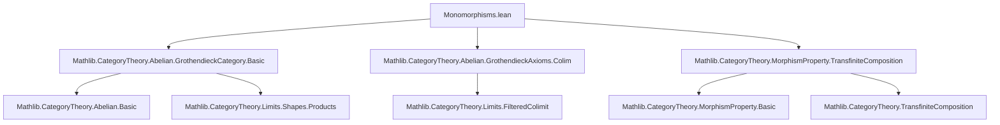
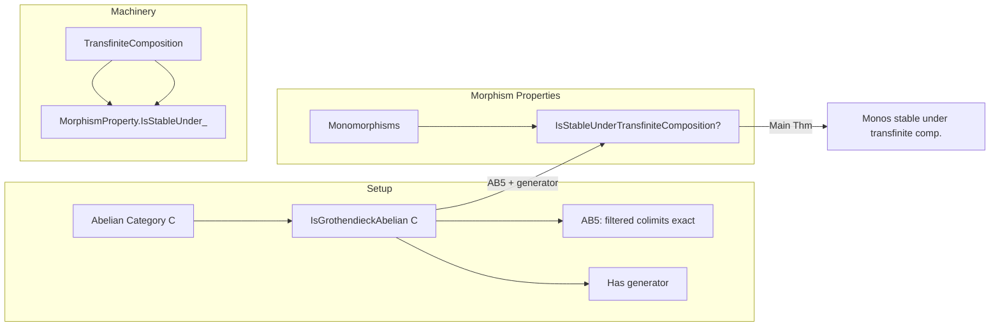

**Technical Brief: `Monomorphisms.lean`**

---

### 1. **Key Definitions & Theorems**

| Name | Type / Statement | Purpose |
|------|------------------|---------|
| `IsStableUnderTransfiniteComposition` | `class` (from `MorphismProperty`) | A property of morphisms is stable under transfinite composition if colimits of transfinite diagrams of such morphisms are again of the same type. |
| `monomorphisms C` | `Class.{u+1} (C ⟶ C)` | The class of monomorphisms in category `C`. |
| `IsGrothendieckAbelian` | `class` (from `GrothendieckCategory.Basic`) | A class of abelian categories satisfying Grothendieck axioms: cocomplete, AB5, has a generator. |
| **Main Theorem** | `instance {C : Type u} [Category C] [Abelian C] [IsGrothendieckAbelian C] : IsStableUnderTransfiniteComposition (monomorphisms C)` | In any Grothendieck abelian category, monomorphisms are stable under transfinite composition. |

---

### 2. **Naming Conventions**

- **Prefixes**:
  - `is_`: Used in `IsGrothendieckAbelian`, `IsStableUnderTransfiniteComposition` — indicates a *property* or *class*.
- **Suffixes**:
  - `_composition`: Used in `TransfiniteComposition` — indicates construction or property involving transfinite ordinal-indexed composites.
  - `_under_`: As in `IsStableUnderTransfiniteComposition` — standard in Mathlib for stability under operations.

- **Module/namespace structure**:
  - `CategoryTheory.IsGrothendieckAbelian` — groups results specific to Grothendieck abelian categories.
  - `MorphismProperty` — imported via `open`, contains the stability classes.

---

### 3. **Tactic Stack**

- `infer_instance`: Sole tactic used in the proof.  
  This indicates the result is *definitional* or follows directly from existing typeclass instances (e.g., via `instance` resolution), likely via `deriving` or `instance` chaining in the `MorphismProperty` module.

No explicit proof term is given — the instance is derived automatically.

---

### 4. **Proof Logic**

- **Strategy**: *Typeclass inference*.
- The proof is a one-liner: `infer_instance`, meaning the theorem is not proven constructively here, but *declared* as an instance that Lean can infer from existing infrastructure.
- This implies that the core argument (e.g., transfinite induction on the composition diagram, using AB5 and existence of generators) is already encoded in the typeclass instances of `IsGrothendieckAbelian` and `MorphismProperty.IsStableUnderTransfiniteComposition`.

---

### 5. **Imports**

| Import | Purpose |
|--------|---------|
| `Mathlib.CategoryTheory.Abelian.GrothendieckCategory.Basic` | Defines `IsGrothendieckAbelian` and basic properties. |
| `Mathlib.CategoryTheory.Abelian.GrothendieckAxioms.Colim` | Provides colimit-related properties (e.g., AB5: filtered colimits are exact). |
| `Mathlib.CategoryTheory.MorphismProperty.TransfiniteComposition` | Defines `IsStableUnderTransfiniteComposition` and transfinite composition machinery. |

These imports indicate the file sits at the intersection of:
- **Abelian category theory** (Grothendieck axioms),
- **Homological algebra** (exactness of colimits),
- **Higher categorical constructions** (transfinite compositions of morphisms).

---

### 8. **Mermaid Diagrams**

#### **Dependency Graph (File-Level)**

#### **Conceptual Overview (Theory Flow)**

---

### Summary

This file formalizes a key homological algebra fact: in a Grothendieck abelian category, monomorphisms are stable under transfinite composition. The proof is non-constructive and relies on typeclass inference, indicating that the heavy lifting (e.g., verification of AB5 for transfinite diagrams, use of generators) is already encoded in the `MorphismProperty` and `GrothendieckAxioms` modules. The file exemplifies Lean’s ability to compose high-level categorical abstractions via typeclasses.
