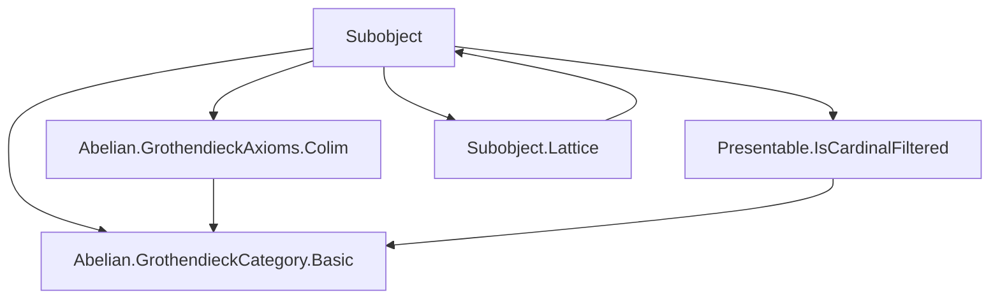
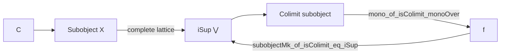

### Technical Brief: `Subobject.lean` — Subobjects in Grothendieck Abelian Categories

---

#### **1. Key Definitions & Theorems**

| Name | Type / Signature | Purpose |
|------|------------------|---------|
| `mono_of_isColimit_monoOver` | `Mono f` | Shows that the induced map `f : colim(F) → X` is a monomorphism, using that colimits of monos are monic in Grothendieck abelian categories. |
| `subobjectMk_of_isColimit_eq_iSup` | `Subobject.mk f = ⨆ j, Subobject.mk (F.obj j).obj.hom` | Relates the colimit subobject (via `f`) to the supremum (join) of the subobjects in the image of `F`. |
| `isColimitMapCoconeOfSubobjectMkEqISup` | `IsColimit ((Over.forget _).mapCocone c)` | Converse: if a cocone’s apex maps monically to `X` and its subobject is the supremum, then it is a colimit in `C`. |
| `exists_isIso_of_functor_from_monoOver` | `∃ j, IsIso (F.obj j).obj.hom` | A compactness / accessibility result: under cardinality constraints (`κ`-filtered + `HasCardinalLT`), if the colimit map `f` is an epimorphism, then one of the components must already be an isomorphism. |

---

#### **2. Naming Conventions**

- **Prefixes**:
  - `mono_of_...`: proves a morphism is monic.
  - `subobjectMk_of_...`: constructs or identifies a subobject via `Subobject.mk`.
  - `isColimit...`: constructs or characterizes colimit cocones.
  - `exists_isIso_of_...`: existence of an isomorphism in a diagram.

- **Suffixes**:
  - `_eq_iSup`: equality with a supremum (join) of subobjects.
  - `_of_...`: implication from assumptions (e.g., `mono_of_isColimit_monoOver`).
  - `_comm`: used in lemmas about commuting diagrams (e.g., `Subobject.mk_le_mk_of_comm`).

- **Helper lemmas**:
  - `Subobject.mk_le_mk_of_comm`: standard tool for comparing subobjects via factorization.
  - `Subobject.isoOfMkEqMk`: equivalence of subobjects when their `mk`-representatives are equal.
  - `Subobject.isIso_iff_mk_eq_top`: characterizes isomorphisms in `MonoOver X` as top elements in the subobject lattice.

---

#### **3. Tactic Stack**

| Tactic | Usage Frequency | Purpose |
|--------|-----------------|---------|
| `simp` / `simp only` | High | Simplify hom-sets, forgetful functors, naturality, and `Subobject.mk`-related expressions. |
| `rw` | Very High | Rewrite using equalities (e.g., `hf`, `h`, `hc.desc`, `Subobject.mk_le_mk_of_comm`). |
| `exact` / `refine` | High | Construct proofs using known lemmas or partial proofs with holes. |
| `intro` / `rintro` | Medium | Introduce hypotheses and destruct existential/universal quantifiers. |
| `induction` | Medium | Induction on subobjects (`Subobject.ind`). |
| `apply` / `apply le_antisymm` | Medium | Prove equalities by antisymmetry in posetal structures (subobject lattice). |
| `dsimp` | Medium | Simplify definitional equalities (e.g., in cocones, maps). |
| `trans` | Medium | Chain inequalities or equalities (e.g., in `exists_isIso_of_functor_from_monoOver`). |
| `apply colimit.ι_desc` | Low | Use universal property of colimits. |
| `apply IsColimit.ofIsoColimit` | Low | Transfer colimit structure along isomorphisms. |

---

#### **4. Proof Logic**

- **General Flow**:
  1. **Setup**: Fix filtered index category `J`, functor `F : J ⥤ MonoOver X`, and cocone `c` over `F` in `C`.
  2. **Monicity**: Prove the induced map `f : colim(F) → X` is monic using:
     - naturality of the diagram of monos,
     - `NatTrans.mono_of_mono_app`,
     - stability of monos under colimits in Grothendieck abelian categories.
  3. **Supremum Identification**:
     - Use `le_antisymm` on `Subobject.mk f` vs `⨆ j, Subobject.mk (F.obj j).obj.hom`.
     - For `≤`: factor each component through `f` using the universal property of the colimit.
     - For `≥`: use that each component factors through `f` by assumption (`hf`).
  4. **Converse Direction**:
     - Assume `Subobject.mk c.pt.hom = ⨆ j, ...`, then show `c` is a colimit by comparing to the canonical colimit cocone and using `Subobject.isoOfMkEqMk`.
  5. **Compactness / Accessibility**:
     - Use `HasCardinalLT` to bound the size of the range of `j ↦ Subobject.mk (F.obj j).obj.hom`.
     - Use `IsCardinalFiltered.max` to pick a "large enough" index.
     - Show that at this index, the subobject is top ⇒ the morphism is iso.

- **Key Logical Tools**:
  - **Subobject lattice is complete** (imported from `Subobject.Lattice`).
  - **Grothendieck axioms**: existence of colimits, exactness, generator condition.
  - **Filtered colimits commute with finite limits** (implicit in monicity preservation).
  - **Cardinal filteredness + `HasCardinalLT` ⇒ existence of cofinal small subdiagram**.

---

#### **5. Imports & Dependencies**

| Module | Role |
|--------|------|
| `Mathlib.CategoryTheory.Abelian.GrothendieckAxioms.Colim` | Colimits in Grothendieck abelian categories (e.g., exactness, existence). |
| `Mathlib.CategoryTheory.Abelian.GrothendieckCategory.Basic` | Definition of `IsGrothendieckAbelian`, basic properties. |
| `Mathlib.CategoryTheory.Presentable.IsCardinalFiltered` | `κ`-filtered categories, `IsCardinalFiltered`, `HasCardinalLT`. |
| `Mathlib.CategoryTheory.Subobject.Lattice` | Complete lattice structure on `Subobject X`, `iSup`, `le_iSup_iff`, etc. |

---

#### **6. Mermaid Diagrams**

##### **Dependency Graph (Module Level)**



##### **Overview of Theoretical Flow in `Subobject.lean`**

```mermaid
flowchart LR
  A[Filtered J] --> B[F : J ⥤ MonoOver X]
  B --> C[Forgetful composition: J → C]
  C --> D[Colimit cocone c in C]
  D --> E[f : c.pt → X]
  E --> F{Is f mono?}
  F -->|Yes| G[Subobject.mk f]
  G --> H[= ⨆ j, Subobject.mk (F.obj j).hom?]
  H -->|Yes| I[c is colimit in C]
  I --> J[Compactness: if f epi ⇒ some F.obj j iso]
```

##### **Subobject Lattice Context**



---

#### **7. Summary**

This file establishes foundational results about subobjects in Grothendieck abelian categories, especially how filtered colimits interact with the subobject lattice. It shows:

- Colimits of monos remain monic.
- The colimit of a diagram of subobjects (in `MonoOver X`) corresponds to the supremum in the subobject lattice.
- A converse: if a mono factors through a colimit and its image is the supremum, then it is the colimit cocone.
- A compactness principle: under size constraints, an epimorphic colimit map implies one component is already an isomorphism.

These results are essential for developing presentability theory, accessibility, and size-based arguments in abelian categories (e.g., in sheaf theory or derived categories).
