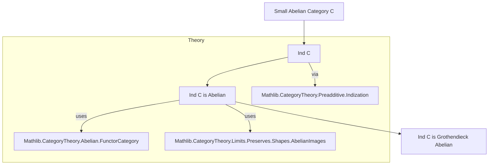

**Technical Brief: `Indization.lean`**

---

### 1. **Key Definitions & Theorems**

| Name | Type / Signature | Purpose |
|------|------------------|---------|
| `Ind C` | `Type (v + 1)` (for `C : Type v`) | Category of ind-objects over a small category `C` |
| `Abelian.coimageImageComparison f` | `Coimage f ⟶ Image f` | The canonical comparison morphism from coimage to image in a preadditive category |
| `IsIso (Abelian.coimageImageComparison f)` | `Prop` | States that the coimage–image comparison is an isomorphism (a key condition for abelianness) |
| `instance {X Y : Ind C} (f : X ⟶ Y) : IsIso (Abelian.coimageImageComparison f)` | `Prop` proof term | Shows that in `Ind C`, every morphism has an iso coimage–image comparison |
| `instance : Abelian (Ind C)` | `Abelian (Ind C)` | Main theorem: if `C` is small abelian, then `Ind C` is abelian |

---

### 2. **Naming Conventions**

- **Prefixes**:
  - `isIso_`: used for properties of morphisms (e.g., `Iso.isIso_hom`)
  - `coimageImageComparison`: standard term for the canonical map `coim f → im f`
  - `PreservesCoimageImageComparison`: indicates preservation of this structure under a functor
- **Suffixes**:
  - `_Functor`: for functors (e.g., `coimageImageComparisonFunctor`)
  - `_iso`: for isomorphisms (e.g., `i'`, `ϕ`)
- **Notable pattern**: `mk_iso_ind_lim` — construction of an isomorphism from a diagram indexed by a filtered system.

---

### 3. **Tactic Stack**

- `obtain ⟨…⟩ := …`: destructuring existential quantifiers and products
- `dsimp only [...] at i'`: simplification with explicit lemmas
- `rw [...]`: rewriting using isomorphism and arrow category lemmas
- `infer_instance`: triggers typeclass search for `IsIso`
- `have := ...`: introduces intermediate facts
- `ofCoimageImageComparisonIsIso`: constructor for `Abelian` instance, requiring all coimage–image comparisons to be isos

---

### 4. **Proof Logic**

The proof proceeds as follows:

1. **Reduction to a diagram**: For any morphism `f : X ⟶ Y` in `Ind C`, use `Ind.exists_nonempty_arrow_mk_iso_ind_lim` to express `f` as a colimit of a diagram of morphisms in `C`.
2. **Functoriality**: Apply `coimageImageComparisonFunctor.mapIso` to lift the isomorphism `i` (from the representation of `f`) to an isomorphism in the arrow category.
3. **Simplify**: Use `dsimp` to unpack definitions of `coimageImageComparisonFunctor`, `Arrow.mk`, etc.
4. **Leverage preservation**: Use `PreservesCoimageImageComparison.iso` to relate the comparison map in `Ind C` to that in `C`, where it is known to be an iso (since `C` is abelian).
5. **Conclude**: Show that the comparison map in `Ind C` is an isomorphism using `Arrow.isIso_iff_isIso_of_isIso`, then apply the `Abelian.ofCoimageImageComparisonIsIso` constructor.

---

### 5. **Imports**

| Import | Role |
|--------|------|
| `Mathlib.CategoryTheory.Preadditive.Indization` | Core theory of ind-objects, including their construction and universal property |
| `Mathlib.CategoryTheory.Abelian.FunctorCategory` | Provides abelian structure on functor categories (used implicitly for `Ind C` as a functor category) |
| `Mathlib.CategoryTheory.Limits.Preserves.Shapes.AbelianImages` | Ensures that certain functors preserve abelian image/coimage structure, used in the comparison argument |

---

### 6. **Mermaid Diagrams**

#### **Dependency Graph**

#### **Overview of File Structure**

--- 

This file is a key step in establishing that the indization of a small abelian category preserves abelianness — a foundational result for derived categories and Grothendieck abelian category theory.
