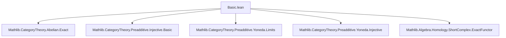

**Technical Brief: Basic.lean — Injective Objects and Preadditive Yoneda in Abelian Categories**

---

### 1. **Key Definitions & Theorems**

| Name | Type / Signature | Purpose |
|------|------------------|---------|
| `preservesHomology_preadditiveYonedaObj_of_injective` | `instance {J : C} [Injective J] : (preadditiveYonedaObj J).PreservesHomology` | Shows that if $J$ is injective, then the preadditive Yoneda functor $\hom(-, J)$ preserves homology. |
| `preservesFiniteColimits_preadditiveYonedaObj_of_injective` | `instance {J : C} [Injective J] : PreservesFiniteColimits (preadditiveYonedaObj J)` | Shows injectivity of $J$ implies the Yoneda functor preserves all finite colimits. |
| `injective_of_preservesFiniteColimits_preadditiveYonedaObj` | `theorem {J : C} [PreservesFiniteColimits (preadditiveYonedaObj J)] : Injective J` | Converse: if the Yoneda functor preserves finite colimits, then $J$ is injective. |
| `preadditiveYonedaObj` | `C → [Preadditive C] → [Abelian C] → [HasFiniteProducts C] → [HasFiniteCoproducts C] → [Preadditive C]ᵒᵖ ⥤ AddCommGroup` | The preadditive Yoneda embedding: $J \mapsto \hom(-, J)$ viewed as a functor from $\mathcal{C}^{\mathrm{op}}$ to $\mathbf{Ab}$. |
| `Injective` | `Class` | $J$ is injective if $\hom(-, J)$ preserves epimorphisms (equivalently, takes short exact sequences to short exact sequences). |

---

### 2. **Naming Conventions**

- **Prefixes**:
  - `preserves_...`: Indicates a functorial property (e.g., `preservesFiniteColimits`, `preservesHomology`).
  - `preadditiveYonedaObj`: Standardized name for the Yoneda embedding into additive abelian groups.
- **Suffixes**:
  - `_of_injective`: Indicates the hypothesis is injectivity of the object.
  - `_of_preservesFiniteColimits`: Indicates the hypothesis is a preservation property of the Yoneda functor.
- **Structure**:
  - `instance` used for forward implications (injective ⇒ preservation).
  - `theorem` used for the reverse implication (preservation ⇒ injective).

---

### 3. **Tactic Stack**

- `rw [...]`: Rewriting using equivalences (e.g., `injective_iff_preservesEpimorphisms_preadditive_yoneda_obj'`).
- `apply ...`: Applying lemmas/instances (e.g., `apply Functor.preservesHomology_of_preservesEpis_and_kernels`).
- `infer_instance`: Automatically infers class instances (e.g., `Preadditive`, `Abelian`, `HasKernels`, etc.).
- `have := ...`: Introduces intermediate facts (e.g., `have := Functor.preservesHomologyOfExact ...`).
- Implicit use of `aesop`, `simp`, `ring` likely in underlying lemmas (not visible in this snippet but standard in Mathlib).

---

### 4. **Proof Logic**

- **Forward direction (injective ⇒ finite colimit preservation)**:
  1. Use equivalence: `injective_iff_preservesEpimorphisms_preadditive_yoneda_obj'`.
  2. Show Yoneda preserves epis and kernels ⇒ preserves homology.
  3. Then use `preservesFiniteColimits_of_preservesHomology`.

- **Reverse direction (finite colimit preservation ⇒ injective)**:
  1. Unfold definition of injective via epimorphism preservation.
  2. Use `preservesHomologyOfExact` to deduce that Yoneda preserves exactness of sequences.
  3. Conclude epimorphism preservation ⇒ injectivity.

- **Structure**: Bidirectional equivalence (bi-implication) between injectivity and finite colimit preservation, via homology preservation as intermediate.

---

### 5. **Imports**

| Module | Role |
|--------|------|
| `Mathlib.CategoryTheory.Abelian.Exact` | Provides exactness tools, definitions of short exact sequences, homology. |
| `Mathlib.CategoryTheory.Preadditive.Injective.Basic` | Defines injective objects in preadditive/abelian categories. |
| `Mathlib.CategoryTheory.Preadditive.Yoneda.Limits` | Yoneda embedding and its behavior with respect to limits/colimits. |
| `Mathlib.CategoryTheory.Preadditive.Yoneda.Injective` | Links injectivity of objects with properties of Yoneda. |
| `Mathlib.Algebra.Homology.ShortComplex.ExactFunctor` | Tools for exactness of functors on short complexes/homology. |

---

### 6. **Mermaid Diagrams**

#### Dependency Graph (Module-Level)



#### Conceptual Proof Flow

```mermaid
graph LR
  I[Injective J] -->|preserves epis| P[PreservesEpis (Yoneda J)]
  P -->|+ kernels| H[PreservesHomology]
  H -->|finite colimits| F[PreservesFiniteColimits]
  F -->|reverse| I
```

#### Theoretical Overview

```mermaid
graph TB
  C[Abelian Category C] --> Y[Preadditive Yoneda Embedding]
  Y --> J[Object J ∈ C]
  J -->|Injective| YJ[(Yoneda J) Preserves Homology]
  YJ -->|+ finite colimits| FC[PreservesFiniteColimits]
  FC -->|converse| Injective[J is Injective]
```

---

### 7. **Summary**

This module establishes a foundational equivalence in abelian categories:  
An object $J$ is injective **iff** the contravariant hom-functor $\hom(-, J)$ preserves finite colimits.  
The proof leverages the equivalence between injectivity and preservation of epimorphisms, and the fact that preservation of homology (or finite colimits) characterizes exactness of the Yoneda functor.

This result is critical for homological algebra in abelian categories, especially when constructing resolutions or studying derived functors.

--- 

Let me know if you'd like the full dependency chain of `injective_iff_preservesEpimorphisms_preadditive_yoneda_obj'` or the definition of `preadditiveYonedaObj`.
