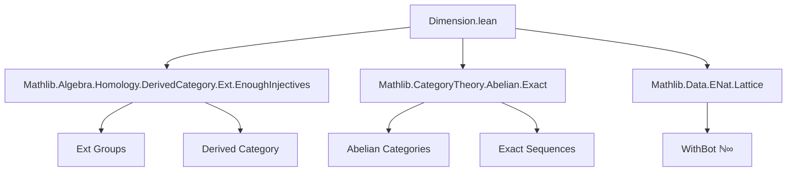

### Technical Brief: `Dimension.lean` — Injective Dimension in Abelian Categories

---

#### **1. Key Definitions & Theorems**

| Name | Type / Signature | Purpose |
|------|------------------|---------|
| `HasInjectiveDimensionLT X n` | `Prop` | Object `X` has *injective dimension `< n`*: all `Ext^i(Y, X)` vanish for `i ≥ n`. |
| `HasInjectiveDimensionLE X n` | `abbrev` | Abbreviation for `HasInjectiveDimensionLT X (n + 1)` — *injective dimension `≤ n`*. |
| `injectiveDimension X` | `WithBot ℕ∞` | Minimal `n ∈ WithBot ℕ∞` such that `X` has injective dimension `< n`. Noncomputable. |
| `hasInjectiveDimensionLT_iff` | `↔` | Equivalence: `HasInjectiveDimensionLT X n` iff all `Ext^i(Y,X)` vanish for `i ≥ n`. |
| `Abelian.Ext.eq_zero_of_hasInjectiveDimensionLT` | `e = 0` | Any `e : Ext Y X i` is zero when `n ≤ i` and `X` has injective dimension `< n`. |
| `hasInjectiveDimensionLT_zero_iff_isZero` | `↔` | `X` has injective dimension `< 0` iff `X` is zero. |
| `injective_iff_hasInjectiveDimensionLT_one` | `↔` | `X` is injective iff `X` has injective dimension `< 1`. |
| `injectiveDimension_lt_iff` | `↔` | `dim(X) < n` iff `X` has injective dimension `< n`. |
| `injectiveDimension_le_iff` | `↔` | `dim(X) ≤ n` iff `X` has injective dimension `≤ n`. |
| `injectiveDimension_eq_bot_iff` | `↔` | `dim(X) = ⊥` iff `X` is zero. |
| `injectiveDimension_ne_top_iff` | `↔` | `dim(X) ≠ ⊤` iff `X` has finite injective dimension (`≤ n` for some `n`). |
| `ShortExact.hasInjectiveDimensionLT_X₂` | `HasInjectiveDimensionLT S.X₂ n` | In a short exact sequence `0 → X₁ → X₂ → X₃ → 0`, if `X₁`, `X₃` have dim `< n`, then so does `X₂`. |
| `ShortExact.hasInjectiveDimensionLT_X₁` | `HasInjectiveDimensionLT S.X₁ (n+1)` | If `X₃` has dim `< n`, `X₂` has dim `< n+1`, then `X₁` has dim `< n+1`. |
| `ShortExact.hasInjectiveDimensionLT_X₃` | `HasInjectiveDimensionLT S.X₃ n` | If `X₂` has dim `< n`, `X₁` has dim `< n+1`, then `X₃` has dim `< n`. |
| `Retract.hasInjectiveDimensionLT` | `HasInjectiveDimensionLT X n` | Retracts inherit injective dimension bounds from codomain. |
| `hasInjectiveDimensionLT_of_iso` | `HasInjectiveDimensionLT X' n` | Isomorphic objects share injective dimension bounds. |
| `instance ⊞` | `HasInjectiveDimensionLT (X ⊞ Y) n` | Binary biproducts preserve injective dimension bounds. |

---

#### **2. Naming Conventions**

- **Prefixes**:
  - `hasInjectiveDimensionLT_`: lemmas about `HasInjectiveDimensionLT`.
  - `injectiveDimension_`: lemmas about the `injectiveDimension` function.
  - `eq_zero_of_`: lemmas proving Ext classes vanish.
- **Suffixes**:
  - `_iff`: characterizations (`↔`).
  - `_le`, `_lt`, `_ge`: comparisons with bounds.
  - `_iff_isZero`, `_iff_injective`: special cases.
- **Structure fields**:
  - `subsingleton'`: internal field (not for direct use); ensures `Ext^i(Y,X)` is subsingleton.

---

#### **3. Tactic Stack**

Frequently used tactics:
- `rw`, `simp`, `simp only`, `congr!`
- `intro`, `rintro`, `obtain ⟨…⟩`, `exact`
- `have`, `set`, `letI` (for implicit instance introduction)
- `cases` (on natural numbers, e.g., `obtain _ | i := i`)
- `lia`, `linarith` (for arithmetic inequalities)
- `subsingleton`, `injective`, `surjective`, `elim`
- `ext`, `funext`, `apply`, `apply_fun`
- `convert`, `change`, `refine`, `apply _ [h]`

No heavy automation (e.g., `ring`, `field_simp`, `norm_num`) — proofs are mostly structural and rely on homological algebra lemmas.

---

#### **4. Proof Logic**

- **Induction & case analysis** on natural numbers (`i : ℕ`) is common, especially distinguishing `i = 0` vs `i > 0`.
- **Exact sequence arguments**: use long exact sequences of Ext (via `Ext.covariant_sequence_exact₁/₂/₃`) to lift or descend Ext classes.
- **Subsingleton reasoning**: vanishing of Ext groups follows from subsinglenton + existence of zero element.
- **Retract / iso stability**: proven via naturality of Ext and factorization through retraction maps.
- **Infimum-based definitions**: `injectiveDimension` defined via `sInf`; proofs use `sInf_lt_iff`, `sInf_le_sInf_of_subset`, etc.
- **Logical equivalences**: many key properties are proven as `↔`, enabling bidirectional reasoning.

---

#### **5. Imports**

| Module | Purpose |
|--------|---------|
| `Mathlib.Algebra.Homology.DerivedCategory.Ext.EnoughInjectives` | Ext groups, derived functors, enough injectives. |
| `Mathlib.CategoryTheory.Abelian.Exact` | Abelian categories, exact sequences, homological algebra basics. |
| `Mathlib.Data.ENat.Lattice` | Extended naturals `ℕ∞`, used in `WithBot ℕ∞`. |

---

#### **6. Mermaid Diagrams**

##### **Dependency Graph (Module-Level)**



##### **Overview of Theory Flow**

```mermaid
flowchart LR
  A[Abelian Category C] --> B[Ext^i(Y,X) groups]
  B --> C[Vanishing for i ≥ n]
  C --> D[HasInjectiveDimensionLT X n]
  D --> E[HasInjectiveDimensionLE X n = LT X (n+1)]
  D --> F[injectiveDimension X = sInf {n | LT X n}]
  F --> G[Properties: ≤, <, = ⊥, ≠ ⊤]
  G --> H[Applications: short exact sequences, retracts, biproducts]
```

##### **Key Logical Dependencies**

```mermaid
graph LR
  A[Abelian C + HasExt] --> B[HasInjectiveDimensionLT X n]
  B --> C[Ext^i(Y,X) = 0 for i ≥ n]
  C --> D[IsZero X ↔ LT X 0]
  C --> E[Injective X ↔ LT X 1]
  B --> F[injectiveDimension X]
  F --> G[injectiveDimension_lt_iff]
  F --> H[injectiveDimension_le_iff]
  G --> I[Finite ⇔ ≠ ⊤]
```

---

#### **7. Summary**

This file formalizes *injective dimension* in an abelian category with enough injectives, using Ext groups. It defines:
- A type class `HasInjectiveDimensionLT` for bounding injective dimension,
- A noncomputable function `injectiveDimension` mapping to `WithBot ℕ∞`,
- Key equivalences linking vanishing Ext, zero objects, injective objects, and finite/infinite dimension,
- Stability under retracts, isomorphisms, biproducts, and short exact sequences.

The development is clean, modular, and leverages Lean’s type class inference and homological algebra infrastructure in Mathlib.

--- 

Let me know if you'd like a formalization roadmap or a summary of how this integrates with projective dimension or cohomological dimension.
