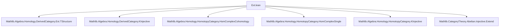

Here is a structured technical brief extracted from the provided `Ext.lean` file:

---

### **1. Key Definitions & Theorems**

| Name | Type / Signature | Purpose |
|------|------------------|---------|
| `extEquivCohomologyClass` | `Ext X Y n ≃ CohomologyClass ((singleFunctor C 0).obj X) R.cochainComplex n` | Establishes an equivalence (not yet additive) between `Ext`-group elements and degree-`n` cohomology classes from $X$ to the injective resolution $R$. |
| `extAddEquivCohomologyClass` | `Ext X Y n ≃+ CohomologyClass ((singleFunctor C 0).obj X) R.cochainComplex n` |upgrade to an additive equivalence (i.e., group isomorphism). |
| `extMk` | `(f : X ⟶ R.cocomplex.X n) → f ≫ d = 0 → Ext X Y n` | Constructor for elements of `Ext X Y n` from a cocycle $f$ in the injective resolution. |
| `extMk_eq_zero_iff` | `R.extMk f = 0 ↔ ∃ g, g ∘ d = f` | Characterizes when an `extMk`-class is zero: iff the cocycle $f$ is a coboundary. |
| `extMk_surjective` | `∀ α : Ext X Y n, ∃ f, R.extMk f = α` | Surjectivity of `extMk`: every `Ext` class arises from some cocycle. |
| `mk₀_comp_extMk` | `(Ext.mk₀ g).comp (R.extMk f) = R.extMk (g ≫ f)` | Compatibility of `extMk` with precomposition (contravariance in first argument). |
| `extMk_comp_mk₀` | `(R.extMk f).comp (Ext.mk₀ g) = R'.extMk (f ≫ φ.hom.f n)` | Compatibility of `extMk` with postcomposition via a morphism of injective resolutions. |
| `extEquivCohomologyClass_symm_mk_hom` | Explicit description of the hom-component of the image under `extEquivCohomologyClass.symm`. | Used to compute the underlying morphism in the derived category. |

---

### **2. Naming Conventions**

- **Prefixes**:
  - `extEquivCohomologyClass`: core equivalence between `Ext` and cohomology classes.
  - `extMk`: “make” an `Ext` element from a cocycle.
  - `mk₀`: standard constructor for morphisms in `Ext` (pre/post-composition).
- **Suffixes**:
  - `_hom`: describes the underlying morphism in the derived category.
  - `_add`, `_sub`, `_neg`, `_zero`: lemmas about additive structure.
  - `_comp`: behavior under composition (pre- or post-).
  - `_surjective`, `_eq_zero_iff`: properties of the constructor.

---

### **3. Tactic Stack**

Frequently used tactics:
- `simp` / `simp only`: simplification with many lemmas (especially `extMk`, `extEquivCohomologyClass`, `Cocycle.fromSingleMk`, `ShiftedHom`).
- `rw`: rewriting using equivalences and naturality squares.
- `congr`: for proving equality of morphisms by congruence (especially in derived category).
- `ext`: extensionality for morphisms (e.g., in `Ext`, `CohomologyClass`, `CochainComplex.Hom`).
- `cat_disch`: category-theoretic discharge tactic (likely custom).
- `lia`: linear integer arithmetic for degree constraints (e.g., `n + 1 = m`).
- `dsimp`, `change`, `obtain`, `cases`: for proof engineering.

---

### **4. Proof Logic**

- **Structure**:
  - Most proofs rely on the equivalence `extEquivCohomologyClass` to reduce to computations in cohomology.
  - Additive properties follow from `extAddEquivCohomologyClass` being an `AddEquiv`.
  - Key lemmas (`extMk_surjective`, `extMk_eq_zero_iff`) are proven by:
    - Pulling back along the equivalence,
    - Using surjectivity of `Cocycle.mk` and `Cocycle.fromSingleMk`,
    - Translating coboundary conditions via isomorphisms `R.cochainComplexXIso`.
- **Common pattern**:
  - Use `extEquivCohomologyClass_symm_mk_hom` to compute the underlying morphism.
  - Use naturality of derived category isomorphisms (e.g., `DerivedCategory.singleFunctorIsoCompQ`, `Q.map R.ι'`) to simplify diagrams.

---

### **5. Imports & Dependencies**

**Primary dependencies**:
- `Mathlib.Algebra.Homology.DerivedCategory.Ext.TStructure`
- `Mathlib.Algebra.Homology.DerivedCategory.KInjective`
- `Mathlib.Algebra.Homology.HomotopyCategory.HomComplexCohomology`
- `Mathlib.Algebra.Homology.HomotopyCategory.HomComplexSingle`
- `Mathlib.Algebra.Homology.HomotopyCategory.KInjective`
- `Mathlib.CategoryTheory.Abelian.Injective.Extend`

**Key abstractions used**:
- Abelian categories with injective resolutions and `Ext` groups.
- Derived category `D(C)` and localization `Q : HomotopyCategory C → DerivedCategory C`.
- `CochainComplex`, `CohomologyClass`, `Cocycle`, `ShiftedHom`, `SmallShiftedHom`.
- `InjectiveResolution`, `Hom R R' g` (morphisms of resolutions).
- `singleFunctor`, `singleFunctorIsoCompQ`, `Q.map`.

---

### **6. Mermaid Diagrams**

#### **Dependency Graph (Module-Level)**



#### **Conceptual Overview of the Theory**

```mermaid
flowchart LR
  subgraph Setup
    C[Abelian Category C]
    R[Injective Resolution R of Y]
    X[Object X]
  end

  subgraph Derived Category
    Q[Derived Category D(C)]
    QX[(singleFunctor 0).obj X]
    QR[R.cochainComplex]
  end

  subgraph Cohomology
    Hn[CohomologyClass QX QR n]
    Zn[Cocycles Zⁿ(QHom(QX, QR))]
    Bn[Coboundaries Bⁿ]
    Hn_iso[Zⁿ / Bⁿ]
  end

  subgraph Ext
    Extn[Ext X Y n]
    ext_equiv[extEquivCohomologyClass]
    ext_mk[extMk : Zⁿ → Extⁿ]
  end

  C --> R
  C --> X
  R --> QR
  X --> QX
  QX -->|Hom in D(C)| QR
  Zn -->|quotient| Hn_iso
  Hn_iso <-->|equiv| Hn
  Extn <-->|ext_equiv| Hn
  Zn -->|ext_mk| Extn
```

#### **Key Equivalence Chain**

$$
\mathrm{Ext}^n(X, Y)
\xrightarrow{\sim}
\mathrm{Hom}_{\mathcal{D}(C)}\big((\Sigma^0 X), R\big)_n
\xrightarrow{\sim}
H^n\big(\mathrm{Hom}(\Sigma^0 X, R)\big)
$$

Where:
- $\Sigma^0 X = (singleFunctor\ C\ 0).obj\ X$,
- $R$ is viewed as a complex in the derived category via `isKInjective_of_injective`,
- The second map uses `equivOfIsKInjective` (since $R$ is K-injective).

---

Let me know if you'd like a formalized summary in Lean syntax or a diagram of the `extMk` naturality square.
