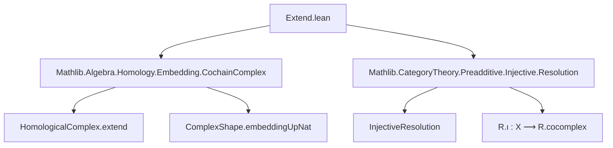

Here is the structured technical metadata extracted from `Extend.lean`:

---

### **1. Key Definitions & Theorems**

| Name | Type / Signature | Purpose |
|------|------------------|---------|
| `cochainComplex` | `R.cochainComplex : CochainComplex C ℤ` | Extends the cochain complex `R.cocomplex : CochainComplex C ℕ` (from an injective resolution) to a ℤ-indexed cochain complex by zero extension along `ComplexShape.embeddingUpNat`. |
| `cochainComplexXIso` | `R.cochainComplex.X n ≅ R.cocomplex.X k` (when `k = n`) | Provides the isomorphism between components of the extended complex and the original ℕ-indexed complex over nonnegative degrees. |
| `cochainComplex_d` | `R.cochainComplex.d n₁ n₂ = ...` | Describes the differential of the extended complex in terms of the original one via the isomorphisms. |
| `ι'` | `ι' : (CochainComplex.singleFunctor C 0).obj X ⟶ R.cochainComplex` | The canonical quasi-isomorphism from the single-object complex concentrated in degree 0 at `X` to the extended injective resolution. |
| `ι'_f_zero` | Explicit formula for component `f 0` of `ι'` | Verifies the degree-0 component of `ι'` matches the original resolution map `R.ι.f 0`. |
| `hom'` | `φ.hom' : R.cochainComplex ⟶ R'.cochainComplex` | Induced morphism of extended cochain complexes from a morphism of injective resolutions. |
| `hom'_f` | Component-wise description of `φ.hom'` | Relates `φ.hom'.f n` to `φ.hom.f m` via the isomorphisms `cochainComplexXIso`. |
| `ι'_comp_hom'` | `R.ι' ≫ φ.hom' = ...` | Naturality square for `ι'` with respect to morphisms of injective resolutions. |
| `instance QuasiIso R.ι'` | Proof that `ι'` is a quasi-isomorphism | Follows from the corresponding property of `R.ι` and extension. |
| `instance IsLE R.cochainComplex 0` | Proof that the complex is supported in degrees ≤ 0 | Derived from quasi-isomorphism to a complex supported in degree 0. |

---

### **2. Naming Conventions**

- **Prefixes**:
  - `cochainComplex_`: for constructions related to the extended ℤ-indexed complex.
  - `cochainComplexXIso`: for isomorphisms between components of extended and original complexes.
  - `ι'`: distinguished notation for the canonical quasi-isomorphism (prime indicates extension).
  - `hom'`: for induced morphisms on extended complexes.

- **Suffixes**:
  - `_f`: for component functions (e.g., `ι'_f_zero`, `hom'_f`).
  - `_f_zero`: for degree-0 component formulas.

- **Pattern**: `R.cochainComplex` is the canonical name for the extended complex; `R.ι'` for the canonical map.

---

### **3. Tactic Stack**

Frequently used tactics in proofs:
- `dsimp [cochainComplex]`, `simp`, `simp only [...]`: simplification using definitions and rewrite rules.
- `infer_instance`: to discharge typeclass goals (e.g., `Injective`, `QuasiIso`, `IsLE`, `IsStrictlyGE`).
- `rw [...]`, `cat_disch`: categorical rewriting and diagram chasing.
- `obtain ⟨k, rfl⟩ := Int.eq_ofNat_of_zero_le hn`: integer case analysis using nonnegativity.
- `by_cases hn : 0 ≤ n`: case split on integer sign.
- `simp [hom', ...]`: simplification with definitions and lemmas.

---

### **4. Proof Logic**

- **Structure**:
  - Define `cochainComplex` via `extend` along `ComplexShape.embeddingUpNat`.
  - Prove structural properties (e.g., `IsStrictlyGE 0`, `Injective` components) using case analysis on `n : ℤ`.
  - Define `ι'` using `extendSingleIso` and `extendFunctor.map`.
  - Prove component formulas (`ι'_f_zero`, `hom'_f`) via `HomologicalComplex.extendMap_f`, `extend_d_eq`, etc.
  - Prove naturality (`ι'_comp_hom'`) by reducing to degree 0 and using `HomologicalComplex.from_single_hom_ext`.

- **Common proof pattern**:
  - Use `HomologicalComplex.extend_*` lemmas to relate extended and original data.
  - Leverage `cochainComplexXIso` to transport structure between `ℤ`- and `ℕ`-indexed parts.
  - Use `QuasiIso` and `IsLE` instances via `from_quasiIso` or `from_single_hom_ext`.

---

### **5. Imports**

- `Mathlib.Algebra.Homology.Embedding.CochainComplex`: for `extend`, `extendMap`, `extendSingleIso`, `extendFunctor`, etc.
- `Mathlib.CategoryTheory.Preadditive.Injective.Resolution`: for `InjectiveResolution`, `R.ι`, `Hom R R' f`, etc.

---

### **6. Mermaid Diagrams**

#### **Dependency Graph (Module-Level)**



#### **Overview of Theory Flow**

```mermaid
flowchart LR
  subgraph Input
    X[Object X in C]
    R[InjectiveResolution X]
  end

  subgraph Construction
    R_cocomplex[R.cocomplex : CochainComplex C ℕ]
    R_cochain[R.cochainComplex : CochainComplex C ℤ]
    ι'[ι' : X[0] ⟶ R.cochainComplex]
  end

  subgraph Properties
    QI[QuasiIso ι']
    LE[IsLE R.cochainComplex 0]
    Injective[∀ n, Injective (R.cochainComplex.X n)]
  end

  R --> R_cocomplex
  R_cocomplex -->|extend| R_cochain
  R_cochain --> ι'
  ι' --> QI
  QI --> LE
  R_cochain --> Injective
```

---

Let me know if you'd like a formalized dependency graph (e.g., for `leanpkg` or `lake`) or a visualization of the categorical diagram for `ι'_comp_hom'`.
