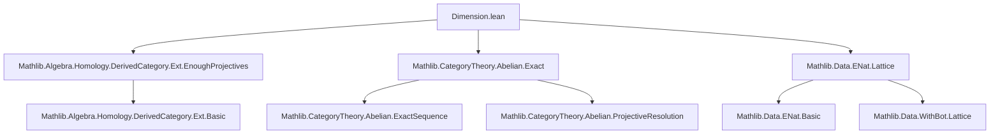
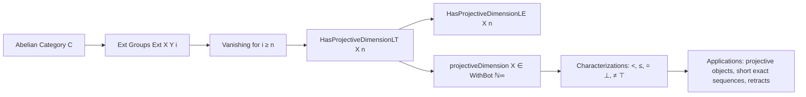

### Technical Brief: Projective Dimension in Lean 4 (Dimension.lean)

---

#### **1. Key Definitions & Theorems**

| Name | Type / Signature | Purpose |
|------|------------------|---------|
| `HasProjectiveDimensionLT X n` | `Class` | `X` has projective dimension `< n`: all `Ext X Y i = 0` for `n ≤ i`. |
| `HasProjectiveDimensionLE X n` | `Abbrev` | `HasProjectiveDimensionLT X (n + 1)` — i.e., projective dimension `≤ n`. |
| `projectiveDimension X` | `WithBot ℕ∞` | Minimal `n ∈ WithBot ℕ∞` such that `∀ i > n, HasProjectiveDimensionLT X i`. |
| `hasProjectiveDimensionLT_iff` | `↔` | Characterization: `HasProjectiveDimensionLT X n ↔ ∀ i ≥ n, Ext X Y i = 0`. |
| `Abelian.Ext.eq_zero_of_hasProjectiveDimensionLT` | `Ext X Y i → e = 0` | Any extension class vanishes under the hypothesis. |
| `isZero_of_hasProjectiveDimensionLT_zero` | `IsZero X` | `X = 0` iff `HasProjectiveDimensionLT X 0`. |
| `projective_iff_hasProjectiveDimensionLT_one` | `↔` | `X` projective ⇔ `HasProjectiveDimensionLT X 1`. |
| `projectiveDimension_lt_iff` | `↔` | `projectiveDimension X < n ↔ HasProjectiveDimensionLT X n`. |
| `projectiveDimension_le_iff` | `↔` | `projectiveDimension X ≤ n ↔ HasProjectiveDimensionLE X n`. |
| `projectiveDimension_eq_bot_iff` | `↔` | `projectiveDimension X = ⊥ ↔ IsZero X`. |
| `Retract.hasProjectiveDimensionLT` | `→` | Retracts inherit projective dimension bounds. |
| `ShortExact.hasProjectiveDimensionLT_X₂` | `→` | In a short exact sequence, middle term inherits bound from ends. |
| `ShortExact.hasProjectiveDimensionLT_X₃_iff` | `↔` | Under projectivity of middle term, shift in dimension between ends. |

---

#### **2. Naming Conventions**

- **Prefixes**:
  - `hasProjectiveDimensionLT_`: lemmas about `HasProjectiveDimensionLT`.
  - `projectiveDimension_`: lemmas about the `projectiveDimension` function.
  - `eq_zero_of_`: lemmas asserting extension classes vanish.
  - `isZero_of_`: lemmas deducing zero object from vanishing Ext.

- **Suffixes**:
  - `_iff`: equivalence characterizations.
  - `_le`, `_lt`, `_ge`: relational lemmas.
  - `_of_iso`, `_of_ge`, `_of_iso`: structural propagation lemmas.

- **Class naming**:
  - `HasProjectiveDimensionLT`, `HasProjectiveDimensionLE`: standard `Has*` pattern.

---

#### **3. Tactic Stack**

Frequently used tactics:
- `rw` / `simp` / `simp only`: rewriting and simplification (especially with `Ext.mk₀`, `Ext.comp_zero`, etc.).
- `intro` / `rintro`: introduction of variables and hypotheses.
- `obtain ⟨x, rfl⟩`: destructing existential equalities (e.g., from exactness).
- `have := ...; exact ...`: intermediate lemma application.
- `subsingleton`, `subsingleton'`: leveraging subsingleton properties of extension groups.
- `congr!`: congruence reasoning for equality of infima.
- `csInf_mem`, `sInf_lt_iff`, `sInf_le_sInf_of_subset_insert_top`: lattice-theoretic reasoning in `WithBot ℕ∞`.
- `lia`: linear integer arithmetic for inequalities like `n ≤ i`, `n + k ≤ i`.

---

#### **4. Proof Logic**

- **Induction & case analysis**:
  - On natural numbers (`i`), especially distinguishing `i = 0` vs `i > 0`.
  - On `WithBot ℕ∞` (via `induction d with | bot | coe d`).
- **Exactness-based reasoning**:
  - Use of `Ext.contravariant_sequence_exact₂/₃/₁` to lift or descend extension classes along short exact sequences.
- **Retract & isomorphism propagation**:
  - Use of `Retract.hasProjectiveDimensionLT`, `hasProjectiveDimensionLT_of_iso`.
- **Subsingleton elimination**:
  - `Subsingleton.elim` or `eq_zero_of_subsingleton` pattern to deduce equality to zero.
- **Infimum reasoning**:
  - `projectiveDimension` defined as `sInf`, so proofs often use `sInf_lt_iff`, `sInf_le_sInf_of_subset`, etc.

---

#### **5. Imports & Dependencies**

| Module | Role |
|--------|------|
| `Mathlib.Algebra.Homology.DerivedCategory.Ext.EnoughProjectives` | Provides `Ext` groups and enough projectives for derived functors. |
| `Mathlib.CategoryTheory.Abelian.Exact` | Provides exact sequences, `ShortComplex`, `ShortExact`, and Ext long exact sequences. |
| `Mathlib.Data.ENat.Lattice` | Provides `ℕ∞` and `WithBot` lattice structure for dimension values. |

---

#### **6. Mermaid Diagrams**

##### **Dependency Graph (Module-Level)**



##### **Conceptual Overview (Theory Flow)**



##### **Short Exact Sequence Propagation**

```mermaid
flowchart LR
  S[X₁] -->|h₁| S[X₂] -->|h₂| S[X₃]
  h₁ -.->|hasProjectiveDimensionLT_X₁| h₂
  h₂ -.->|hasProjectiveDimensionLT_X₂| h₁ & h₃
  h₃ -.->|hasProjectiveDimensionLT_X₃| h₁ & h₂
  h₂ -- Projective -->|hasProjectiveDimensionLT_X₃_iff| h₁ ↔ h₃[shifted]
```

---

#### **7. Summary**

This file formalizes **projective dimension** in an abelian category using `Ext` groups. It defines:
- A type class `HasProjectiveDimensionLT` for bounding dimension from above,
- A derived abbreviation `HasProjectiveDimensionLE`,
- A noncomputable function `projectiveDimension : C → WithBot ℕ∞`,
- Key equivalences linking dimension bounds to vanishing Ext,
- Structural lemmas for retracts, isomorphisms, biproducts, and short exact sequences.

The development is clean, modular, and leverages Lean’s type class inference and subsingleton reasoning to manage extension groups’ uniqueness. It serves as a foundation for homological algebra in abelian categories, especially for derived functor computations and dimension theory.
