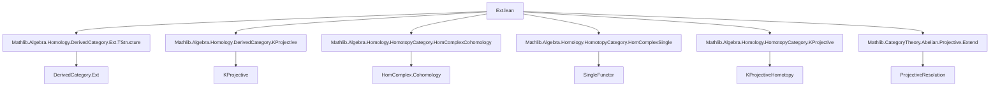

### Technical Brief: `Ext.lean` — Computing `Ext` via Projective Resolutions

---

#### **1. Key Definitions & Theorems**

| Name | Type / Signature | Purpose |
|------|------------------|---------|
| `extEquivCohomologyClass` | `Ext X Y n ≃ CohomologyClass R.cochainComplex ((singleFunctor C 0).obj Y) n` | Establishes an equivalence between `Ext^n(X,Y)` and degree-`n` cohomology classes from the projective resolution `R` to `Y` (viewed as a complex concentrated in degree 0). |
| `extAddEquivCohomologyClass` | `Ext X Y n ≃+ CohomologyClass R.cochainComplex ((singleFunctor C 0).obj Y) n` | Refines the above to an *additive* equivalence (i.e., group isomorphism). |
| `extMk` | `(f : R.complex.X n ⟶ Y) → (m : ℕ) → n + 1 = m → R.complex.d m n ≫ f = 0 → Ext X Y n` | Constructor for elements of `Ext X Y n` from a *cocycle* `f` in the projective resolution. |
| `extEquivCohomologyClass_extMk` | `R.extEquivCohomologyClass (R.extMk f ... ) = ...` | Describes the image of `extMk f ...` under the equivalence. |
| `extMk_eq_zero_iff` | `R.extMk f ... = 0 ↔ ∃ g, R.complex.d n p ≫ g = f` | Characterizes when an `Ext`-class defined by `extMk` is zero: iff the cocycle `f` is a coboundary. |
| `extMk_surjective` | `∀ α : Ext X Y n, ∃ f, R.extMk f ... = α` | Surjectivity of the `extMk` construction — every `Ext`-class arises from some cocycle. |
| `extMk_comp_mk₀` | `(R.extMk f ...).comp (Ext.mk₀ g) = R.extMk (f ≫ g) ...` | Compatibility of `extMk` with post-composition in the second argument (`Y → Y'`). |
| `mk₀_comp_extMk` | `(Ext.mk₀ g).comp (R.extMk f ...) = R'.extMk (φ.hom.f n ≫ f) ...` | Compatibility of `extMk` with pre-composition in the first argument (`X' → X`) via a lift `φ : Hom R' R g`. |
| `extEquivCohomologyClass_symm_mk_hom` | Explicit formula for the hom-component of the image of a cocycle under `extEquivCohomologyClass.symm`. | Used to compute concrete representatives in the derived category. |

---

#### **2. Naming Conventions**

- **Prefixes**:
  - `extEquivCohomologyClass*`: Equivalence between `Ext` and cohomology classes.
  - `extMk*`: Constructor for `Ext` elements from cocycles.
  - `mk₀*`: Standard morphism in `Ext` induced by a map in the base category (e.g., `Ext.mk₀ g`).
- **Suffixes**:
  - `_hom`: Refers to the hom-component of a derived morphism.
  - `_add`, `_sub`, `_neg`, `_zero`: Laws for additive structure.
  - `_comp_*`: Behavior under composition (pre- or post-).
  - `_surjective`, `_eq_zero_iff`: Characterization lemmas.

---

#### **3. Tactic Stack**

Frequently used tactics in proofs:
- `simp` / `simp only` — heavily used to normalize expressions involving `HomComplex`, `CohomologyClass`, `ShiftedHom`, `Iso`, `DerivedCategory`.
- `rw` — rewriting using equivalences, naturality, and definitions.
- `congr` — for proving equality of morphisms in `ShiftedHom` or `HomComplex`.
- `ext` — extensionality for morphisms in `Ext` or `Hom`.
- `have := HasDerivedCategory.standard C` — to access structural facts about the derived category.
- `obtain ⟨x, rfl⟩ := ...` — destructuring surjectivity or equivalence properties.
- `dsimp`, `change`, `exact`, `refine`, `simpa`.

---

#### **4. Proof Logic**

The logical flow of most proofs follows this pattern:

1. **Reduce to cohomology classes** via `extEquivCohomologyClass` or its inverse.
2. **Use surjectivity of `CohomologyClass.mk`** to assume elements are of the form `.mk x`.
3. **Unfold definitions** (`extMk`, `extEquivCohomologyClass`, `Cocycle.toSingleMk`, etc.).
4. **Apply naturality and functoriality** of derived category constructions (e.g., `ShiftedHom`, `Q.map`, `singleFunctorIsoCompQ`).
5. **Simplify using `simp` lemmas** for `ShiftedHom`, `CohomologyClass`, `Cocycle`, and `Iso`.
6. **Conclude via congruence or extensionality**.

Induction is *not* used — the arguments are mostly computational and rely on explicit descriptions in terms of complexes and homotopy categories.

---

#### **5. Imports & Dependencies**

**Primary imports** (define the theoretical scope):
```lean
Mathlib.Algebra.Homology.DerivedCategory.Ext.TStructure
Mathlib.Algebra.Homology.DerivedCategory.KProjective
Mathlib.Algebra.Homology.HomotopyCategory.HomComplexCohomology
Mathlib.Algebra.Homology.HomotopyCategory.HomComplexSingle
Mathlib.Algebra.Homology.HomotopyCategory.KProjective
Mathlib.CategoryTheory.Abelian.Projective.Extend
```

**Core theoretical dependencies**:
- Abelian categories with projective resolutions and `Ext` groups.
- Derived category `D(C)` and localization `Q : CochainComplex C → D(C)`.
- `K`-projective complexes (projective complexes are `K`-projective).
- Cohomology of `Hom` complexes and equivalence via `isKProjective`.
- `singleFunctor` embedding objects as complexes concentrated in degree 0.
- `SmallShiftedHom` and `ShiftedHom` for grading shifts.

---

#### **6. Mermaid Diagrams**

##### **Dependency Graph (Module-Level)**



##### **Conceptual Overview of `Ext.lean`**

```mermaid
flowchart LR
  subgraph Input
    R[ProjectiveResolution R of X]
    Y[Object Y]
    n[Natural n]
  end

  subgraph Construction
    R.cochainComplex[R.cochainComplex]
    CohomologyClass[CohomologyClass^n(R.cochainComplex, Y)]
    extEquiv[extEquivCohomologyClass]
  end

  subgraph Output
    Ext[Ext^n(X, Y)]
    extMk[extMk f ...]
  end

  R --> R.cochainComplex
  R.cochainComplex -->|via extEquiv| Ext
  R.cochainComplex -->|cocycle f| CohomologyClass
  CohomologyClass -->|extEquiv.symm| Ext
  extMk -->|surjective| Ext
  extMk -->|equiv| CohomologyClass
```

##### **Functoriality Sketch (TODO)**

```mermaid
flowchart LR
  X'[X'] -->|g| X
  R'[R': PR of X'] -->|φ| R[R: PR of X]
  Y -->|id| Y

  R'.extMk -->|precomp by φ| R.extMk
  Ext^n(X,Y) <--|precomp by g| Ext^n(X',Y)
```

> *This diagram motivates the TODO: functoriality in `X` via morphisms of resolutions.*

---

#### **7. Summary**

This module provides a *concrete computational framework* for `Ext` groups in an abelian category using projective resolutions. It:
- Identifies `Ext^n(X,Y)` with degree-`n` cohomology classes from a projective resolution to `Y`.
- Gives a surjective constructor `extMk` from cocycles.
- Proves algebraic properties (additivity, zero, negation, subtraction).
- Describes behavior under composition (both arguments).
- Enables explicit calculations in `Ext` via homological algebra on the resolution.

The formalization is highly structured, leveraging the derived category and `K`-projectivity to avoid homotopy-theoretic subtleties. It sets the stage for functorial constructions (e.g., change of base object) — currently marked as TODO.
