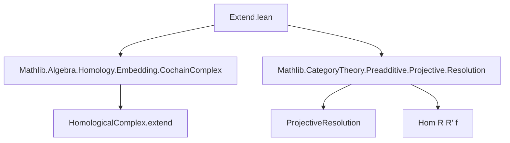

### Technical Brief: `Extend.lean` — Projective Resolutions as Integer-Indexed Cochain Complexes

---

#### **1. Key Definitions & Theorems**

| Name | Type / Signature | Purpose |
|------|------------------|---------|
| `cochainComplex` | `R : ProjectiveResolution X → CochainComplex C ℤ` | Extends a chain complex indexed by `ℕ` (from a projective resolution) to a cochain complex indexed by `ℤ`, using `extend` along `ComplexShape.embeddingDownNat : ℤᵒᵖ → ℕ`. |
| `cochainComplexXIso` | `n : ℤ → k : ℕ → -k = n → R.cochainComplex.X n ≅ R.complex.X k` | Provides explicit isomorphism between components of the extended cochain complex and original chain complex, for non-positive integers `n = -k`. |
| `cochainComplex_d` | `n₁ n₂ : ℤ → ... → R.cochainComplex.d n₁ n₂ = ...` | Describes the differential of the extended cochain complex in terms of the original chain complex’s differential, via the isomorphisms `cochainComplexXIso`. |
| `π'` | `R.π' : R.cochainComplex ⟶ (CochainComplex.singleFunctor C 0).obj X` | The canonical quasi-isomorphism from the extended cochain complex to the single-object cochain complex concentrated in degree `0` at `X`. |
| `hom'` | `φ.hom' : R.cochainComplex ⟶ R'.cochainComplex` | Induced morphism of cochain complexes from a morphism `φ : Hom R R' f` of projective resolutions. |
| `QuasiIso R.π'` | `instance` | Proves that `π'` is a quasi-isomorphism (i.e., induces isomorphisms on cohomology). |
| `IsGE R.cochainComplex 0` | `instance` | Shows that `R.cochainComplex` is supported in degrees `≥ 0`. |
| `IsStrictlyLE R.cochainComplex 0` | `instance` | Shows that `R.cochainComplex` is zero in degrees `> 0`. |
| `Projective (R.cochainComplex.X n)` | `instance` | Each component of the extended cochain complex is projective. |
| `hom'_f` | `φ.hom'.f n = ...` | Describes the component `f n` of the induced morphism `hom'`. |
| `hom'_comp_π'` | `φ.hom' ≫ R'.π' = R.π' ≫ (singleFunctor).map f` | Commutativity of the square involving `hom'`, `π'`, and the morphism `f`. |

---

#### **2. Naming Conventions**

- **Prefixes**:
  - `cochainComplex_`: for constructions related to the extended cochain complex.
  - `cochainComplexXIso`: for component-wise isomorphisms.
  - `π'`: for the canonical quasi-isomorphism (prime distinguishes from `π` in `ProjectiveResolution`).
  - `hom'`: for induced morphisms on cochain complexes (prime again distinguishes from `Hom.hom`).

- **Suffixes**:
  - `_f`: for component-wise descriptions of natural transformations.
  - `_comp_π'`: for commutativity with `π'`.

- **Notable pattern**: Prime (`'`) used to distinguish integer-indexed cochain complex versions from their `ℕ`-indexed chain complex counterparts.

---

#### **3. Tactic Stack**

- **Core automation**:
  - `dsimp`, `simp`, `rw`, `cat_disch`, `infer_instance`
- **Arithmetic simplification**:
  - `by lia` (for linear integer arithmetic, e.g., solving `-k = n`)
- **Homological algebra helpers**:
  - `HomologicalComplex.extendMap_f`, `HomologicalComplex.extend_d_eq`, `HomologicalComplex.to_single_hom_ext`
- **Isomorphism manipulation**:
  - `.hom`, `.inv`, `.symm`, `of_iso`

---

#### **4. Proof Logic**

- **Structure**:
  1. **Extension**: Use `extend` to lift `R.complex : ChainComplex C ℕ` to `CochainComplex C ℤ`.
  2. **Component analysis**: Prove isomorphisms `R.cochainComplex.X n ≅ R.complex.X k` for `n = -k ≤ 0`.
  3. **Differential compatibility**: Show that differentials match under these isomorphisms.
  4. **Projectivity & support**: Use `IsStrictlyLE` and `IsGE` to bound support and deduce projectivity of components.
  5. **Quasi-isomorphism**: Lift `R.π` via `extendFunctor.map` and compose with `extendSingleIso`.
  6. **Morphism lifting**: Extend `Hom R R' f` to `hom'`, verify naturality with `π'`.

- **Typical flow**:
  - `by_cases hn : n ≤ 0` → split into `n = -k` and `n > 0` cases.
  - Use `HomologicalComplex.extend_*` lemmas to reduce to `ℕ`-indexed statements.
  - Apply `simp` with `reassoc` lemmas to normalize expressions.

---

#### **5. Imports**

| Module | Role |
|--------|------|
| `Mathlib.Algebra.Homology.Embedding.CochainComplex` | Provides `extend`, `extendFunctor`, `extendSingleIso`, etc., for extending chain/cochain complexes along shape embeddings. |
| `Mathlib.CategoryTheory.Preadditive.Projective.Resolution` | Defines `ProjectiveResolution`, its `complex`, `π`, and `Hom` category. |

---

#### **8. Mermaid Diagrams**

##### **Dependency Graph (Module-Level)**



##### **Overview of Theory Flow**

```mermaid
flowchart LR
  R[ProjectiveResolution X] -->|complex| R_comp[ChainComplex C ℕ]
  R_comp -->|extend| R_cochain[CochainComplex C ℤ]
  R -->|π| X_single[(CochainComplex.singleFunctor C 0).obj X]
  R_cochain -->|π'| X_single
  R -->|Hom φ| R'_comp -->|extend| R'_cochain
  R_cochain -->|hom' φ| R'_cochain
  R_cochain -.->|QuasiIso| X_single
  R_cochain -.->|IsGE/LE| support_bounds
```

##### **Component-Level Isomorphism Diagram**

```mermaid
graph LR
  R_cochain.X n[-k] -- cochainComplexXIso --> R_comp.X k
  R_cochain.X n -- d --> R_cochain.X m[-l]
  R_comp.X k -- d --> R_comp.X l
  R_cochain.X n -- iso⁻¹ --> R_comp.X k
  R_comp.X l -- iso --> R_cochain.X m[-l]
```

---

This file bridges the gap between classical homological algebra over `ℕ`-graded chain complexes and `ℤ`-graded cochain complexes, enabling compatibility with the broader `Mathlib` homological algebra infrastructure (e.g., derived categories, spectral sequences).
