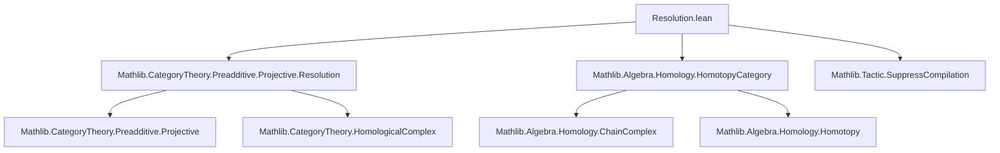

### Technical Brief: `Resolution.lean`

---

#### **1. Key Definitions & Theorems**

| Name | Type / Signature | Purpose |
|------|------------------|---------|
| `liftFZero` | `(f : Y ⟶ Z) → P : ProjectiveResolution Y → Q : ProjectiveResolution Z → P.complex.X 0 ⟶ Q.complex.X 0` | Constructs the 0-th component of a chain map lift using projectivity of $P_0$ and epimorphism $Q_0 \twoheadrightarrow Z$. |
| `liftFOne` | `(f : Y ⟶ Z) → P → Q → P.complex.X 1 ⟶ Q.complex.X 1` | Constructs the 1-st component using projectivity of $P_1$ and exactness at $Q_0$. |
| `liftFSucc` | `(P Q : ProjectiveResolution Y Z) → (n : ℕ) → (g : P_n → Q_n) → (g' : P_{n+1} → Q_{n+1}) → (w : g' ∘ d_P = d_Q ∘ g) → Σ g'' : P_{n+2} → Q_{n+2}, ...` | Inductive step to extend chain map to higher degrees using projectivity and exactness. |
| `lift` | `(f : Y ⟶ Z) → P → Q → P.complex ⟶ Q.complex` | Constructs a chain map lifting $f$ along the resolutions. |
| `lift_commutes` | `lift f P Q ≫ Q.π = P.π ≫ (ChainComplex.single₀ C).map f` | Ensures the lift commutes with the resolution maps (i.e., is a morphism of resolutions). |
| `liftHomotopyZero` | `(f : P.complex ⟶ Q.complex) → (f ≫ Q.π = 0) → Homotopy f 0` | Shows any lift of the zero morphism is null-homotopic. |
| `liftHomotopy` | `(f : Y ⟶ Z) → (g h : P.complex ⟶ Q.complex) → (g_comm, h_comm) → Homotopy g h` | Any two lifts of the same $f$ are homotopic. |
| `liftIdHomotopy` | `Homotopy (lift (𝟙 X) P P) (𝟙 P.complex)` | Identity lifts are homotopic to identity chain maps. |
| `liftCompHomotopy` | `Homotopy (lift (f ≫ g) P R) (lift f P Q ≫ lift g Q R)` | Composition of lifts is homotopic to lift of composition. |
| `homotopyEquiv` | `P Q : ProjectiveResolution X → HomotopyEquiv P.complex Q.complex` | Any two projective resolutions of the same object are homotopy equivalent. |
| `projectiveResolutions` | `C ⥤ HomotopyCategory C (ComplexShape.down ℕ)` | Functor assigning to each object its projective resolution (up to homotopy). |
| `ProjectiveResolution.iso` | `(P : ProjectiveResolution X) → (projectiveResolutions C).obj X ≅ P.complex` | Shows the functorial resolution is isomorphic (in homotopy category) to any concrete resolution. |
| `ofComplex` | `ChainComplex C ℕ` | Underlying chain complex of the canonical resolution built from `Projective.over` and `Projective.syzygies`. |
| `of` | `ProjectiveResolution Z` | Canonical projective resolution constructed inductively using syzygies. |
| `exact_d_f` | `(f : X ⟶ Y) → (ShortComplex.mk (d f) f ...).Exact` | Exactness of the short complex $P_1 \xrightarrow{d} P_0 \xrightarrow{f} X \to 0$, where $P_0 \twoheadrightarrow X$ is projective. |

---

#### **2. Naming Conventions**

- **Prefixes**:
  - `lift_`: chain map lifts of morphisms between objects.
  - `homotopy_`: homotopies between chain maps (e.g., `liftHomotopy`, `liftHomotopyZero`).
  - `of_`: canonical constructions (e.g., `ofComplex`, `of`).
  - `iso_`: isomorphisms in homotopy category (e.g., `ProjectiveResolution.iso`).
- **Suffixes**:
  - `_Zero`, `_One`, `_Succ`: indexing by degree (0, 1, or $n+2$).
  - `_comm`: commutativity conditions (e.g., `lift_commutes`, `liftHomotopyZeroZero_comp`).
  - `_assoc`: associativity or naturality up to homotopy (e.g., `iso_hom_naturality_assoc`).
- **Structure**:
  - `exact_`, `Projective.`, `ShortComplex.`, `Homotopy.`: module-specific qualifiers.

---

#### **3. Tactic Stack**

| Tactic | Usage Frequency | Purpose |
|--------|-----------------|---------|
| `simp` | Very High | Simplify homological algebra expressions, especially using `reassoc` attributes. |
| `apply` | High | Apply lemmas like `liftFromProjective`, `exact_d_f`, `Homotopy.mkInductive`. |
| `rw` | High | Rewrite using definitions and lemmas (e.g., `ofComplex_d_1_0`, `assoc`). |
| `match` / `cases` | Medium | Structural induction on natural numbers (e.g., `match n with | 0 => ...`). |
| `cat_disch` | Medium | Category-theoretic discharge of goals (used in `iso_inv_naturality`). |
| `apply HomotopyCategory.eq_of_homotopy` | Medium | Prove equality of morphisms in homotopy category via homotopy. |
| `dsimp`, `convert`, `infer_instance` | Low-Medium | Fine-grained simplification and typeclass inference. |

---

#### **4. Proof Logic**

- **Inductive Construction**:
  - Chain maps are built inductively: degree 0 via projectivity of $P_0$, degree 1 via exactness at $Q_0$, and higher degrees via `liftFSucc`.
- **Homotopy Uniqueness**:
  - Uniqueness up to homotopy is shown by reducing to the case of zero morphisms (`liftHomotopyZero`) and using additivity (`Homotopy.equivSubZero`).
- **Functoriality**:
  - The functor `projectiveResolutions` is defined on objects via `projectiveResolution`, and on morphisms via `lift`.
  - Identity and composition laws hold *up to homotopy*, so equality in the homotopy category follows from `HomotopyCategory.eq_of_homotopy`.
- **Canonical Resolution**:
  - `of` is defined via `ofComplex`, with exactness proven by induction using `exact_d_f`.
  - Projectivity of each term follows from `Projective.projective_over`.

---

#### **5. Imports**

| Module | Role |
|--------|------|
| `Mathlib.CategoryTheory.Preadditive.Projective.Resolution` | Core definitions of projective objects, resolutions, and syzygies. |
| `Mathlib.Algebra.Homology.HomotopyCategory` | Homotopy category of chain complexes, homotopy equivalences, and quotient functor. |
| `Mathlib.Tactic.SuppressCompilation` | Optimization for large proofs (used in `suppress_compilation`). |

---

#### **6. Mermaid Diagrams**

##### **Dependency Graph (Module-Level)**



##### **Overview of Theory Flow**

```mermaid
flowchart LR
  A[Abelian C + EnoughProjectives] --> B[ProjectiveResolution X exists]
  B --> C[Lift of morphisms f : X → Y]
  C --> D[Homotopy uniqueness of lifts]
  D --> E[Homotopy equivalence of resolutions]
  E --> F[Functor projectiveResolutions : C → HoCh(C)]
  F --> G[Isomorphism (projectiveResolutions X) ≅ P.complex]
  A --> H[Canonical resolution ofComplex / of]
  H --> I[Exactness of d_f]
  I --> J[Quasi-isomorphism of of]
```

---

#### **7. Summary**

This file formalizes the foundational homological algebra result: *in an abelian category with enough projectives, every object admits a projective resolution, and any two such resolutions are homotopy equivalent*. It constructs:

- **Canonical resolutions** (`of`) using syzygies,
- **Lifts of morphisms** between resolutions (`lift`),
- **Homotopy uniqueness** of lifts (`liftHomotopy`, `liftHomotopyZero`),
- **Functoriality up to homotopy** (`projectiveResolutions`), landing in the homotopy category.

The proofs rely heavily on projectivity (to solve lifting problems), exactness (to ensure compatibility), and homotopy theory (to handle uniqueness up to homotopy). The structure is highly modular, with auxiliary definitions (`liftFZero`, `liftFSucc`, etc.) enabling clean inductive constructions.
