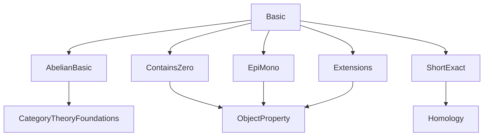
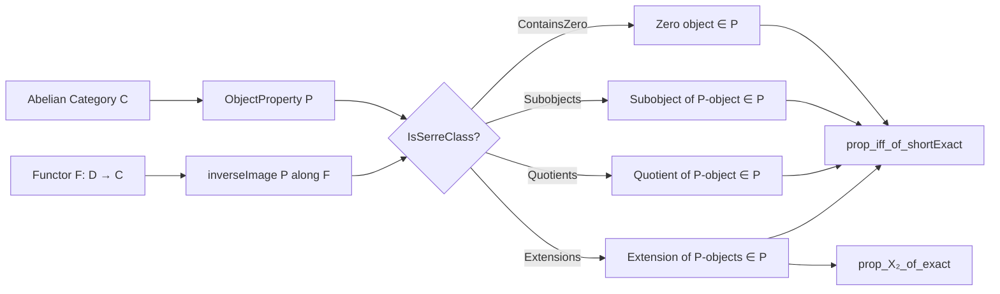

**Technical Brief: `Basic.lean` – Serre Classes in Abelian Categories**

---

### 1. **Key Definitions & Theorems**

| Name | Type / Signature | Purpose |
|------|------------------|---------|
| `IsSerreClass` | `class IsSerreClass : Prop extends P.ContainsZero, P.IsClosedUnderSubobjects, P.IsClosedUnderQuotients, P.IsClosedUnderExtensions` | Defines a Serre class: a predicate on objects closed under zero, subobjects, quotients, and extensions. |
| `prop_iff_of_shortExact` | `∀ {S : ShortComplex C}, S.ShortExact → P S.X₂ ↔ P S.X₁ ∧ P S.X₃` | Equivalence between the predicate holding on the middle term and on both ends in a short exact sequence. |
| `prop_X₂_of_exact` | `∀ {S : ShortComplex C}, S.Exact → P S.X₁ → P S.X₃ → P S.X₂` | Closure under extensions: if the outer terms satisfy `P`, then so does the middle term in any exact sequence. |
| `instance inverseImage` | `(F : D ⥤ C) [PreservesFiniteLimits F] [PreservesFiniteColimits F] → (P.inverseImage F).IsSerreClass` | Pullback of a Serre class along a finite-limit/colimit-preserving functor remains a Serre class. |
| `example : P.IsClosedUnderIsomorphisms` | `inferInstance` | Derives closure under isomorphisms as a consequence of the class axioms. |
| `instance ⊤.IsSerreClass` | `⊤` is the maximal object property (always true); it is a Serre class. | Trivial Serre class. |
| `instance IsZero.IsSerreClass` | `IsZero` (the property of being zero) is a Serre class. | Minimal Serre class. |

---

### 2. **Naming Conventions**

- **Predicates**: `P`, `Q`, etc., of type `ObjectProperty C`.
- **Class name**: `IsSerreClass` — follows Lean’s convention for typeclass predicates (`IsX`, `HasX`, `Xable`).
- **Property names** (used in `extends`):
  - `ContainsZero`
  - `IsClosedUnderSubobjects`
  - `IsClosedUnderQuotients`
  - `IsClosedUnderExtensions`
- **Lemma suffixes**:
  - `_of_shortExact`: derived from a short exact sequence.
  - `_of_exact`: derived from a merely exact sequence (via homology data).
  - `_of_epi`, `_of_mono`: closure under epimorphic/monomorphic images.

---

### 3. **Tactic Stack**

- `aesop` (implicit via `inferInstance`)
- `simp_rw` (via `⟨…, …⟩` and `⟨h₁, h₂⟩` pattern matching)
- `exact` (explicit in `prop_X₂_of_exact`)
- `let` + `have` + `exact` (in `prop_X₂_of_exact` proof)
- `inferInstance` (for `example : P.IsClosedUnderIsomorphisms`)

No heavy automation (e.g., `ring`, `linarith`) — proofs are mostly structural and rely on categorical lemmas.

---

### 4. **Proof Logic**

- **Structure**: Definitions are built from categorical properties (abelian category, short/exact sequences).
- **Proof style**:
  - For `prop_iff_of_shortExact`: bi-implication via two implications, each using existing lemmas.
  - For `prop_X₂_of_exact`: factor an exact sequence into a short exact one via homology data, then apply closure under short exact sequences.
  - For `inverseImage`: verify the four closure properties for the pullback predicate using preservation of limits/colimits.

- **Induction**: Not used — all arguments are *structural* and rely on universal properties.

---

### 5. **Imports**

| Import | Role |
|--------|------|
| `Mathlib.CategoryTheory.Abelian.Basic` | Provides abelian category infrastructure (kernels, cokernels, image factorization, etc.). |
| `Mathlib.CategoryTheory.ObjectProperty.ContainsZero` | Defines `ContainsZero` and related infrastructure. |
| `Mathlib.CategoryTheory.ObjectProperty.EpiMono` | Defines closure under epis/monos. |
| `Mathlib.CategoryTheory.ObjectProperty.Extensions` | Defines closure under extensions and related lemmas. |
| `Mathlib.Algebra.Homology.ShortComplex.ShortExact` | Short exact sequences of short complexes; homology data. |

→ These imports define the *categorical and homological context* needed to formalize Serre classes.

---

### 6. **Mermaid Diagrams**

#### **Dependency Graph (Module-Level)**

#### **Conceptual Overview of `Basic.lean`**

---

### 7. **Theory Scope & Future Work**

- **Scope**: Formalization of Serre classes (a.k.a. Serre subcategories) in arbitrary abelian categories.
- **Future work** (explicitly stated): proving that the *quotient category* (localization) by a Serre class is again abelian.
- **Relation to existing theory**:
  - Connects to *localization theory*, *torsion theories*, and *t-structures*.
  - Serves as a foundation for derived category constructions (e.g., quotient of abelian categories).

---

### 8. **Summary**

This file introduces the foundational definition of a **Serre class** in an abelian category, leveraging existing infrastructure for object properties and short exact sequences. It establishes key closure properties and shows stability under pullback along finite-limit/colimit-preserving functors. The formalization is minimal, clean, and ready for extension to derived/localization theory.
