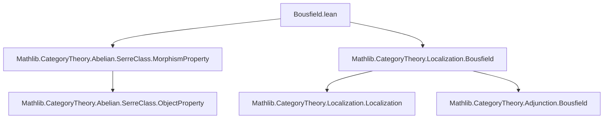

Here is the structured technical metadata extracted from `Bousfield.lean`:

---

### **1. Key Definitions & Theorems**

| Name | Type / Signature | Purpose |
|------|------------------|---------|
| `G.kernel.isoModSerre` | `MorphismProperty D` | The Serre class of morphisms in `D` inverted by `G`, i.e., those `f` such that `G.map f` is an isomorphism. |
| `isomorphisms C`.`inverseImage G` | `MorphismProperty D` | Pullback of isomorphisms in `C` along `G`. |
| `ObjectProperty.isLocal (· ∈ Set.range F.obj)` | `ObjectProperty D` | The local objects for the reflection given by `F : C ⥤ D`, i.e., objects `X` such that `Hom(D(X, F(-)), -)` detects isomorphisms — equivalently, `X` is in the essential image of `F`. |
| `G.IsLocalization P` | `Prop` | States that `G` exhibits `C` as the localization of `D` w.r.t. morphism class `P`. |
| `isoModSerre_kernel_eq_inverseImage_isomorphisms` | `G.kernel.isoModSerre = (isomorphisms C).inverseImage G` | Identifies the Serre class inverted by `G` with the pullback of isomorphisms. |
| `isoModSerre_kernel_eq_isLocal_of_rightAdjoint` | Under a fully faithful right adjoint `F`, `G.kernel.isoModSerre = ObjectProperty.isLocal (· ∈ Set.range F.obj)` | Connects Bousfield localization (via local objects) with Serre-class localization. |
| `isLocalization_isoModSerre_kernel_of_leftAdjoint` | `G.IsLocalization G.kernel.isoModSerre` | Main result: `G` is the localization w.r.t. its kernel Serre class, assuming a fully faithful right adjoint. |

> **Note**: The deprecated alias `isoModSerre_kernel_eq_leftBousfield_W_of_rightAdjoint` maps to `isoModSerre_kernel_eq_isLocal_of_rightAdjoint`, indicating the equivalence with *left* Bousfield localization (where `W` is the class of inverted morphisms).

---

### **2. Naming Conventions**

- **Prefixes**:
  - `isoModSerre_`: Relates to morphisms inverted modulo a Serre class.
  - `inverseImage_`: Pullback of a property along a functor.
  - `isLocalization_`: Relates to the universal property of localization.
  - `kernel_`: Refers to the kernel Serre class of a functor.

- **Suffixes**:
  - `_eq_`: Equivalence of two constructions.
  - `_of_`: Implication under additional assumptions (e.g., existence of an adjoint).

- **Pattern**: `G.kernel.isoModSerre` — functor-specific Serre class derived from `G`.

---

### **3. Tactic Stack**

Frequent tactics used in proofs:

- `ext`: Extensionality for morphism classes (extensional equality of predicates).
- `refine ⟨…, fun hf ↦ ?_⟩`: Construct equality of biconditionals via `iff`.
- `simp only [...] at hf`: Simplify hypotheses using specific lemmas.
- `constructor`: Split `↔` or `∧` goals.
- `exact ...`: Apply known lemmas (e.g., `KernelFork.IsLimit.isZero_of_mono`).
- `rw [...]`: Rewrite using proven equalities (e.g., `isoModSerre_kernel_eq_inverseImage_isomorphisms`).
- `rfl`: Reflexivity for trivial equalities.

No heavy automation (e.g., `aesop`, `ring`, `linarith`) is used—proofs are largely structural and rely on categorical lemmas.

---

### **4. Proof Logic**

- **Structure**:  
  1. **Equality of morphism classes**: Prove two morphism properties are equal by extensionality (`ext`) and mutual implication.  
  2. **Use of adjunction properties**: When a fully faithful right adjoint `F` exists, relate `G.kernel.isoModSerre` to `ObjectProperty.isLocal` via known equivalences.  
  3. **Localization criterion**: Apply `adj.isLocalization` (from `Localization` theory) once the morphism class is identified with `inverseImage isomorphisms`.  
  4. **Kernel/cokernel properties**: Use that `G` preserves finite limits/colimits to deduce that `G(f)` iso ⇔ `ker f`, `coker f` in kernel Serre class.

- **Typical flow**:  
  `ext → split → simplify → apply Serre-class/kernel-cokernel lemmas → conclude equality`.

---

### **5. Imports**

| Import | Role |
|--------|------|
| `Mathlib.CategoryTheory.Abelian.SerreClass.MorphismProperty` | Defines Serre classes, `isoModSerre`, and related morphism properties. |
| `Mathlib.CategoryTheory.Localization.Bousfield` | Provides background on Bousfield localizations, `isLocal`, `IsLocalization`, and connections to adjoints. |

> These imports indicate the module sits at the intersection of **abelian categories**, **Serre localization**, and **Bousfield localization**.

---

### **6. Mermaid Diagrams**

#### **Dependency Graph (Module-Level)**



#### **Conceptual Overview (Theory Flow)**

```mermaid
flowchart LR
  D[Abelian Category D] -- G : D → C --> C[Abelian Category C]
  C -- F : C → D -->|right adjoint| D
  D -.->|localize w.r.t. G.kernel.isoModSerre| C
  C <-->|equivalence| D[G.kernel.isoModSerre⁻¹]
  style D fill:#f9f,stroke:#333
  style C fill:#bbf,stroke:#333
  classDef abelian fill:#f9f,stroke:#333;
  classDef localization fill:#bbf,stroke:#333;
  class D,C abelian;
  class D[G.kernel.isoModSerre⁻¹] localization;
```

#### **Proof Structure (High-Level)**

```mermaid
flowchart LR
  Start[Given G : D ⥤ C exact, with fully faithful right adjoint F] --> Step1[Show G.kernel.isoModSerre = inverseImage(isomorphisms C)]
  Step1 --> Step2[Apply adj.isLocalization]
  Step2 --> Result[G is localization w.r.t. kernel Serre class]
  Step1 -.->|also| Step3[Identify with ObjectProperty.isLocal(range F.obj)]
  Step3 --> Bousfield[Left Bousfield localization interpretation]
```

---

Let me know if you'd like a formalization-level dependency graph (e.g., `leanpkg` tree) or a comparison with related files (e.g., `Localization.lean`, `SerreClass.lean`).
