### Technical Brief: `MorphismProperty.lean`

---

#### **1. Key Definitions & Theorems**

| Name | Type | Purpose |
|------|------|---------|
| `monoModSerre` | `P : ObjectProperty C → MorphismProperty C` | Class of morphisms `f` with `kernel f ∈ P`. |
| `epiModSerre` | `P : ObjectProperty C → MorphismProperty C` | Class of morphisms `f` with `cokernel f ∈ P`. |
| `isoModSerre` | `P : ObjectProperty C → MorphismProperty C` | Intersection: `f` such that `kernel f ∈ P` **and** `cokernel f ∈ P`. |
| `monoModSerre_iff`, `epiModSerre_iff`, `isoModSerre_iff` | `↔` | Characterization lemmas: `P.monoModSerre f ↔ P (kernel f)`, etc. |
| `isomorphisms_le_isoModSerre` | `≤` | Every isomorphism lies in `P.isoModSerre`. |
| `monomorphisms_le_monoModSerre`, `epimorphisms_le_epiModSerre` | `≤` | Every mono/epi lies in the respective mod-Serre class. |
| `instance : IsMultiplicative` | `MorphismProperty → Prop` | Proves closure under identities and composition for `monoModSerre`, `epiModSerre`, `isoModSerre`. |
| `instance : IsStableUnderRetracts` | `MorphismProperty → Prop` | Stability under retracts for all three classes. |
| `instance : HasTwoOutOfThreeProperty` | `MorphismProperty → Prop` | Two-out-of-three property for `isoModSerre`. |
| `instance : IsStableUnderBaseChange`, `IsStableUnderCobaseChange` | `MorphismProperty → Prop` | Stability under pullbacks (base change) and pushouts (cobase change). |
| `le_kernel_of_isoModSerre_isInvertedBy` | `P ≤ F.kernel` | If `F` inverts `P.isoModSerre`, then `P` is pointwise contained in `kernel(F)`. |
| `isoModSerre_isInvertedBy_iff` | `↔` | Equivalence: `F` inverts `P.isoModSerre` **iff** `P ≤ kernel(F)`, assuming `F` preserves finite limits/colimits. |

---

#### **2. Naming Conventions**

- **Prefixes**:
  - `monoModSerre`, `epiModSerre`, `isoModSerre`: denote classes modulo a Serre class.
  - `le_`: inclusion of standard classes (mono/epi/iso) into mod-Serre classes.
  - `of_`: introduction lemmas (e.g., `of_mono`, `of_epi`, `of_isPullback`).
- **Suffixes**:
  - `_iff`: characterizations (↔).
  - `_of_`: implications from additional structure (e.g., `isoModSerre_of_mono`).
  - `_zero_iff`: special case for zero morphism.
- **`_map`**: morphism induced on kernel/cokernel by a commutative square.

---

#### **3. Tactic Stack**

Frequent tactics used:
- `simp` / `simp only`: simplification using lemmas like `kernelZeroIsoSource`, `cokernelZeroIsoTarget`.
- `rw`: rewriting using `isoModSerre_iff`, `monoModSerre_iff`, etc.
- `tauto`: for propositional logic (e.g., in `isoModSerre_iff_of_mono`).
- `infer_instance`: to discharge typeclass goals (e.g., multiplicative, retract stability).
- `dsimp only [isoModSerre]`: definitional simplification before `infer_instance`.
- `exact`, `apply`, `have`, `let`: standard proof construction.
- `asIso ... .isZero_iff`: leveraging isomorphism-induced zero-object properties.

---

#### **4. Proof Logic**

- **Structure**: Most proofs follow a pattern:
  1. **Unfold definitions** (`isoModSerre := monoModSerre ⊓ epiModSerre`).
  2. **Reduce to kernel/cokernel properties** via `monoModSerre_iff`, `epiModSerre_iff`.
  3. **Use exact sequences** (e.g., `kernelCokernelCompSequence_exact`) for composition/cancellation.
  4. **Apply stability lemmas** (`prop_of_mono`, `prop_of_epi`, `prop_of_iso`) for base/cobase change and retracts.
  5. **Leverage Serre class axioms** (`IsSerreClass`) for closure under subobjects, quotients, extensions.

- **Two-out-of-three**: Uses the 5-lemma-like exact sequence from `kernelCokernelCompSequence_exact` at positions 1 and 2.
- **Inversion characterization**: Relates Serre class containment to preservation under localization functors via kernel/cokernel analysis.

---

#### **5. Imports**

Core dependencies:
- `Mathlib.Algebra.Homology.Square`: for complexes and short exact sequences.
- `Mathlib.CategoryTheory.Abelian.*`: abelian category theory (Serre classes, commutative squares, diagram lemmas).
- `Mathlib.CategoryTheory.Limits.Shapes.Pullback.IsPullback.Kernels`: kernel behavior in pullbacks.
- `Mathlib.CategoryTheory.MorphismProperty.*`: general theory of morphism properties (multiplicativity, retracts, stability, two-out-of-three).

---

#### **8. Mermaid Diagrams**

##### **Dependency Graph (Module-Level)**

```mermaid
graph TD
  A[MorphismProperty.lean] --> B[Mathlib.Algebra.Homology.Square]
  A --> C[Mathlib.CategoryTheory.Abelian.SerreClass.Basic]
  A --> D[Mathlib.CategoryTheory.Abelian.CommSq]
  A --> E[Mathlib.CategoryTheory.Abelian.DiagramLemmas.KernelCokernelComp]
  A --> F[Mathlib.CategoryTheory.Limits.Shapes.Pullback.IsPullback.Kernels]
  A --> G[Mathlib.CategoryTheory.MorphismProperty.Composition]
  A --> H[Mathlib.CategoryTheory.MorphismProperty.Retract]
  A --> I[Mathlib.CategoryTheory.MorphismProperty.Limits]
  A --> J[Mathlib.CategoryTheory.MorphismProperty.IsInvertedBy]
```



##### **Conceptual Overview**

```mermaid
flowchart LR
  P[Serre Class P] --> monoModSerre[P.monoModSerre]
  P --> epiModSerre[P.epiModSerre]
  P --> isoModSerre[P.isoModSerre = monoModSerre ⊓ epiModSerre]

  monoModSerre --> IsMult[IsMultiplicative]
  monoModSerre --> Retract[Stable under Retracts]
  monoModSerre --> BaseChange[Stable under Base Change]
  monoModSerre --> CobaseChange[Stable under Cobase Change]

  epiModSerre --> IsMult
  epiModSerre --> Retract
  epiModSerre --> BaseChange
  epiModSerre --> CobaseChange

  isoModSerre --> IsMult
  isoModSerre --> Retract
  isoModSerre --> TwoOutOfThree[Two-out-of-Three]
  isoModSerre --> BaseChange
  isoModSerre --> CobaseChange

  isoModSerre --> InvByF[IsInvertedBy F] -->|↔| KernelContainment[P ≤ kernel(F)]
```

##### **Proof Strategy Flow (e.g., `comp_mem`)**

```mermaid
flowchart LR
  Start[Given f, g with P.kernel/g cokernel in P] --> Unfold[Unfold isoModSerre]
  Unfold --> Split[Split into mono & epi parts]
  Split --> MonoPart[Apply exactness at X₂ in kernelCokernelCompSequence]
  Split --> EpiPart[Apply exactness at X₂ in same sequence]
  MonoPart --> PropX2[P.prop_X₂_of_exact]
  EpiPart --> PropX2
  PropX2 --> End[Conclude P(kernel(fg)), P(cokernel(fg))]
```

---

#### **6. Summary**

This file formalizes the *calculus of fractions* for abelian categories relative to a Serre class `P`. It defines three key morphism classes (`monoModSerre`, `epiModSerre`, `isoModSerre`) and proves they form *multiplicative systems* stable under retracts, base/cobase change, and satisfy two-out-of-three. Crucially, it characterizes when a functor inverts `P.isoModSerre` — a prerequisite for constructing the *abelian localization* (a TODO item). The proofs rely heavily on homological algebra in abelian categories: exact sequences, kernel-cokernel factorizations, and diagram lemmas.
