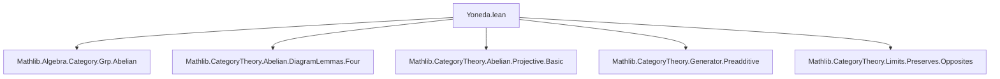
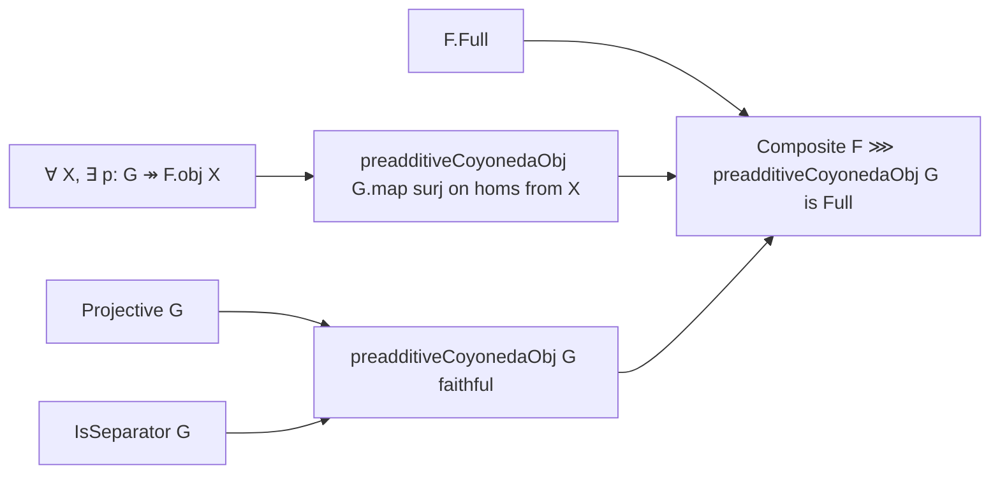

**Technical Brief: `Yoneda.lean` — Fullness of Restrictions of `preadditiveCoyonedaObj`**

---

### 1. **Key Definitions & Theorems**

| Name | Type / Signature | Purpose |
|------|------------------|---------|
| `preadditiveCoyonedaObj` | `C → [Preadditive C] ⥤ AddCommGrp` | The preadditive Coyoneda embedding: sends $G \mapsto \hom(G, -)$ viewed as an additive functor to abelian groups. |
| `Projective` | `Class (G : C)` | $G$ is projective: $\hom(G, -)$ preserves epimorphisms. |
| `IsSeparator` | `Class (G : C)` | $G$ is a separator: $\hom(G, f) = \hom(G, g) \Rightarrow f = g$; equivalently, `preadditiveCoyonedaObj G` is faithful. |
| `preadditiveCoyonedaObj_map_surjective` | `{G : C} [Projective G] → IsSeparator G → (p : G ⟶ X) [Epi p] → (Y : C) → Function.Surjective ((preadditiveCoyonedaObj G).map : (X ⟶ Y) → _)` | Shows that if $p: G \twoheadrightarrow X$ is epi and $G$ is projective + separator, then preadditive Coyoneda on $G$ maps $\hom(X,Y)$ *surjectively* onto $\hom(\hom(G,X), \hom(G,Y))$. |
| `full_comp_preadditiveCoyonedaObj` | `{F : D ⥤ C} [F.Full] → [Projective G] → IsSeparator G → (∀ X, ∃ p : G ⟶ F.obj X, Epi p) → (F ⋙ preadditiveCoyonedaObj G).Full` | Main theorem: if $F$ is full, $G$ is a projective separator, and every object in the image of $F$ is a quotient of $G$, then the composite $D \xrightarrow{F} C \xrightarrow{\hom(G,-)} \mathbf{Ab}$ is full. |

---

### 2. **Naming Conventions**

- **Prefixes**:
  - `preadditiveCoyonedaObj`: standard name for the additive Hom-functor.
  - `isSeparator_`: used in lemmas like `isSeparator_iff_faithful_preadditiveCoyonedaObj`.
  - `map_surjective`, `map_injective`, `epi_of_...`, `mono_of_...`: standard morphism property lemmas.
- **Suffixes**:
  - `_op`: used for dual constructions (e.g., `cm.op`).
  - `_of_...`: e.g., `epi_of_mono_of_epi_of_mono`, `full_comp_...`.
- **Abbreviations**:
  - `φ`, `cm`: local abbreviations for `preadditiveCoyonedaObj G` and a short complex.

---

### 3. **Tactic Stack**

| Tactic | Usage Frequency | Purpose |
|--------|-----------------|---------|
| `rw` | High | Rewriting definitions (e.g., `← Functor.coe_mapAddHom`, `← AddCommGrpCat.epi_iff_surjective`). |
| `simp` / `simp only` | High | Simplifying hom-sets, functors, and short complex data. |
| `infer_instance` | High | Solving class instances (e.g., `Abelian C`, `Preadditive C`, `Epi`, `Mono`). |
| `cat_disch` | Medium | Category-theoretic discharge tactic (used in `preadditiveCoyonedaObj_map_surjective`). |
| `obtain` / `have` | High | Extracting witnesses and intermediate facts (e.g., `⟨p, _⟩`, `⟨f, rfl⟩`). |
| `apply` | Medium | Applying lemmas like `ShortComplex.epi_of_mono_of_epi_of_mono`. |
| `rwa` | Medium | Rewrite + apply (e.g., `rwa [← isSeparator_iff_faithful_preadditiveCoyonedaObj]`). |

---

### 4. **Proof Logic**

The proofs follow a **diagram-chasing + categorical homological algebra** pattern:

1. **Reduction to group-theoretic surjectivity/injectivity** via:
   - `Functor.coe_mapAddHom`, `AddCommGrpCat.epi_iff_surjective`, `mono_iff_injective`.
2. **Construction of a short complex** `cm = ⟨ker p ↪ G, p⟩`, using `kernel.ι p` and `p`.
3. **Verification of exactness** (`exact_of_f_is_kernel`) and monomorphism properties (`Mono cm.op.f`).
4. **Application of a general short complex epimorphism criterion** (`ShortComplex.epi_of_mono_of_epi_of_mono`) to the map induced by `preadditiveYonedaMap`.
5. **Faithfulness of `preadditiveCoyonedaObj G`** via `isSeparator_iff_faithful_preadditiveCoyonedaObj`.
6. **Lifting morphisms** using:
   - Surjectivity of `preadditiveCoyonedaObj.map` (from `preadditiveCoyonedaObj_map_surjective`).
   - Surjectivity of `F.map` (from `F.Full`).
7. **Composite fullness** via chaining surjectivity of maps in two steps.

---

### 5. **Imports & Scope**

| Import | Role |
|--------|------|
| `Mathlib.Algebra.Category.Grp.Abelian` | Provides `AddCommGrp`, its abelian structure. |
| `Mathlib.CategoryTheory.Abelian.DiagramLemmas.Four` | Likely used for diagram lemmas (e.g., snake lemma, 4-lemma); used implicitly via `ShortComplex` machinery. |
| `Mathlib.CategoryTheory.Abelian.Projective.Basic` | Defines projective objects and basic properties. |
| `Mathlib.CategoryTheory.Generator.Preadditive` | Defines separators/generators and their relation to faithfulness. |
| `Mathlib.CategoryTheory.Limits.Preserves.Opposites` | Provides `preservesFiniteLimits_op`, used via local instance. |

**Scope**: This file lies at the intersection of:
- **Abelian category theory**
- **Homological algebra (short complexes, projectives)**
- **Representable functors and Yoneda embeddings in preadditive settings**

---

### 6. **Mermaid Diagrams**

#### **Dependency Graph (Module-Level)**



#### **Theoretical Flow (Main Theorem)**



#### **Proof Sketch (for `preadditiveCoyonedaObj_map_surjective`)**

```mermaid
graph TD
  A[Start: want surjectivity of (preadditiveCoyonedaObj G).map] --> B[Rewrite to group-level surjectivity]
  B --> C[Construct short complex cm = ker p → G → X]
  C --> D[cm is exact]
  D --> E[Apply ShortComplex.epi_of_... to cm.op]
  E --> F[Verify 4 conditions: mono, epi, etc.]
  F --> G[Use Projective + Separator to finish]
```

---

### 7. **Summary**

This file establishes a **representability criterion** for fullness of composite functors involving the preadditive Coyoneda embedding. It leverages:
- **Projectivity** to lift morphisms through epimorphisms,
- **Separator** to ensure faithfulness (injectivity on hom-sets),
- **Quotient condition** (`∀ X, ∃ p: G ↠ F.obj X`) to ensure every object in the image of $F$ is covered by $G$.

The result is foundational for constructing **Grothendieck categories** or proving **adjoint functor theorems** in abelian settings, especially when $G$ is a *progenerator*.

--- 

Let me know if you'd like a formalized dependency graph (e.g., for `leanproject`), or a tactic-level trace of the proofs.
