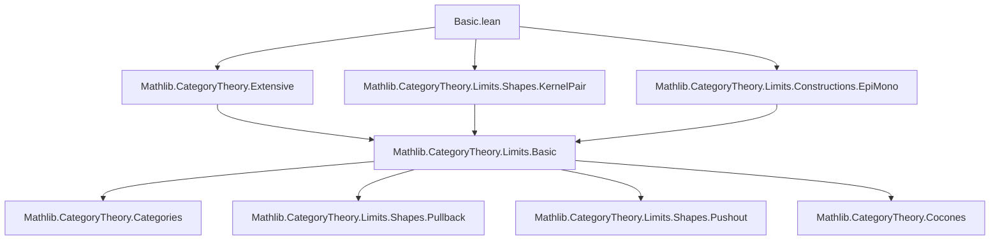
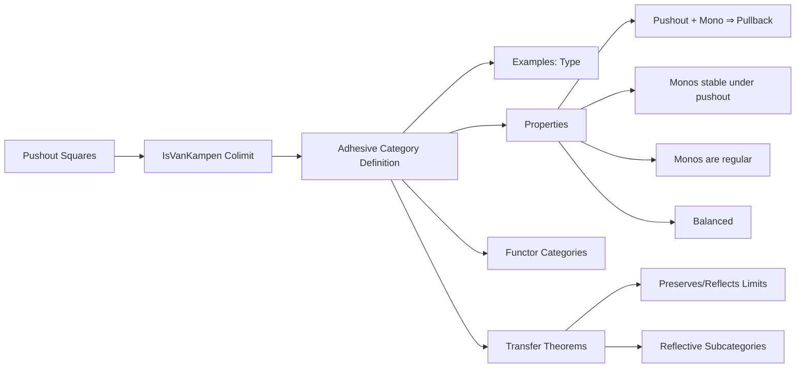
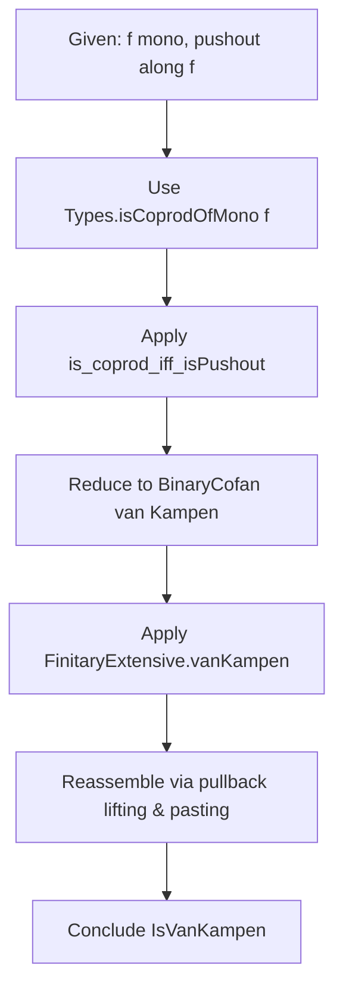

### Technical Brief: Adhesive Categories in Lean 4 (Basic.lean)

---

#### **1. Key Definitions & Theorems**

| Name | Type / Signature | Purpose |
|------|------------------|---------|
| `IsPushout.IsVanKampen` | `H : IsPushout f g h i → Prop` | Formalizes that a pushout square is a *van Kampen colimit*: pullback-stability of the colimit property. |
| `Adhesive` | `class Adhesive (C : Type u) [Category C] : Prop` | Defines a category as *adhesive*: has pullbacks and pushouts along monos, and such pushouts are van Kampen. |
| `Type.adhesive` | `instance : Adhesive (Type u)` | Proves `Type` is adhesive (key example). |
| `Adhesive.isPullback_of_isPushout_of_mono_left` | `[Adhesive C] → [Mono f] → IsPushout f g h i → IsPullback f g h i` | In adhesive categories, pushouts along monos are pullbacks. |
| `Adhesive.mono_of_isPushout_of_mono_left` | `[Adhesive C] → [Mono f] → IsPushout f g h i → Mono i` | Monos are stable under pushouts in adhesive categories. |
| `Adhesive.toRegularMonoCategory` | `instance [Adhesive C] : IsRegularMonoCategory C` | Shows monos in adhesive categories are regular monos ⇒ adhesive ⇒ balanced. |
| `adhesive_functor` | `instance [Adhesive C] [HasPullbacks C] [HasPushouts C] : Adhesive (D ⥤ C)` | Functor categories into adhesive categories (with sufficient limits/colimits) are adhesive. |
| `adhesive_of_preserves_and_reflects` | Thm about reflection of structure via functors | Transfer adhesive property along limit/colimit-preserving & reflecting functors. |
| `adhesive_of_reflective` | Thm for reflective subcategories | Adhesiveness descends along reflective adjunctions under conditions. |

---

#### **2. Naming Conventions**

- **Prefixes**:
  - `isVanKampen`: for van Kampen colimit properties.
  - `van_kampen`: for the class axiom (e.g., `Adhesive.van_kampen`).
  - `isPullback_of_isPushout_of_mono_*`: derived properties of adhesive categories.
  - `mono_of_isPushout_of_mono_*`: stability of monos under pushouts.
- **Suffixes**:
  - `_left` / `_right`: indicate which leg of the pushout square the property applies to (e.g., `mono_left` = along `f`, `mono_right` = along `g`).
  - `_flip`: symmetry (swap legs of pushout/pullback).
- **Other**:
  - `toRegularMonoCategory`: indicates construction of a structure (regular mono category).
  - `adhesive_*`: naming for theorems/instances about adhesive categories.

---

#### **3. Tactic Stack**

- **Core tactics**:
  - `introv`, `intro`, `rintro`, `refine`, `exact`, `rw`, `erw`, `dsimp`, `simp`, `simp_rw`
- **Category-theoretic automation**:
  - `apply`, `convert`, `symm`, `assumption`, `congr`, `ext`, `funext`
  - `have`, `obtain`, `let`, `set`
- **Limits/Colimits-specific**:
  - `apply IsPushout.mk`, `apply IsPullback.mk`, `apply IsColimit.mk`, etc.
  - `apply BinaryCofan.isColimitMk`, `apply PushoutCocone.isColimitAux'`
  - `apply Cocones.ext`, `apply Functor.ext`, `apply NatTrans.ext`
- **Advanced automation**:
  - `aesop` (not explicitly used here, but `simp` + `rw` heavy)
  - `ring` (not used — algebraic reasoning is minimal)
- **Key idioms**:
  - `rw [Category.assoc]`, `rw [Category.id_comp]`, `rw [Category.comp_id]`
  - `convert hα WalkingSpan.Hom.fst`, `rw [← H.w]`, `rw [← w.w]`
  - `apply IsPullback.of_hasPullback`, `apply IsPushout.of_horiz_isIso`

---

#### **4. Proof Logic**

- **Induction & case analysis**:
  - Rarely structural induction; instead, *universal properties* (colimit/limit uniqueness) dominate.
  - Case analysis on sum types (e.g., `BinaryCofan`, `WalkingSpan`, `WalkingCospan`) via `intro (_ | _)`.
- **Logical flow**:
  1. **Unfold definitions** (`rw [IsPushout.isVanKampen_iff]`, `rw [IsVanKampenColimit...]`)
  2. **Construct auxiliary objects** (pullbacks, pushouts, cocones)
  3. **Use universal properties** (e.g., `IsColimit.hom_ext`, `PushoutCocone.IsColimit.hom_ext`)
  4. **Paste diagrams** (`paste_horiz`, `paste_vert`, `of_horiz_isIso`, `of_vert_isIso`)
  5. **Leverage symmetry** (`flip`, `symm`, `eq_comm`)
  6. **Apply known lemmas** (e.g., `FinitaryExtensive.vanKampen`, `is_coprod_iff_isPushout`)
- **Key pattern**:
  - Prove equivalence `IsVanKampen ↔ IsVanKampenColimit` via cocone/universal property translation.
  - Use `diagramIsoSpan`, `Functor.map`, `evaluation` to reduce to base category.

---

#### **5. Imports**

| Module | Purpose |
|--------|---------|
| `Mathlib.CategoryTheory.Extensive` | Finitary extensive categories (used in `IsVanKampen_inl` proof) |
| `Mathlib.CategoryTheory.Limits.Shapes.KernelPair` | Kernel pairs, monos ⇒ regular monos, `IsKernelPair.id_of_mono` |
| `Mathlib.CategoryTheory.Limits.Constructions.EpiMono` | Basic constructions with epis/monos, e.g., `HasPullback`, `HasPushout` |

---

#### **6. Mermaid Diagrams**

##### **Dependency Graph (Module-Level)**

##### **Conceptual Overview (Theory Flow)**

##### **Proof Structure (Key Lemma: `IsVanKampen_inl`)**

---

#### **7. Summary**

This file formalizes **adhesive categories**, a categorical notion capturing the good behavior of pushouts along monomorphisms (e.g., in toposes, categories of graphs, or sets). It introduces the *van Kampen* condition for pushouts, proves foundational properties (pullback-stability, mono-stability, regularity of monos), and shows closure under functor categories and reflective subcategories. The proofs rely heavily on universal properties, diagram chasing, and pasting lemmas for limits/colimits.

The formalization is **highly structured**, with clear separation of definitions, axioms, and derived results — typical of modern Lean category theory libraries like Mathlib.
