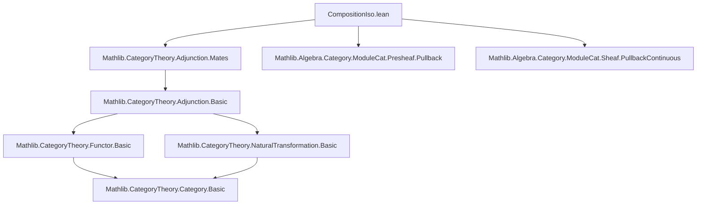
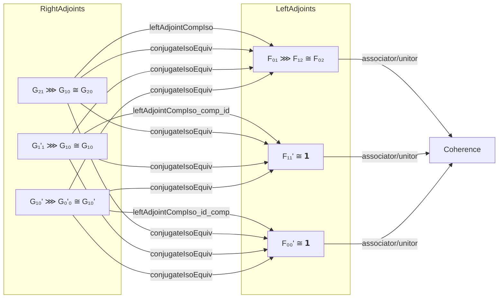

### Technical Brief: `CompositionIso.lean`

---

#### **1. Key Definitions & Theorems**

| Name | Type | Purpose |
|------|------|---------|
| `leftAdjointIdIso` | `(F ⊣ G) → G ≅ 𝟭 _ → F ≅ 𝟭 _` | If a right adjoint $G$ is isomorphic to the identity, then its left adjoint $F$ is too. |
| `leftAdjointCompNatTrans` | `(G₂₀ ⟶ G₂₁ ⋙ G₁₀) → (F₀₁ ⋙ F₁₂ ⟶ F₀₂)` | Transfers a natural transformation between right adjoints to one between left adjoints. |
| `leftAdjointCompIso` | `(G₂₁ ⋙ G₁₀ ≅ G₂₀) → (F₀₁ ⋙ F₁₂ ≅ F₀₂)` | Transfers a natural *isomorphism* between right adjoints to one between left adjoints. |
| `leftAdjointCompIso_hom` | `rfl` | Relates the hom-component of `leftAdjointCompIso` to `leftAdjointCompNatTrans`. |
| `conjugateEquiv_leftAdjointCompIso_inv` | `simp`-lemma | Describes the image of the inverse of `leftAdjointCompIso` under the conjugate equivalence. |
| `leftAdjointCompIso_comp_id` | Equality of isomorphisms | Shows compatibility of `leftAdjointCompIso` with right unitality: if $G' ⋙ G ≅ G$ via $e$, and $G' ≅ \mathrm{id}$, then the induced iso on left adjoints is $F ≅ F ⋙ \mathrm{id}$. |
| `leftAdjointCompIso_id_comp` | Equality of isomorphisms | Shows compatibility with left unitality: dual to above. |
| `leftAdjointCompNatTrans₀₁₃_eq_conjugateEquiv_symm` | Equality of natural transformations | Expresses associativity-like composition of `leftAdjointCompNatTrans` via conjugate equivalence. |
| `leftAdjointCompNatTrans₀₂₃_eq_conjugateEquiv_symm` | Equality of natural transformations | Expresses associativity with whiskering and associators. |
| `leftAdjointCompNatTrans_assoc` | Equality of natural transformations | Proves that if the right-adjoint data satisfies an associativity condition, then so does the induced left-adjoint data. |
| `leftAdjointCompIso_assoc` | Equality of isomorphisms | Lifts associativity from right adjoints to left adjoints. |

---

#### **2. Naming Conventions**

- **Prefixes**:
  - `leftAdjoint_`: Indicates construction/property derived from left adjoints.
  - `conjugateEquiv_`: Relates to the `conjugateEquiv` equivalence (from `Mathlib.CategoryTheory.Adjunction.Mates`).
- **Suffixes**:
  - `_iso`: For isomorphisms.
  - `_natTrans`: For natural transformations.
  - `_hom`, `_inv`: For components of morphisms/isos.
  - `_app`: For component at an object (though not used here, implied by `hom_app`).
- **Pattern**:
  - `leftAdjointCompIso adj₀₁ adj₁₂ adj₀₂ e₀₁₂` — takes three adjunctions and an iso between composites of right adjoints.

---

#### **3. Tactic Stack**

- `simp` / `simp only` / `simp_rw`: Extensively used for simplification, especially with `@[simp]` lemmas.
- `ext`: Extensionality for natural transformations/isomorphisms.
- `dsimp`: For definitional simplification before `simp`.
- `obtain ⟨x, rfl⟩ := ...`: To eliminate surjectivity of equivalences.
- `apply ...injective` / `apply ...surjective`: To reduce proofs to the level of the equivalence domain/codomain.
- `rw`, `assoc`, `reassoc_of%`: For manipulating associators and whiskering.
- `subst`: To substitute equalities (e.g., `h : e = ...`).
- `rfl`: Reflexivity for definitional equalities.

---

#### **4. Proof Logic**

- **Structure**:
  - Proofs proceed by reducing statements about left adjoints to statements about right adjoints via the *conjugate equivalence* (`conjugateEquiv`, `conjugateIsoEquiv`).
  - Use surjectivity/injectivity of equivalences to lift elements/identities.
  - Use naturality and functoriality to manipulate whiskered morphisms.
  - For associativity/unitality, reduce to verifying equality after applying the conjugate equivalence, then use known identities (e.g., `conjugateEquiv_associator_hom`, `conjugateEquiv_whiskerLeft`, etc.).
- **Typical flow**:
  1. Apply `conjugateEquiv ...injective` to reduce to a simpler equation.
  2. Expand definitions (`leftAdjointCompIso`, `leftAdjointCompNatTrans`).
  3. Use `simp` with `conjugateEquiv_*` lemmas.
  4. Apply known naturality or coherence laws (e.g., triangle identities, associator coherence).
  5. Conclude via `reassoc_of%` or `assimilate`-style reasoning.

---

#### **5. Imports**

- `Mathlib.CategoryTheory.Adjunction.Mates`: Provides `conjugateEquiv`, `conjugateIsoEquiv`, and related lemmas.

---

#### **6. Theory Overview & Dependencies**

##### **Dependency Diagram (Mermaid)**

##### **Overview Diagram (Mermaid)**

---

#### **7. Role in Larger Theory**

- **Purpose**: Enables *transferring* algebraic structure (e.g., coherence laws, functoriality) from *pushforward* (right adjoint) constructions to *pullback* (left adjoint) constructions in module categories.
- **Used in**:
  - `Mathlib.Algebra.Category.ModuleCat.Presheaf.Pullback`: To define and prove properties of pullback functors on presheaves of modules.
  - `Mathlib.Algebra.Category.ModuleCat.Sheaf.PullbackContinuous`: Analogous for sheaves.

This file formalizes a general categorical principle: *left adjoints inherit pseudofunctorial structure from right adjoints*, via conjugate equivalences.

--- 

Let me know if you'd like a formalized summary in `lean` comment style or a proof sketch of `leftAdjointCompIso_assoc`.
