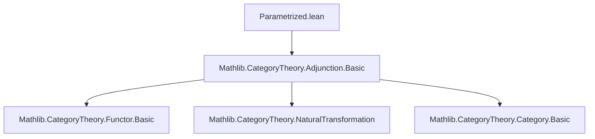
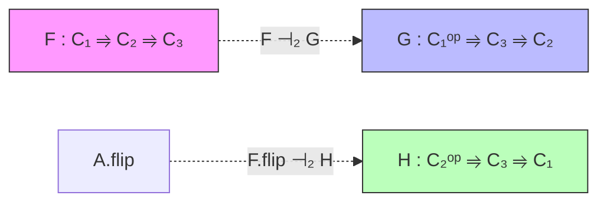

### Technical Brief: `Parametrized.lean`

---

#### **1. Key Definitions & Theorems**

| Name | Type / Structure | Purpose |
|------|------------------|---------|
| `ParametrizedAdjunction` | `structure` | Encodes a family of adjunctions $F(X_1) \dashv G(\mathrm{op}\,X_1)$ for all $X_1 : C_1$, together with a naturality condition over morphisms in $C_1$. |
| `⊣₂` | `infixl:15` notation | Shorthand for `ParametrizedAdjunction F G`. |
| `homEquiv` | `def` | The natural bijection $((F X_1) X_2 \to X_3) \simeq (X_2 \to (G (\mathrm{op}\,X_1)) X_3)$ induced by the parametrized adjunction. |
| `homEquiv_naturality_one` | `lemma` | Naturality of `homEquiv` in the parameter $X_1$: compatibility with $f_1 : X_1 \to Y_1$. |
| `homEquiv_naturality_two` | `lemma` | Naturality in the second variable $X_2$. |
| `homEquiv_naturality_three` | `lemma` | Naturality in the third variable $X_3$. |
| `homEquiv_symm_naturality_*` | `lemmas` | Naturality of the inverse equivalence. |
| `whiskerLeft_map_counit` | `lemma` | Compatibility of the counits with morphisms in $C_1$, expressed via whiskering. |
| `mk'` | `def` | Alternative constructor for `ParametrizedAdjunction`, using `homEquiv`-based naturality condition. |

---

#### **2. Naming Conventions**

- **Prefixes**:
  - `homEquiv_`: properties of the hom-equivalence.
  - `unit_whiskerRight_map`: structural condition on units under whiskering.
  - `whiskerLeft_map_counit`: structural condition on counits.
- **Suffixes**:
  - `_one`, `_two`, `_three`: indicate naturality in the first, second, or third argument respectively.
  - `_symm`: refers to properties of the inverse equivalence.
- **General pattern**:
  - `adj₂` for a variable of type `F ⊣₂ G`.
  - `op` used to lift morphisms in $C_1$ to $C_1^{\mathrm{op}}$.

---

#### **3. Tactic Stack**

- `by cat_disch`: used repeatedly to discharge category-theoretic goals automatically (likely a custom tactic in Mathlib).
- `ext`: extensionality for natural transformations.
- `simp only [...]`: precise simplification using lemmas like `homEquiv_eq`, `Adjunction.homEquiv_unit`, etc.
- `rw [...]`: rewriting using naturality lemmas.
- `simp [h]`: simplification with helper lemmas.
- `apply homEquiv.injective`: to reduce equalities of morphisms to equalities of their images under `homEquiv`.

---

#### **4. Proof Logic**

- **Structure**: The core idea is to lift pointwise adjunctions $F(X_1) \dashv G(\mathrm{op}\,X_1)$ to a *parametrized* adjunction by enforcing naturality in the parameter $X_1$.
- **Typical proof pattern**:
  1. Define the family of adjunctions `adj X₁`.
  2. Prove naturality condition (e.g., `unit_whiskerRight_map`) using diagram chasing or extensionality.
  3. For lemmas about `homEquiv`, reduce to known properties of individual adjunctions (`(adj X₁).homEquiv`) via `homEquiv_eq`.
  4. Use `homEquiv.injective` to prove equalities by mapping both sides via `homEquiv`.
- **Inductive/recursive structure**: Not present here; this is a static categorical definition.

---

#### **5. Imports**

- `Mathlib.CategoryTheory.Adjunction.Basic`: Provides basic definitions and lemmas about adjunctions (`Adjunction`, `homEquiv`, `unit`, `counit`, whiskering, etc.).

---

#### **8. Mermaid Diagrams**

##### **Dependency Graph**



##### **Overview of Theory**

```mermaid
flowchart LR
  subgraph Definitions
    A[F : C₁ ⥤ C₂ ⥤ C₃]
    B[G : C₁ᵒᵖ ⥤ C₃ ⥤ C₂]
    C[ParametrizedAdjunction F G]
  end

  subgraph Structure
    D[adj X₁ : F.obj X₁ ⊣ G.obj (op X₁)]
    E[unit_whiskerRight_map]
  end

  subgraph Derived Equivalence
    F[homEquiv : ((F X₁) X₂ → X₃) ≃ (X₂ → (G op X₁) X₃)]
    G[homEquiv_naturality_*]
    H[whiskerLeft_map_counit]
  end

  A --> C
  B --> C
  C --> D
  C --> E
  C --> F
  F --> G
  F --> H
```

##### **Relationship to Adjunctions of Two Variables**



> *Note*: A *two-variable adjunction* (in the literature) requires both `F ⊣₂ G` and `F.flip ⊣₂ H`, plus coherence conditions. `ParametrizedAdjunction` is strictly weaker.

---

#### **6. Example Use Case**

- `MonoidalClosed.internalHomAdjunction₂` in `CategoryTheory.Closed.Monoidal` uses `⊣₂` to express the adjunction:
  $$
  - \otimes X \dashv \mathrm{hom}(X, -)
  $$
  as a parametrized adjunction over the monoidal category.

---

#### **7. Future Work (from TODO)**

- Prove that if each $F(X_1)$ has a right adjoint $G_{X_1}$, then $G$ extends uniquely to a bifunctor $G' : C_1^{\mathrm{op}} \to C_3 \to C_2$ such that $F \dashv_2 G'$.
- Similarly for left adjoints.

This would establish a *parametrized adjoint functor theorem*.

--- 

Let me know if you'd like a formalization of the TODO or a port to a different style (e.g., using `homEquiv_naturality` as the primitive).
