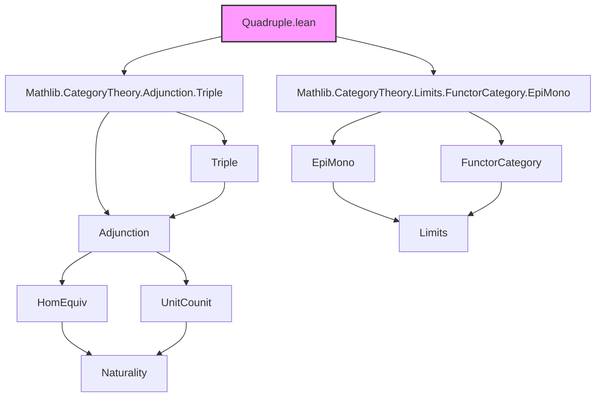

### Technical Brief: `Quadruple.lean`

---

#### **1. Key Definitions & Theorems**

| Name | Type / Signature | Purpose |
|------|------------------|---------|
| `Quadruple L F G R` | `Structure` | Bundles three adjunctions: $L \dashv F$, $F \dashv G$, $G \dashv R$, forming an adjoint quadruple. |
| `leftTriple q` | `Triple L F G` | Extracts the left triple of the quadruple: $L \dashv F \dashv G$. |
| `rightTriple q` | `Triple F G R` | Extracts the right triple: $F \dashv G \dashv R$. |
| `q.op` | `Quadruple R.op G.op F.op L.op` | Dual quadruple via opposite categories. |
| `epi_leftTriple_rightToLeft_app_iff_mono_rightTriple_leftToRight_app` | `∀ X, Epi (q.leftTriple.rightToLeft.app X) ↔ ∀ X, Mono (q.rightTriple.leftToRight.app X)` | When $F$ (hence $R$) is fully faithful: components of $G \Rightarrow L$ are epis iff components of $F \Rightarrow R$ are monos. |
| `epi_leftTriple_rightToLeft_iff_mono_rightTriple_leftToRight` | `Epi q.leftTriple.rightToLeft ↔ Mono q.rightTriple.leftToRight` | Global version of above, assuming pullbacks/pushouts. |
| `epi_leftTriple_leftToRight_app_iff_mono_rightTriple_rightToLeft_app` | `∀ X, Epi (q.leftTriple.leftToRight.app X) ↔ ∀ X, Mono (q.rightTriple.rightToLeft.app X)` | When $L$ and $G$ are fully faithful: components of $L \Rightarrow G$ are epis iff components of $R \Rightarrow F$ are monos. |
| `epi_leftTriple_leftToRight_iff_mono_rightTriple_rightToLeft` | `Epi q.leftTriple.leftToRight ↔ Mono q.rightTriple.rightToLeft` | Global version of above, assuming pullbacks/pushouts. |

---

#### **2. Naming Conventions**

- **Prefixes**:
  - `epi_` / `mono_`: Indicates epimorphism/monomorphism conditions.
  - `leftTriple_` / `rightTriple_`: Refers to projections of the quadruple into triples.
  - `rightToLeft` / `leftToRight`: Standard notation for unit/counit-induced natural transformations in triples (e.g., `rightToLeft : G ⇒ L`, `leftToRight : F ⇒ R`).
- **Suffixes**:
  - `_app_iff_`: Equivalence of pointwise properties.
  - `_iff_`: Equivalence of global (natural transformation) properties.
- **Structure fields**:
  - `adj₁`, `adj₂`, `adj₃`: Adjunctions in order $L \dashv F$, $F \dashv G$, $G \dashv R$.

---

#### **3. Tactic Stack**

Frequent tactics used:
- `simp_rw`, `simp only`, `dsimp`: Simplification with rewrite rules and definitional reductions.
- `rw`: Rewriting using lemmas like `homEquiv_naturality`, `epi_comp_iff_of_epi`, etc.
- `refine`, `exact`, `apply`: Goal-directed proof construction.
- `forall_congr'`: Quantifier manipulation for equivalence proofs.
- `symm`: Flip equivalences.
- `have`, `exact`, `rw [← ...]`: Use of adjunction hom-equivalences and their properties.
- `simpa`: Simplify and discharge goal using a hypothesis.

No heavy automation (e.g., `aesop`, `linarith`) — proofs are highly structured around adjunction properties.

---

#### **4. Proof Logic**

- **Structure**: Proofs rely on:
  - **Adjoint hom-equivalences** (`homEquiv`) and their naturality.
  - **Fully faithfulness** ↔ isomorphism of hom-sets, enabling injectivity/surjectivity arguments.
  - **Characterizations**:
    - `epi_iff_forall_injective`, `mono_iff_forall_injective`
    - `epi_comp_iff_of_epi`, `mono_leftToRight_app_iff_mono_adj₂_unit_app`
  - **Opposite category duality** (`op`, `Opposite.equivToOpposite`) to reduce second main lemma to first.

- **Typical flow**:
  1. Unfold definitions (`rightToLeft_eq_counits`, `leftToRight` as unit).
  2. Use `simp` to reduce to hom-set level.
  3. Apply injectivity/surjectivity of hom-equivalences.
  4. Use naturality and composition properties to relate transformations.
  5. For dual case, apply `op` and use `simpa`.

---

#### **5. Imports & Dependencies**

- **Core imports**:
  ```lean
  Mathlib.CategoryTheory.Adjunction.Triple
  Mathlib.CategoryTheory.Limits.FunctorCategory.EpiMono
  ```
- **Key modules used**:
  - `CategoryTheory.Adjunction`: Hom-equivalences, units/counits, naturality.
  - `CategoryTheory.Limits`: Epis/monos in functor categories, pullbacks/pushouts.
  - `CategoryTheory.FunctorCategory`: Objects/morphisms in functor categories.
  - `CategoryTheory.Opposite`: Opposite categories and duality.

---

#### **6. Theory Overview & Dependency Diagram**

##### **Dependency Graph (Mermaid)**



##### **Overview of File Role**

- **Purpose**: Formalizes *adjoint quadruples* $L \dashv F \dashv G \dashv R$, building on `Triple` and leveraging duality.
- **Context**: Central to cohesive toposes (e.g., $π₀ \dashv disc \dashv Γ \dashv codisc$).
- **Contribution**:
  - Bundles three adjunctions into a structure.
  - Provides characterizations of epis/monos between induced natural transformations under full faithfulness assumptions.
  - Demonstrates how duality reduces half the work.

##### **Related Theory**

- `Triple.lean`: Basis for left/right triples.
- `cohesive_topos.lean` (hypothetical): Application to cohesive structures.
- `adjunction.lean`: Foundational adjunction machinery.

---

Let me know if you'd like a formalized summary in LaTeX or a dependency tree for the entire `CategoryTheory.Adjunction` hierarchy.
