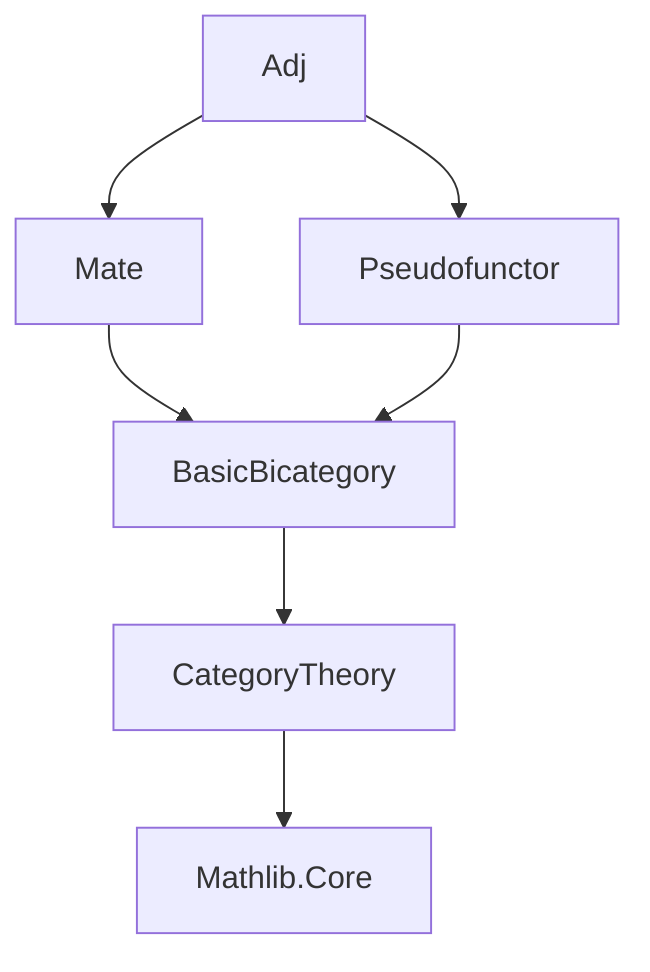
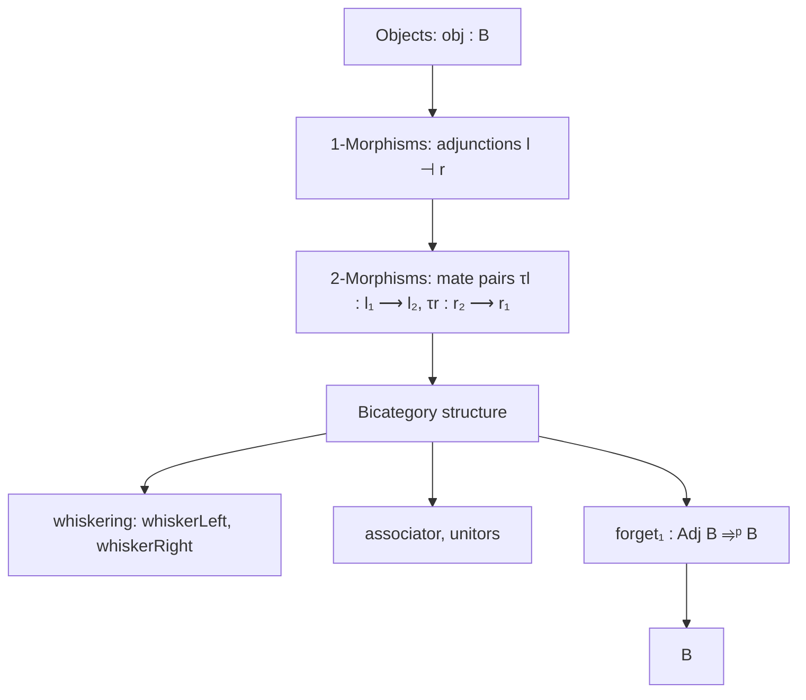

### Technical Brief: `Adj.lean` — Bicategory of Adjunctions

---

#### **1. Key Definitions & Theorems**

| Name | Type / Structure | Purpose |
|------|------------------|---------|
| `Adj (B : Type u) [Bicategory B]` | `Type (max u w v)` | Objects of the new bicategory are objects of `B`. |
| `Adj.Hom a b` | `Type (max u w v)` | Type of adjunctions `l ⊣ r` with `l : a ⟶ b`, `r : b ⟶ a`. |
| `Adj.Hom₂ α β` | `Type (max u w v)` | Morphisms between adjunctions `α, β : a ⟶ b`, given by a pair of **mates** `(τl : α.l ⟶ β.l, τr : β.r ⟶ α.r)` satisfying conjugacy condition. |
| `instance : Category (a ⟶ b)` | `Category (a ⟶ b)` | Vertical composition & identity for 2-morphisms. |
| `iso₂Mk` | `α ≅ β` | Constructor for isomorphisms in `Hom₂`, using isos on left/right adjoints. |
| `associator`, `leftUnitor`, `rightUnitor` | `iso` | Structural isos for bicategory axioms, built from those in `B`. |
| `whiskerLeft`, `whiskerRight` | `α ≫ β ⟶ α ≫ β'` etc. | Horizontal composition of 2-morphisms with 1-morphisms. |
| `instance : Bicategory (Adj B)` | `Bicategory (Adj B)` | Main theorem: `Adj B` inherits a bicategory structure from `B`. |
| `forget₁ : Adj B ⥤ᵖ B` | `pseudofunctor` | Forgets adjunctions to underlying 1-morphisms (left adjoints). |
| `lIso`, `rIso` | `adj₁.l ≅ adj₂.l`, `adj₁.r ≅ adj₂.r` | Extract left/right adjoint isos from an iso in `Adj B`. |

---

#### **2. Naming Conventions**

- **Prefixes**:
  - `adj_`: for adjunction-related data (e.g., `adj`, `Hom`, `Hom₂`)
  - `l`, `r`: denote left/right adjoint components (e.g., `l`, `r`, `lIso`, `rIso`)
  - `τl`, `τr`: denote components of 2-morphisms (left/right mate maps)
- **Suffixes**:
  - `_hom`, `_inv`: for components of isomorphisms (e.g., `associator_hom_τl`)
  - `_τl`, `_τr`: for projections of 2-morphism components (e.g., `comp_τl`, `whiskerLeft_τr`)
- **`conjugateEquiv_τl`**: key coherence condition equating mate maps.

---

#### **3. Tactic Stack**

Frequent tactics used in proofs:

- `simp` / `simp only` — simplifying `simps!`-generated lemmas and definitions.
- `rw` — rewriting using `conjugateEquiv_τl`, `Iso` laws, `comp_τl`, etc.
- `by cat_disch` — category-theoretic discharge tactic (likely custom or from `Mathlib.CategoryTheory`).
- `ext` / `hom₂_ext` — extensionality for 2-morphisms.
- `congr'` / `congr` — for structural equalities (e.g., `mk_obj`).
- `simpa using` — simplifying with a hypothesis (e.g., in `leftUnitor` proof).
- `cancel_mono` — used in `iso₂Mk` to simplify compositions with monos (assumed or derived).

---

#### **4. Proof Logic**

- **Structure construction**:
  - Define objects, morphisms, and 2-morphisms via `structure` + `instance`.
  - Use `simps!` to generate projection lemmas automatically.
- **Bicategory axioms**:
  - Define structural isos (`associator`, `leftUnitor`, `rightUnitor`) using those in `B`.
  - Prove coherence conditions implicitly via `simps!` and `conjugateEquiv` naturality.
- **Whiskering & composition**:
  - Define whiskering via action on `τl`, `τr`, and verify mate condition using `conjugateEquiv_whiskerLeft/right`.
  - Composition uses `conjugateEquiv_comp` to ensure coherence.
- **Isomorphism lifting**:
  - `iso₂Mk` constructs iso in `Adj B` from iso on left/right adjoints, using `conjugateEquiv` to match inverses.
  - `lIso`, `rIso` extract components of iso in opposite directions (note: `rIso.hom = e.inv.τr` due to opposite direction of `τr`).

---

#### **5. Imports & Dependencies**

- **Core**:
  - `Mathlib.CategoryTheory.Bicategory.Adjunction.Mate`
    - Provides `conjugateEquiv`, mate calculus, and basic adjunction lemmas.
  - `Mathlib.CategoryTheory.Bicategory.Functor.Pseudofunctor`
    - Provides `pseudofunctor`, `pseudofunctor.mapId`, etc., used in `forget₁`.

- **Implicit dependencies**:
  - `Mathlib.CategoryTheory.Bicategory.Basic` (via `Bicategory` class)
  - `Mathlib.CategoryTheory.Category.Basic`, `Iso`, `whiskering`, `natural transformations`.

---

#### **8. Mermaid Diagrams**

##### **Dependency Graph (Module Level)**



##### **Overview of `Adj B` Structure**



##### **2-Morphism Commutativity (Mate Condition)**

```mermaid
graph LR
  A[l₁] -->|τl| B[l₂]
  A'["r₁"] <--|τr| B'["r₂"]
  A -- adj₁ --> A'
  B -- adj₂ --> B'
  A -- l₁ --> B
  A' -- r₁ --> B'
  B -- r₂ --> A'
  A -- l₂ --> B
  style A fill:#f9f,stroke:#333
  style B fill:#f9f,stroke:#333
  style A' fill:#bbf,stroke:#333
  style B' fill:#bbf,stroke:#333
  linkStyle 0 stroke:#f66,stroke-width:2px
  linkStyle 1 stroke:#f66,stroke-width:2px
  linkStyle 2 stroke:#66f,stroke-width:2px
  linkStyle 3 stroke:#66f,stroke-width:2px
  classDef obj fill:#f9f,stroke:#333;
  classDef adj fill:#bbf,stroke:#333;
  class A,A' adj;
  class B,B' adj;
```

> **Legend**: Solid arrows = 1-morphisms in `B`; dashed arrows = 2-morphism components; top/bottom rows = left/right adjoints.

---

#### **Summary**

This file constructs the **bicategory of adjunctions** `Adj B` over any bicategory `B`, where:
- 1-morphisms are adjunctions (not just arrows),
- 2-morphisms are **mate pairs**, enforcing coherence via `conjugateEquiv`,
- The resulting structure satisfies bicategory axioms via transport along mate calculus.

It serves as a categorical foundation for bifibered-like structures (e.g., in descent theory), and is intended to support formalization of pullback/pushforward adjunctions in contexts like sheaves, modules, or homotopy theory.

--- 

Let me know if you'd like a formalized checklist of bicategory axioms or a proof sketch for coherence (e.g., pentagon identity).
