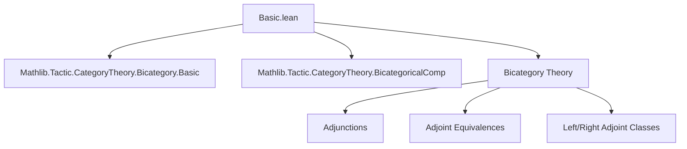
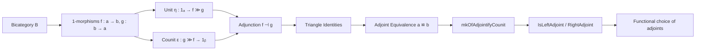
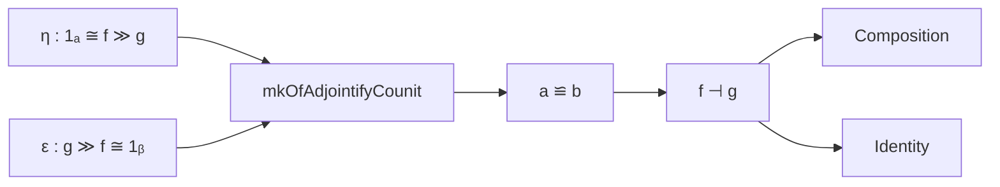

### Technical Brief: Adjunctions in Bicategories (Basic.lean)

---

#### **1. Key Definitions & Theorems**

| Name | Type / Structure | Purpose |
|------|------------------|---------|
| `leftZigzag η ε` | `leftZigzag : (η : 𝟙 a ⟶ f ≫ g) → (ε : g ≫ f ⟶ 𝟙 b) → (a ⟶ b)` | Composite 2-morphism representing the left triangle pasting: $f \xrightarrow{η ▷ f} f g f \xrightarrow{f ε} f$ |
| `rightZigzag η ε` | `rightZigzag : (η : 𝟙 a ⟶ f ≫ g) → (ε : g ≫ f ⟶ 𝟙 b) → (a ⟶ b)` | Composite 2-morphism representing the right triangle pasting: $g \xrightarrow{g η} g f g \xrightarrow{ε g} g$ |
| `Adjunction f g` | `structure` | An adjunction between 1-morphisms $f : a \to b$, $g : b \to a$, given by unit `η`, counit `ε`, and triangle identities (`left_triangle`, `right_triangle`) |
| `id a` | `Adjunction (𝟙 a) (𝟙 a)` | Identity adjunction on object `a` |
| `comp adj₁ adj₂` | `Adjunction (f₁ ≫ f₂) (g₂ ≫ g₁)` | Composition of adjunctions in a bicategory |
| `Equivalence a b` | `structure` | Adjoint equivalence between objects `a`, `b`: includes `hom`, `inv`, unit/counit *isomorphisms*, and `left_triangle` condition |
| `mkOfAdjointifyCounit η ε` | `Equivalence a b` | Constructs an adjoint equivalence from isomorphisms `η : 𝟙 a ≅ f ≫ g`, `ε : g ≫ f ≅ 𝟙 b`, by adjusting `ε` to satisfy triangle identities |
| `rightZigzag_idempotent_of_left_triangle` | `theorem` | Shows that if the left triangle identity holds, then `rightZigzag` is idempotent |
| `right_triangle_of_left_triangle` | `theorem` | Derives the right triangle identity from the left one, assuming `leftZigzag` is invertible (i.e., when `η`, `ε` are isos) |
| `RightAdjoint f` | `structure` | A chosen right adjoint to `f`, with witness `right : b ⟶ a` and `adj : f ⊣ right` |
| `IsLeftAdjoint f` | `class` | Prop asserting existence of a right adjoint to `f` |
| `LeftAdjoint f`, `IsRightAdjoint f` | `structure` / `class` | Dual notions for left adjoints |

---

#### **2. Naming Conventions**

- **Prefixes**:
  - `leftZigzag`, `rightZigzag`: pasting diagrams for triangle identities.
  - `compUnit`, `compCounit`: auxiliary components for composition of adjunctions.
  - `adjointifyCounit`: modifies `ε` to satisfy triangle identities.
- **Suffixes**:
  - `Iso`: for isomorphism versions (e.g., `leftZigzagIso`, `rightZigzagIso`).
  - `hom`: extracts underlying 2-morphism from iso (e.g., `left_triangle_hom`, `right_triangle_hom`).
- **Infixes**:
  - `⊣` for `Adjunction`
  - `≌` for `Equivalence`

---

#### **3. Tactic Stack**

Frequent tactics used in proofs:

| Tactic | Usage |
|--------|-------|
| `bicategory` | Coherence and manipulation of 2-cells, whiskering, and associators/unitors |
| `bicategory_coherence` | Proves equalities up to coherence isomorphisms |
| `simp_rw` / `simp` | Rewriting using `simp` lemmas (e.g., `left_triangle`, `right_triangle`) |
| `rw` | Rewriting with definitions or theorems (e.g., `← whisker_exchange`) |
| `calc` | Chain of equalities in `rightZigzag_idempotent_of_left_triangle`, `comp_left_triangle_aux`, etc. |
| `ext` + `simp` | Proving extensionality of isomorphisms (e.g., `Iso.ext`) |
| `dsimp` | Simplifying definitions before rewriting |
| `cancel_epi` | Cancellation of epimorphisms in diagram chasing |

---

#### **4. Proof Logic**

- **Structure of proofs**:
  - **Induction/definition-based**: Most proofs unfold definitions (`dsimp`), then apply coherence or whiskering lemmas.
  - **Triangle identities**: Proved by expanding `leftZigzag`/`rightZigzag`, applying `whisker_exchange`, and simplifying using triangle hypotheses.
  - **Iso-based constructions**: Use `Iso.ext` to reduce to hom-component proofs; `simp` lemmas (`leftZigzagIso_hom`, `rightZigzagIso_hom`, etc.) bridge iso and morphism versions.
  - **Idempotence → identity**: In `rightZigzag_idempotent_of_left_triangle`, idempotence + invertibility (from `left_triangle`) implies identity.

- **Typical flow**:
  1. Unfold definitions (`compUnit`, `compCounit`, `adjointifyCounit`, etc.)
  2. Apply `bicategory` to rearrange whiskerings and associators.
  3. Use `whisker_exchange` to commute whiskering past composition.
  4. Apply triangle hypotheses (`left_triangle`, `right_triangle`) to simplify.
  5. Conclude via `simp` or `bicategory_coherence`.

---

#### **5. Imports**

- `Mathlib.Tactic.CategoryTheory.Bicategory.Basic`: Core bicategory infrastructure (objects, 1-morphisms, 2-morphisms, whiskering, unitors, associators).
- `Mathlib.Tactic.CategoryTheory.BicategoricalComp`: Tools for bicategorical composition and coherence (e.g., `bicategoricalComp`, `bicategoricalIsoComp`, `whisker_exchange`).

---

#### **6. Mermaid Diagrams**

##### **Dependency Graph (Module-Level)**

##### **Overview of Theory Flow**

##### **Key Construction Dependencies**

---

This file formalizes the foundational theory of adjunctions and equivalences in bicategories, with emphasis on constructing adjoint equivalences from isomorphic triangle data and enabling functional choice of adjoints via classes. It serves as a basis for higher-categorical adjoint functor theorems and 2-categorical limits/colimits.
