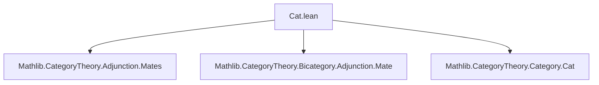
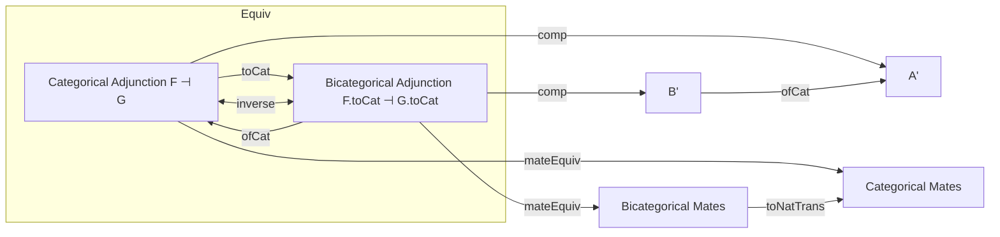
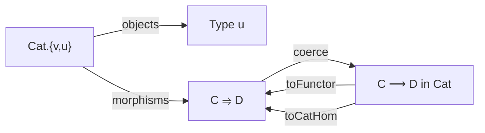

**Technical Brief: `Cat.lean` — Adjunctions in the Bicategory `Cat`**

---

### 1. **Key Definitions & Theorems**

| Name | Type | Purpose |
|------|------|---------|
| `Adjunction.toCat` | `F ⊣ G → Bicategory.Adjunction F.toCatHom G.toCatHom` | Constructs a bicategorical adjunction (in `Cat`) from a categorical adjunction between functors. |
| `Adjunction.ofCat` | `Bicategory.Adjunction F G → F.toFunctor ⊣ G.toFunctor` | Extracts a categorical adjunction from a bicategorical one in `Cat`. |
| `Adjunction.toCat_ofCat` | `adj.toCat.ofCat = adj` | Shows `ofCat` is a left inverse of `toCat`. |
| `Adjunction.ofCat_toCat` | `ofCat adj.toCat = adj` | Shows `toCat` is a right inverse of `ofCat`. |
| `Adjunction.toCat_comp_toCat` | `adj.toCat.comp adj'.toCat = (adj.comp adj').toCat` | Compatibility of composition under the equivalence. |
| `Bicategory.Adjunction.ofCat_id` | `ofCat (id C) = id` | Identity adjunctions correspond under the equivalence. |
| `Bicategory.Adjunction.ofCat_comp` | `ofCat (adj.comp adj') = ofCat adj .comp ofCat adj'` | Composition of adjunctions is preserved. |
| `Bicategory.toNatTrans_mateEquiv` | `mateEquiv` under `toNatTrans` | Relates bicategorical mate equivalence with categorical mate equivalence. |
| `Bicategory.toNatTrans_conjugateEquiv` | `conjugateEquiv` under `toNatTrans` | Relates bicategorical conjugation with categorical conjugation. |

---

### 2. **Naming Conventions**

- **Prefixes**:
  - `toCat`: conversion *to* bicategorical language (from categorical adjunction).
  - `ofCat`: conversion *from* bicategorical language (to categorical adjunction).
  - `toNatTrans`: coercion from bicategorical natural transformations to categorical ones.
- **Suffixes**:
  - `_equiv`: indicates an equivalence (e.g., `mateEquiv`, `conjugateEquiv`).
  - `_comp`, `_id`: denote behavior with respect to composition/identity.

---

### 3. **Tactic Stack**

- `simp`: heavily used, especially with `bicategoricalComp`, `Adjunction.*.toNatTrans`, and `congr`.
- `ext`: for extensionality (natural transformations, adjunctions).
- `simpa`: to simplify using known lemmas (e.g., `simpa using congr($(adj.left_triangle).toNatTrans.app X)`).
- `rw`: for rewriting using lemmas like `toNatTrans_mateEquiv`.
- `dsimp`: used in `toNatTrans_conjugateEquiv` to unfold definitions before rewriting.
- `cat_disch`: used in `toCat_comp_toCat` — likely a custom tactic for category-theoretic discharge.

---

### 4. **Proof Logic**

- **Core strategy**: Establish a *bijection* between categorical adjunctions `F ⊣ G` and bicategorical adjunctions `F.toCat ⊣ G.toCat` in `Cat`.
- **Structure**:
  1. Define `toCat` and `ofCat` as inverses (via `toCat_ofCat`, `ofCat_toCat`).
  2. Prove coherence with structure: identity, composition, mate/conjugate equivalences.
  3. Use `simp`-based automation to reduce triangle identities and naturality to their categorical counterparts.
- **Triangle identities**: Verified by pulling back bicategorical triangle diagrams via `toNatTrans`, using `congr` and `simpa`.

---

### 5. **Imports**

| Import | Role |
|--------|------|
| `Mathlib.CategoryTheory.Adjunction.Mates` | Categorical mate theory (used in `mateEquiv` lemmas). |
| `Mathlib.CategoryTheory.Bicategory.Adjunction.Mate` | Bicategorical mate theory (used in `Bicategory.mateEquiv`). |
| `Mathlib.CategoryTheory.Category.Cat` | Defines `Cat` as a bicategory and `toCatHom`, `toFunctor` coercions. |

---

### 6. **Mermaid Diagrams**

#### Dependency Graph (Module-Level)

#### Overview of Theory Flow

#### Bicategory `Cat` Embedding

---

### 7. **Summary**

This module formalizes the *equivalence* between the classical notion of adjunctions between functors and adjunctions in the bicategory `Cat`. It shows that all structure (units, counits, triangles, composition, mates, conjugates) is preserved under the `toCat`/`ofCat` correspondence. The proofs rely on careful use of `simp`-based simplification and coercion lemmas (`toNatTrans_*`), ensuring that bicategorical constructions reduce exactly to their categorical counterparts.
