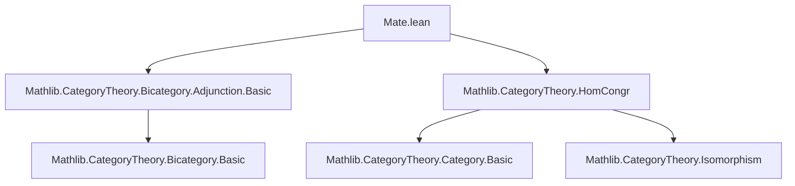
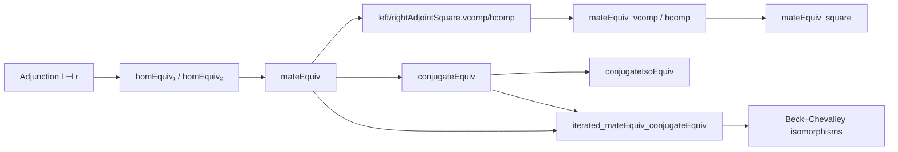

### Technical Brief: Mates in Bicategories (`Mate.lean`)

---

#### **1. Key Definitions & Theorems**

| Name | Type | Purpose |
|------|------|---------|
| `homEquiv₁` | `(g ⟶ l ≫ h) ≃ (r ≫ g ⟶ h)` | Bijection induced by adjunction `l ⊣ r`, mapping left whiskered 2-cells to right whiskered ones. |
| `homEquiv₂` | `(g ≫ l ⟶ h) ≃ (g ⟶ h ≫ r)` | Dual bijection: maps 2-cells through the left adjoint on the domain side to those through the right adjoint on the codomain side. |
| `mateEquiv` | `(g ≫ l₂ ⟶ l₁ ≫ h) ≃ (r₁ ≫ g ⟶ h ≫ r₂)` | Core bijection between *mates*: 2-cells in a square with top/bottom adjunctions. Constructed via `homEquiv₂` then `homEquiv₁`. |
| `leftAdjointSquare.vcomp`, `rightAdjointSquare.vcomp` | Vertical pasting of mate-squares | Define vertical composition of squares of 2-cells between left/right adjoints. |
| `leftAdjointSquare.hcomp`, `rightAdjointSquare.hcomp` | Horizontal pasting of mate-squares | Define horizontal composition of mate-squares. |
| `mateEquiv_vcomp`, `mateEquiv_hcomp` | `mateEquiv (vcomp α β) = vcomp (mateEquiv α) (mateEquiv β)`<br>`mateEquiv (hcomp α β) = hcomp (mateEquiv α) (mateEquiv β)` | Commutativity of `mateEquiv` with vertical/horizontal composition. |
| `mateEquiv_square` | Commutativity of `mateEquiv` with *double* composition (`comp = vcomp ∘ hcomp = hcomp ∘ vcomp`) | Ensures coherence of mate correspondence under iterated pasting; basis for double-categorical structure. |
| `conjugateEquiv` | `(l₂ ⟶ l₁) ≃ (r₁ ⟶ r₂)` | Special case of `mateEquiv` where vertical morphisms are identities; corresponds to *conjugate* transformations. |
| `conjugateEquiv_apply'`, `conjugateEquiv_symm_apply'` | Explicit formulas for `conjugateEquiv` and its inverse | Useful for computation and verification. |
| `conjugateEquiv_id`, `conjugateEquiv_comp`, `conjugateEquiv_associator_hom` | Algebraic properties of `conjugateEquiv` | Shows it respects identities, composition, and associators — key for 2-categorical coherence. |
| `conjugateIsoEquiv` | `(l₂ ≅ l₁) ≃ (r₁ ≅ r₂)` | Equivalence of isomorphism classes of left/right adjoints via conjugation. |
| `iterated_mateEquiv_conjugateEquiv` | `mateEquiv adj₄ adj₃ (mateEquiv adj₁ adj₂ α) = conjugateEquiv (adj₁.comp adj₄) (adj₃.comp adj₂) α` | When all four sides are adjoints, iterating mates yields a conjugate; explains Beck–Chevalley isomorphisms. |

---

#### **2. Naming Conventions**

- **Prefixes**:
  - `homEquiv₁`, `homEquiv₂`: bijections from adjunction unit/counit.
  - `mateEquiv`: core mate correspondence.
  - `leftAdjointSquare.*`, `rightAdjointSquare.*`: squares involving left/right adjoints.
  - `conjugateEquiv`: special case of mate where vertical arrows are identities.
  - `leftAdjointConjugateSquare.*`, `rightAdjointConjugateSquare.*`: mixed compositions with conjugate squares.

- **Suffixes**:
  - `_vcomp`, `_hcomp`: vertical/horizontal composition.
  - `_comp`: composition law (e.g., `conjugateEquiv_comp`).
  - `_iso`, `_symm_iso`: isomorphism instances.
  - `_vhcomp`, `_hvcomp`: interchange law for double composition.

- **Notable patterns**:
  - `α ▷ h`, `g ◁ β`: whiskering notation.
  - `α ≫ β`, `α ◁ β`, `α ▷ β`: composition and whiskering.
  - `α ≃ β`: equivalence/bijection (often `≃` for `Equiv`).

---

#### **3. Tactic Stack**

- **Core tactics**:
  - `bicategory`: custom tactic for manipulating bicategorical diagrams (unit/counit, associators, unitors).
  - `simp`: heavily used with `only` and `dsimp` to simplify using `@[simps]` lemmas.
  - `calc`: for multi-step equational reasoning.
  - `rw`: rewriting using lemmas like `adj.left_triangle`, `whisker_exchange`, `assoc`, etc.
  - `dsimp`: for definitional simplification (e.g., unfolding `comp`, `id`).
  - `infer_instance`: for typeclass inference (e.g., `IsIso`).
  - `have`, `exact`, `symm`: proof structuring.

- **Key lemmas used repeatedly**:
  - `adj.left_triangle`, `adj.right_triangle`: triangle identities.
  - `whisker_exchange`, `leftZigzag`, `rightZigzag`: coherence for whiskering.
  - `Iso.hom_inv_id`, `Iso.inv_hom_id`, `Iso.cancel_*`: isomorphism calculus.
  - `leftUnitor_whiskerRight`, `rightUnitor_whiskerLeft`, `triangle_assoc_*`: unitors/associators interaction.

---

#### **4. Proof Logic**

- **Structure of proofs**:
  1. **Explicit formula derivation**: e.g., `mateEquiv_apply'` expands definitions using `mateEquiv`, `homEquiv₁`, `homEquiv₂`.
  2. **Diagrammatic verification**: proofs often proceed by:
     - Expanding definitions (`rw [mateEquiv_apply', ...]`)
     - Rearranging whiskerings (`rw [whisker_exchange]`)
     - Applying triangle identities (`rw [adj.left_triangle]`)
     - Simplifying with `bicategory`.
  3. **Inductive/iterative reasoning**: for `mateEquiv_vcomp`, `mateEquiv_hcomp`, `mateEquiv_square`, proofs use:
     - `have` to isolate intermediate lemmas (`mateEquiv_vcomp`, `mateEquiv_hcomp`)
     - Substitution into larger diagrams.
  4. **Isomorphism preservation**: proofs of `conjugateEquiv_iso`, `conjugateEquiv_of_iso` use:
     - `IsIso` instance construction with explicit inverses.
     - `conjugateEquiv_comp`, `conjugateEquiv_id` to verify inverse laws.

- **Common pattern**:
  ```lean
  calc
    _ = ... := by rw [defn]
    _ = ... := by rw [whisker_exchange]; bicategory
    _ = ... := by rw [triangle_id]
    _ = ... := by bicategory
  ```

---

#### **5. Imports**

- `Mathlib.CategoryTheory.Bicategory.Adjunction.Basic`: foundational adjunction theory in bicategories.
- `Mathlib.CategoryTheory.HomCongr`: hom-congruence lemmas (e.g., `Iso.homCongr`).

> **Note**: The file is *not* universe-polymorphic in its current form (unlike `Mathlib/CategoryTheory/Adjunction/Mates.lean`), but is designed to be a *specialization* for bicategorical mates.

---

#### **6. Mermaid Diagrams**

##### **Dependency Graph (Module-Level)**



##### **Overview of Theory Flow**



##### **Square Commutativity (MateEquiv_vcomp)**

```mermaid
graph LR
  A[g₁ ≫ g₂ ≫ l₃] -->|α ▷ h₂ ≫ ...| B[l₁ ≫ h₁ ≫ h₂]
  C[g₁ ≫ l₂ ≫ l₃] -->|vcomp α β| A
  D[r₁ ≫ g₁ ≫ g₂] -->|β' ▷ r₃ ≫ ...| E[(h₁ ≫ h₂) ≫ r₃]
  F[r₁ ≫ g₁ ≫ l₂] -->|vcomp α' β'| D
  C -- mateEquiv --> D
  A -- mateEquiv --> E
  style C fill:#f9f,stroke:#333
  style A fill:#bbf,stroke:#333
  style D fill:#bfb,stroke:#333
  style E fill:#f96,stroke:#333
```

> **Interpretation**: The diagram commutes — taking mates commutes with vertical pasting.

---

#### **7. Summary**

This file formalizes the *mate correspondence* in general bicategories, extending the familiar natural isomorphism between hom-sets in an adjunction to a full 2-categorical bijection between squares. It establishes:

- **Foundational equivalences** (`homEquiv₁`, `homEquiv₂`, `mateEquiv`)
- **Composition coherence** (`vcomp`, `hcomp`, `mateEquiv_vcomp`, `mateEquiv_hcomp`, `mateEquiv_square`)
- **Special cases** (`conjugateEquiv`, `iterated_mateEquiv_conjugateEquiv`)
- **Isomorphism preservation** (`conjugateIsoEquiv`, `conjugateEquiv_iso`, `conjugateEquiv_of_iso`)

The proofs rely heavily on diagrammatic reasoning in bicategories, using unit/counit identities, associators, and whiskering lemmas. The structure supports future development of double categories and Beck–Chevalley conditions.

--- 

*End of Technical Brief.*
