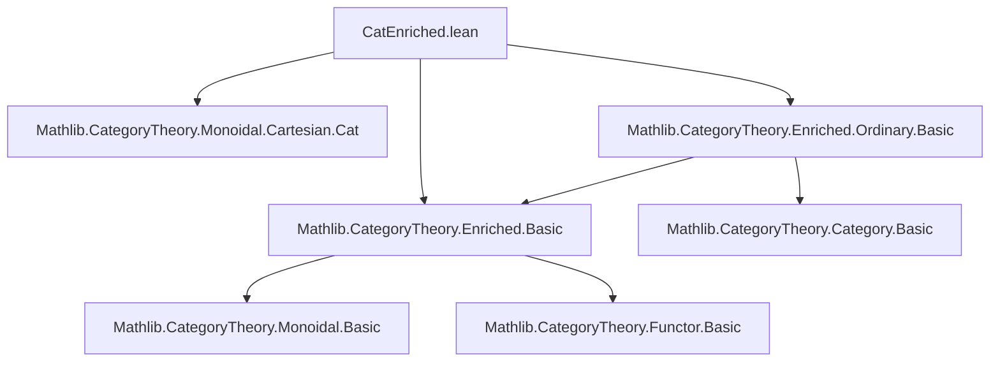

### Technical Brief: `CatEnriched.lean`

---

#### **1. Key Definitions & Theorems**

| Name | Type / Purpose |
|------|----------------|
| `CatEnriched C` | Type alias for `C : Type*` with `EnrichedCategory Cat C`; underlying type inherits a strict bicategory structure. |
| `CatEnrichedOrdinary C` | Type alias for `C : Type*` with `EnrichedOrdinaryCategory Cat C`; extends given `Category C` to a strict bicategory. |
| `instance : Category (CatEnriched C)` | Defines composition and identity using enriched structure (`eComp`, `eId`). |
| `hComp` | Horizontal composition of 2-cells: `f ⟶ f'`, `g ⟶ g'` ↦ `f ≫ g ⟶ f' ≫ g'`, via `(eComp).toFunctor.map`. |
| `id_hComp_id` | `hComp (𝟙 f) (𝟙 g) = 𝟙 (f ≫ g)` — identity preservation under horizontal composition. |
| `hComp_comp` | Interchange law: `hComp η θ ≫ hComp η' θ' = hComp (η ≫ η') (θ ≫ θ')`. |
| `hComp_assoc` / `hComp_assoc_heq` | Associativity of horizontal composition up to coherence isomorphism (`eqToIso (assoc f g h)`). |
| `instance : Bicategory (CatEnriched C)` | Constructs a bicategory structure on `CatEnriched C`. |
| `instance : Bicategory.Strict (CatEnriched C)` | The bicategory is *strict* because unitors/associators are defined via `eqToIso` of category axioms. |
| `homEquiv {a b}` | Equivalence `(a ⟶ b) ≃ (a.toBase ⟶ b.toBase)` in `CatEnrichedOrdinary C`, linking the given category structure with the enriched one. |
| `Hom` structure | Defines 2-cells in `CatEnrichedOrdinary C` as morphisms between `homEquiv f` and `homEquiv g`. |
| `hComp` (for `CatEnrichedOrdinary`) | Horizontal composition adjusted via `homEquiv_comp` coherence. |
| `instance : Bicategory.Strict (CatEnrichedOrdinary C)` | Strict bicategory extending the given `Category C`. |

---

#### **2. Naming Conventions**

- **Prefixes**:
  - `e_`: enriched structure operations, e.g., `eId`, `eComp`, `e_assoc`, `e_id_comp`, `e_comp_id`.
  - `homEquiv_`: coherence properties of the equivalence between hom-sets and hom-objects.
  - `hComp_`: horizontal composition lemmas.
  - `id_`, `comp_`, `assoc_`: standard category axioms used as coherence paths.

- **Suffixes**:
  - `_heq`: proofs of `HEq` (heterogeneous equality), often used before converting to `eqToHom`.
  - `_eq`: proofs of definitional or propositional equality.
  - `_mk`, `_base`: for the `Hom` structure (constructor and projection).
  - `toBase`: map from `CatEnrichedOrdinary C` to `CatEnriched C`.

- **Other**:
  - `whiskerLeft`, `whiskerRight`: defined in terms of `hComp`.
  - `associator`, `leftUnitor`, `rightUnitor`: defined as `eqToIso` of category axioms.

---

#### **3. Tactic Stack**

- **Core tactics**:
  - `rfl`, `simp`, `rw`, `cases`, `ext`, `congr_arg`, `congr_arg_heq`
- **Category-theoretic automation**:
  - `Functor.map_id`, `Functor.map_comp`
  - `eqToHom`, `eqToIso`, `heq_eq_eq`, `heq_eqToHom_*`, `eqToHom_comp_heq_iff`, etc.
- **Simplification & automation**:
  - `simp only [...]`, `conv => ...`, `generalize_proofs`, `intro`, `revert`
- **Proof automation**:
  - `aesop` is *not* used; proofs are mostly manual or `simp`-driven.
  - Heavy use of `simp` with custom lemmas (`hComp_*`, `Hom.*`, `homEquiv.*`).

---

#### **4. Proof Logic**

- **Structure**:
  1. **Define underlying category** on `CatEnriched C` using enriched data.
  2. **Define 2-cells** as morphisms in hom-categories.
  3. **Define horizontal composition** via enriched composition bifunctor.
  4. **Prove bicategory axioms**:
     - Identity laws (`id_hComp`, `hComp_id`)
     - Interchange (`hComp_comp`)
     - Associativity (`hComp_assoc`)
     - Coherence laws (pentagon, triangle) via `simp` + coherence of enriched category.

- **Key technique**:
  - Use `eqToHom` and `eqToIso` to transport structure along propositional equalities (e.g., category axioms).
  - Prove `HEq` versions first, then convert to `eqToHom`-based equalities.
  - For `CatEnrichedOrdinary`, transfer structure via `homEquiv`, using its coherence properties (`homEquiv_id`, `homEquiv_comp`).

- **Induction / Cases**:
  - Rarely needed; mostly equational reasoning.
  - `cases α` for equalities of paths (e.g., `α : f = f'`).

---

#### **5. Imports**

| Module | Purpose |
|--------|---------|
| `Mathlib.CategoryTheory.Monoidal.Cartesian.Cat` | Provides `Cat` as cartesian monoidal category (used for enrichment). |
| `Mathlib.CategoryTheory.Enriched.Basic` | Core enriched category theory: `EnrichedCategory`, `eId`, `eComp`, coherences. |
| `Mathlib.CategoryTheory.Enriched.Ordinary.Basic` | `EnrichedOrdinaryCategory`, `homEquiv`, relation between enriched and ordinary structure. |

---

#### **6. Mermaid Diagrams**

##### **Dependency Graph (Top-Level)**



##### **Theory Overview (Module Scope)**

```mermaid
graph LR
  subgraph Enriched
    E1[EnrichedCategory Cat C]
    E2[EnrichedOrdinaryCategory Cat C]
  end

  subgraph Constructions
    C1[CatEnriched C]
    C2[CatEnrichedOrdinary C]
  end

  subgraph Bicategories
    B1[Bicategory (CatEnriched C)]
    B2[Bicategory.Strict (CatEnriched C)]
    B3[Bicategory (CatEnrichedOrdinary C)]
    B4[Bicategory.Strict (CatEnrichedOrdinary C)]
  end

  E1 --> C1 --> B1 --> B2
  E2 --> C2 --> B3 --> B4

  C1 -.->|underlying| E1
  C2 -.->|forgets to| E2
  C2 -.->|toBase| C1
```

##### **Bicategory Structure Flow**

```mermaid
graph TD
  S[EnrichedCategory Cat C] -->|Define| C[Category (CatEnriched C)]
  C -->|Hom-categories| H[Category (X ⟶ Y)]
  H -->|2-cells| η[η : f ⟶ f']
  η -->|hComp| HComp[Horizontal composition]
  HComp -->|Coherence| P[Pentagon/Triangle]
  P -->|eqToIso| B[Bicategory.Strict]
```

---

#### **7. Summary**

This file formalizes the classical result that a `Cat`-enriched category (or enriched ordinary category) gives rise to a **strict bicategory**, where:
- Objects = elements of `C`
- 1-cells = objects of hom-categories (`X ⟶[Cat] Y`)
- 2-cells = morphisms in hom-categories

The strictness arises because all coherence isomorphisms (associator, unitors) are defined via `eqToIso` of the enriched category axioms, which are *definitional* equalities in the enriched structure.

The `CatEnrichedOrdinary` variant ensures compatibility with an existing `Category C` structure, using `homEquiv` to relate the given hom-sets to the enriched hom-objects.

The formalization is highly structured, with careful handling of heterogeneous equality (`HEq`) and propositional equality (`eqToHom`, `eqToIso`) to manage definitional mismatches.

--- 

Let me know if you'd like a formalized dependency graph for the entire `Mathlib` or a comparison with other bicategory constructions (e.g., `MonCat`, `V-Cat`).
